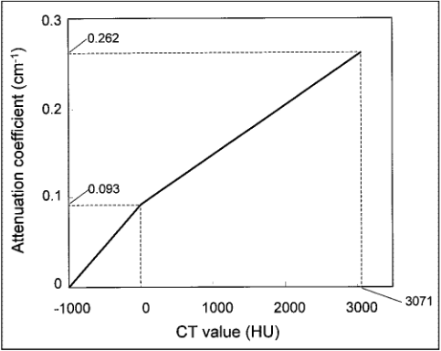
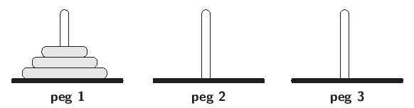

# Exercises: Functions

## Exercise 1

Write a program that repeatedly asks the user to enter pairs of numbers
until at least one of the pair is 0. For each pair, the program should
use a function to calculate the harmonic mean of the numbers. The
function should return the answer to the `main()` function, which should
display the result. The harmonic mean of two numbers, *x* and *y*, is the
inverse of the average of the inverses:

$$
\textrm{harmonic mean} = \frac{1}{\frac{\frac{1}{x}+\frac{1}{y}}{2}} = \frac{2xy}{x+y}
$$

---

## Exercise 2

Write a C++ function which takes a floating point value for the variable
*x*, and computes the value of the following expression

$$
x3 − 5x^2 + 12x − 24
$$

Now write a program which accepts a single command-line argument for the value
of *x*, calls the function, and then prints out the value of the expression.

---

## Exercise 3

CT scanners produce images whose intensities are in Hounsfield Units (HU),
named after the inventor of the CT scanner, Sir Godfrey Hounsfield.  The HU
scale is an approximately linear transformation of attenuation coefficient (AC)
measurements into one in which the radiodensity of distilled water at standard
pressure and temperature is defined as zero HU, while the radiodensity of air
is defined as −1000HU. When reconstructing Positron Emission Tomography (PET)
images the reconstructions need to be corrected for the effects of attenuation
using the attenuation coefficients. Therefore, there is a need to convert from
HU to ACs. The figure below illustrates such a relationship (reproduced from
[Nakamoto et al., 2002](https://pubmed.ncbi.nlm.nih.gov/12215550/)).



Using the relationship illustrated in the figure above, write a C++ function
to convert HU to AC. Write a program to accept a single command-line argument
for the HU value and convert it into AC.

---

## Exercise 4

In Exercise 4 from the "Control structures" worksheet, we wrote a program to
calculate and print out all of the prime numbers between 1 and 50. Rewrite this
program using two functions. The first should compute whether a number is prime
or not, returning either true or false as a return value. The second should
compute and display all prime numbers between 1 and a given maximum number
which should be provided as an argument to the function. The default value for
this argument, if not provided, should be 50. You should also write a
program to call this second function, which should optionally accept a single
command-line argument for the maximum number (and use the default value of 50 if
no argument is provided).

---

## Exercise 5

Run-length encoding is a simple compression algorithm in which runs of data
(i.e. sequences in which the same value occurs several times con- secutively)
are stored as a single data value followed by a count, rather than as the
original run of values. For example, to encode the sequence of characters
"aaabbc" using ASCII codes, run-length encoding would result in the following
sequence of integer values: 

- 97 3 98 2 99 1

(97, 98 and 99 are the ASCII codes for `a`, `b` and `c`.)

Write a C++ program to perform run-length encoding on a sequence
of characters entered by the user. Your program should take a single
command-line argument for the sequence of characters and display to the screen
the sequence of integer values that represent the run-length encoding. 

---

## Exercise 6

### Part A:

The C++ program listing shown below is intended to compute
the volume of a sphere, according to the formula *V* = 4*πr*<sup>3</sup>/3.
However, the program contains 2 errors. What are the errors and how would you
correct each one?  Debug the code so that it compiles and runs correctly.

**`main.cpp`:**
```
#include <iostream >
#include "sphere.h"

int main () {
    const float pi = 3.14159265;

    float r;
    do {
        std::cout << "Enter radius (type -ve number to stop ) ";
        std::cin >> r;

        if (r >= 0.0)
            std::cout << "V = " << sphere(r) << "\n";
    } while (r >= 0.0);
}
```

**`sphere.h`:**

```
#pragma once

float sphere (float);
```

**`sphere.cpp`:**

```
#include "sphere.h"

float sphere (int r)
{
    float cube = r * r * r;
    return ((4.0 * pi * cube) / 3.0);
}
```

### Part B:

The formula for computing the surface area of a sphere is
*A* = 4*πr*<sup>2</sup>. Update your debugged program so that the sphere
function returns two values: one for the volume and one for the surface area.
Both should be displayed by the `main()` function.

---

## Exercise 7

Write a C++ program to read a sequence of characters from the keyboard and
print them in reverse order. Your program should use recursion. The algorithm
for each call of your recursive function should be that it first reads a single
character, then makes a recursive call to print the remaining characters in
reverse order, and finally prints the character just read in. The anchor
condition should be when the user types a newline character ('\n'), in which
case the function should return without printing anything or making any
recursive calls

The following functions from the `<iostream>` include file will be useful to
you:

- `std::cin.get(ch)`: gets a single character from the keyboard and puts
it in the `char` variable `ch`.
- `std::cout.put(ch)`: prints a single character `ch` to the screen.

---

## Exercise 8

Write a C++ program to display the binary equivalent of a decimal number
entered as a command-line argument by the user. The program should work for any
decimal number between 0 and 255, and should display any leading zeros
necessary. For example, if the user enters the decimal number 5, the output
should be `00000101`

For this question, try writing two separate implementations: one iter-
ative and one recursive.

---

## Exercise 9

The Towers of Hanoi is a well-known logic puzzle. The puzzle consists of 3
pegs, with a tower of disks on the first peg (see the figure below). The
objective of the puzzle is to move the tower of disks from peg 1 to peg 3. 
However, you can only move 1 disk at a time and you can never place a disk on
top of a smaller disk (i.e. they must always be stacked with the smallest at
the top and the largest at the bottom).



The Towers of Hanoi problem can be solved using a recursive function.
To move *n* disks from peg *x* to peg *y*, using peg *z* as a spare peg, we
recursively move the top *n*−1 disks from peg *x* to peg *z* (using peg *y*
as a spare peg), then move the last (i.e. biggest) disk from peg *x* to
peg *y*, and finally recursively move the *n*−1 disks from peg *z* to peg *y*
(using peg *x* as a spare peg).

Write a recursive C++ function that solves the Towers of Hanoi problem. Your
function should have four integer parameters: the number of disks to move, the
peg on which they are initially placed, the destination peg, and the spare peg.
The output of your program should be a precise explanation of which disks to
move in which order. For instance, in the example illustrated above the output
should be:

```
Move a disk from peg 1 to peg 3
Move a disk from peg 1 to peg 2
Move a disk from peg 3 to peg 2
Move a disk from peg 1 to peg 3
Move a disk from peg 2 to peg 1
Move a disk from peg 2 to peg 3
Move a disk from peg 1 to peg 3
```

Your program does not need to use any data structure to store the pegs
and disks. It need only display the instructions as given above. Think
about what anchor condition(s) you will need to have for your function.

---

## Exercise 10

In trigonometry, for small values, the approximation

$$
sin(x) = x − x^3
$$


will hold, but for larger values of *x*, the following indirect recursive
definitions can be used:

$$
sin(x) = sin(\frac{x}{3}) \frac{3-\tan^2(\frac{x}{3})}{1+\tan^2(\frac{x}{3})}
$$

$$
tan(x) = \frac{sin(x)}{cos(x)}
$$

$$
cos(x) = 1 − sin(\frac{x}{2})
$$

Write functions to implement *sin*, *cos* and *tan* using indirect recursion
according to the definitions in the equations above, Assume that the
approximation in the first equation holds for all *x* ≤ 0.1 radians.

Your program should accept two command-line arguments: the first to specify
which trigonometric function to compute (one of `sin`, `cos` or `tan`), and the
second to specify the value of *x* as a floating-point value.

---

## Exercise 11

Write a function taking 3 arguments of type `double` to compute the
following calculation:

$$
x = \sqrt{a - \frac{b}{\ln(c+1)} }
$$

The function should return a `double` containing the value of *x*. Identify all
of the different errors that can arise from this equation, and use exceptions
to report them, with each exception providing a helpful description of the problem.
Write a program that will read the 3 required values from the
user as command-line arguments, perform the computation, and report the result
on the terminal. It should be capable of handling errors, particularly
those that might arise from the calculation, and report the description
of the error stored in the exception.


