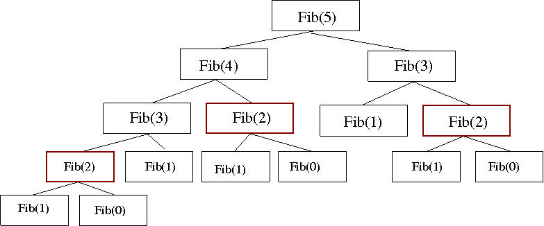
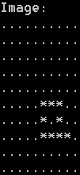
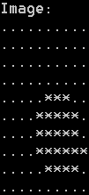
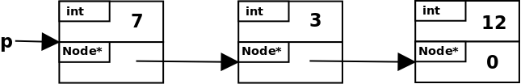

# Exercises: Pointers & C-style arrays

## Exercise 1

Examine the C++ program shown below.


**`main.cpp`:**

```c++
#include <iostream>

// program to illustrate pointer use
int main ()
{
    int *a, *b;
    a = new int;
    *a = 3;
    b = a;

    std::cout << "a->" << *a << ", b->" << *b << "\n";

    *b = 4;
    std::cout << "a->" << *a << ", b->" << *b << "\n";

    b = new int;
    *b = 6;
    std::cout << "a->" << *a << ", b->" << *b << "\n";

    delete a;
    a = b;
    std::cout << "a->" << *a << ", b->" << *b << "\n";

    return 0;
}
```

What would be the output of this program when run? To help, you
may find it useful to draw a graphical representation of the pointers
and the values they point to.

---

## Exercise 2

Write a program that declares a C-style array of 100 integer numbers. Next,
write code to assign to each array element the square of its position in
the array: i.e. the first element should contain the value 1, the second
should contain 4, the third should contain 9, etc. Note that this is not
the same as the square of the array index, as array indices in C++
always start at 0. After assigning the values to the array the program
should print out all 100 numbers.

---

## Exercise 3

Write a C++ program to compute, store and display a multiplication
table that shows all products of the integers from 1 to 10. The output
of the program should be similar to that shown below, and the
program should use a 2-D C-style array to store the products.

---

## Exercise 4

We have seen saw how to write a recursive implementation of the Fibonacci
sequence, i.e. the sequence of integers, starting with 0 and 1, in which every
number is the sum of its two predecessors in the sequence. The recursive
implementation is actually quite inefficient, as is illustrated in the figure
below (adapted from http://functionspace.org//articles/32).


|  |
|:-----:|
| The hierarchy of function calls for a recursive implementation of the Fibonacci sequence, i.e. to compute Fib(5) it is necessary to compute both Fib(4) and Fib(3), to compute Fib(4) it is necessary to compute both Fib(3) and Fib(2), etc. Note that there are duplicated calculations, as indicated by the multiple highlighted calculations of Fib(2). |


It is possible to write a more efficient implementation using iteration, making
use of an array to store the Fibonacci numbers as they are computed.  Write
such an implementation in C++. The program should take an integer argument
which represents the number of Fibonacci numbers to compute and display. If the
number entered is invalid an appropriate error message should be displayed.

---

## Exercise 5

Write a program to efficiently compute the list of prime numbers up to a
user-specified maximum. This should make use of the STL vector class to store
the list, and not have any limit on the maximum. To avoid unnecessary
computation, use the fact that a prime number is not divisible by any other
prime number: build up the list of numbers, adding each number in turn if it
is not divisible by any of the prime numbers already identified. You can check
whether an integer is divisible by another using the modulus operator: `a % b`
computes the remainder of `a/b`.

---

## Exercise 6

A palindrome is a word that is the same spelt backwards, e.g. level or repaper.
Write a C++ program to detect if a word entered by the user is a palindrome.
You can use either a recursive or an iterative implementation, but you must
use the string library to store and manipulate the word entered.

---

## Exercise 7

Image segmentation is a common task in biomedical engineering. Segmenting a
medical image refers to delineating a structure of interest (e.g. an organ) and
thus identifying the pixels that are 'inside' the structure and those that are
'outside'. Segmentations are therefore typically Boolean images, i.e.  a pixel
has value `true` if it is inside the structure and `false` otherwise.

A useful image processing operation in segmentation is dilation. To
dilate a Boolean segmented image, you first take a copy of the segmentation,
then look at each original pixel/voxel in turn: if it is true, or any of its
neighbours are true, the corresponding pixel in the new copy should be set to
true, otherwise it should be set to false.  Dilation has the effect of
'growing' a structure and filling in any small holes it may have. This can be a
useful way of dealing with noise in segmentations.

Write a C++ program to implement the dilation operation, using the 'skeleton'
code provided below.  This 'skeleton' code defines and initialises a 2-D array
of Boolean values to use as your segmentation. You need to write two functions:
- `display_seg`: a function that displays a segmentation, in a manner similar
  to that shown in the figure below.
- `dilate_seg`: a function that dilates a segmentation, producing a new
  segmentation.

The expected output of your program is shown in the figure below.

|   |  |
|:---------------------:|:-----------------------:|
| original segmentation |  dilated segmentation   |


```c++
#include <iostream>

int main()
{
    // define 'segmentation'
    const int im_size = 10;
    bool seg[im_size][im_size], dilated[im_size][im_size];

    // initialise 'segmentation'
    for (int x = 0; x < im_size; x++)
        for (int y = 0; y < im_size; y++)
            seg[x][y] = false;

    seg[5][5] = seg[6][5] = seg[7][5] = true;
    seg[5][6] = seg[7][6] = true;
    seg[5][7] = seg[6][7] = seg[7][7] = seg[8][7] = true;

    // display seg
    // INSERT FUNCTION CALL TO display_seg HERE

    // dilate image
    // INSERT FUNCTION CALL TO dilate_seg HERE

    //display dilated
    // INSERT FUNCTION CALL TO display_seg HERE

    return 0;
}
```

---

## Exercise 8

[A recent Nature
publication](https://www.nature.com/articles/nature10490) has
suggested that a mutation in the gene Endonuclease G could be a determinant of
impaired cardiac function associated with increased left ventricular mass
(LVM). A research group are investigating this link and have gathered data on
the presence of the mutation and LVM values from a number of subjects. This
data is contained in the file `lvm_data.txt`, available at [this
link](lvm_data.txt). 

In order to perform their data analysis the researchers need to read in this
data from the file and separate it into two arrays, one for subjects with the
mutation and one for those without it. Currently, each LVM value is listed in
the `lvm_data.txt` file on a separate line preceded by a single letter: `Y` or
`N` depending on whether the subject had the mutation or not. The lines for
subjects with and without the mutation are mixed randomly within the file.

Write a C++ program that iterates over lines in the file, and at each
iteration reads in the letter and corresponding LVM value. Depend-
ing on the letter, the LVM value should be added to one of the two
arrays: that for subjects with the mutation or that for subjects with-
out it. After constructing the two arrays the program should compute
and print to the screen the mean values of the two arrays. 

---

## Exercise 9

In Exercise 3 from the "Functions" exercise sheet, 3 we wrote a C++ function to
convert from Hounsfield Units (HU) to attenuation coefficients (AC). Write a
new program that makes use of this function to produce an AC image from
a corresponding real CT image.

Your program should read in the CT slice, convert all pixel intensities
from HU to AC, display both images and save the AC image to a new
file. To convert from HU to AC, you should write a new function that
takes two CImg variables as arguments (the original CT image and the
new AC image). It should loop through all pixels in the CT image,
call your existing conversion function to convert from HU to AC, and
store the converted value in the AC image.

To store an image in memory, you can use the `Image` class that we created in
the lecture slides. The original image is stored in plain PGM format and can be
loaded using the `load_pgm()` function that we also wrote in the lecture
slides. To display the images, you can use the [terminal_graphics
library](https://github.com/jdtournier/terminal_graphics), as was used
throughout the lectures and for the coursework. However, to save the
converted image to file, you will need to write a new function `write_pgm()`. 

---

## Exercise 10

C-style arrays in C++ have a fixed length, e.g.  if you define an array of ten
integers you cannot then add an eleventh without creating a new, bigger, array
and copying across all the old values. This would be quite inefficient if you
did it often. To counter this limitation, a data structure known as a linked
list has been proposed. Linked lists use pointers to create a list of nodes
which are dynamic, i.e. you can always add or remove nodes to/from the list at
run-time. One implementation of a linked list data structure, which uses a
struct data type, is shown in the C++ header file below.


**`linked_list.h`:**

```c++
#pragma once

struct Node {
    int val;
    Node *next;
};

using List = Node*;

void AddNode (List& m, List n);
void DeleteNode (List& m, List n);
void PrintList (List m);
```

The struct, which represents a node in the list, contains two values:
an integer and a pointer to another node. The pointer always points
to the node containing the next value in the list, unless it is the last
node, in which case it has the value `nullptr` (a special C++ identifier that
refers to a pointer that doesn’t point anywhere). See the figure below for
an illustration, which represents a `List` variable called `x` that contains
the list of integers: 12, 3, 34. 



In the code above, the `using` directive simply creates an alias for a
specified type, i.e. rather than using `Node*` to define a linked list we can use
the alias `List`.

Functions are defined to add a node to end of the list, delete a node
from the list, and to print all values in the list. Implementations for
these are shown below.


**`linked_list.cpp`:**

```c++
#include <iostream>
#include "linked_list.h"

void AddNode (List& m, List n)
{
    List t;
    // is current list empty?
    if (!m) { // yes , so just assign the new node
        m = n;
        m->next = nullptr;
    }
    else { // no , so go to the end of the list
        t = m;
        while (t->next)
            t = t->next;
        t->next = n;
        n->next = nullptr;
    }
}

void DeleteNode (List& m, List n)
{
    if (m == n) { // delete first node
        List t = m;
        m = m->next;
        delete t;
    }
    else { // delete a later node
        List t = m;
        while (t->next != n)
            t = t->next;
        List u = t->next;
        t->next = u->next;
        delete u;
    }
}

void PrintList (List m)
{
    List t = m;
    std::cout << "List: [ ";
    // loop through all nodes:
    while (t) {
        std::cout << t->val << " ";
        t = t->next;
    }
    std::cout << "]\n";
}
```

Examine the code and make sure you understand how it works. You may find it
useful to step through the code and use a graphical representation
of the list similar to that shown in the figure to visualise what is happening
as nodes are added and removed.

Now add a new function to the program that searches for a particular value in
the linked list. It should take a List and an int as arguments and return an
int representing the index of the first instance of the value in the list
(return -1 if it’s not present).  Test your new function by adding code to the
driver (`main()` function) below.

```c++
#include <iostream>
#include "linked_list.h"

using namespace std;

int main()
{
    // variable declarations
    List x = nullptr, n;

    // add 4 nodes to the list and print it out
    n = new Node;
    n->val = 12;
    AddNode (x, n);

    n = new Node;
    n->val = 3;
    AddNode (x, n);

    n = new Node;
    n->val = 34;
    AddNode (x, n);

    n = new Node;
    n->val = 27;
    AddNode (x, n);

    PrintList (x);

    // delete 2nd node from list and print again
    List t = x->next;
    DeleteNode (x, t);
    PrintList (x);

    return 0;
}
```

