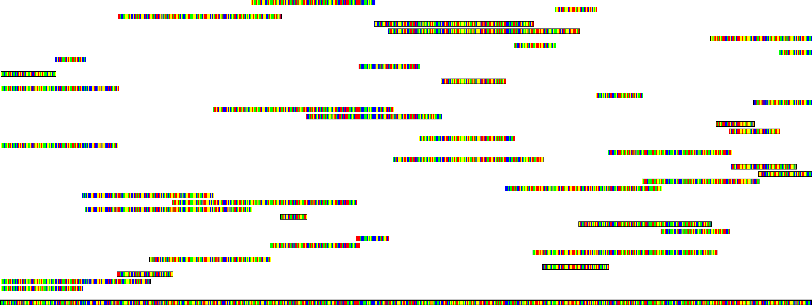
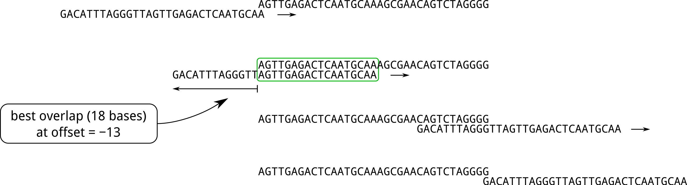

# Shotgun sequencing

## Introduction

There has been a huge increase in the use of genetic information for both research and clinical applications over the last 20 years, made possible by the development of low-cost DNA sequencing technologies. One such method is known as [shotgun sequencing](https://en.wikipedia.org/wiki/Shotgun_sequencing), and works by splitting strands of DNA into smaller fragments, which can be sequenced more easily and reliably using low-cost techniques. If a number of identical DNA strands are split at random into many small fragments, the full sequence can be reconstructed based on the overlapping regions between the different fragments, as illustrated in the Figure below.

---



*Illustration of shotgun sequencing. The original complete DNA sequence is shown at the bottom. Shotgun sequencing works by splitting multiple complete strands into smaller fragments, each of which can be sequenced cheaply and reliably. Since the splitting occurs at random locations, the resulting fragments will overlap, making it possible to reconstruct the full sequence by merging fragments where they overlap.*

---

The task in this project is to implement a simple 'shotgun sequencing' algorithm capable of reconstructing a complete DNA sequence based on the measured fragments. For simplicity, we assume there were **no errors** in the sequencing of the fragments (in a real-world situations, some form of error detection and correction would be necessary). 

Your algorithm will need to perform the following steps:

1. load the fragment data;
2. identify the largest fragment, and set it as your current estimate of the full sequence;
3. of the remaining fragments, find the one with the largest error-free overlap with your current estimate of the full sequence;
4. merge the fragment identified in the previous step with your current estimate of the full sequence, to provide an improved (and hopefully longer) estimate of the full sequence;
5. iterate the previous two steps until no further fragments remain;
6. report the length of the estimated completed sequence on the terminal;
7. save the estimated complete sequence into an appropriately named output text file.

Further details for each step are provided below.

## Instructions

Your task in this coursework is to write a C++ program which meets the requirements described above. Three example datasets are provided, each comprising of an input file with all the measured fragments (`fragments-N.txt`), along with the expected solution for each case (`solution-N.txt`). Your program should be written to handle any data file provided in the expected format (see description below). 

To help with your initial implementation, you are also provided with three equivalent datasets (`fragments-N.txt` along with the corresponding solutions `solution-N.txt`). These data are provided only to allow you to test your program at an earlier stage in development than otherwise. A complete implementation should be able to process *all* datasets provided, and any other unseen datasets provided in the same format.


### Fragment data

The fragment data come in the form a simple text file, which each fragment as a contiguous sequence of the letters `A`, `C`, `G` or `T` (corresponding to the adenine, cytosine, guanine, and thymine bases respectively). Each fragment can readily be stored as a `std::string`. There is one fragment per line, the length of each fragment is variable, and the number of fragments is also variable. You should load all fragments from the input file until the end of file. 

### Detecting overlap

The overlap between two fragments is computed by shifting one fragment relative to the other, and finding the offset that provides the longest run of identical bases between the two fragments without mismatch. The process can be conceptualised as outlined below, and illustrated in the figure below: 

1. set the longer fragment as the reference, and set the offset of the shorter fragment to its lowest possible value (single character overlap on the left of the reference).
2. check whether all bases in the overlap match between fragments; if they do, then if this is largest overlap observed so far, record the size of the overlap and its corresponding offset.
3. shift the shorter fragment one base along (increment the offset), and repeat from step 2. 
4. stop when the offset exceeds its maximum possible value (i.e. when the fragments no longer overlap).
5. return the maximum overlap observed and its corresponding offset. 

---



*Illustration of the overlap detection procedure. Overlap is detected by 'sliding' the shorter fragment across the longer (reference) fragment, checking whether all bases match in the overlap region. In this case, the best overlap is highlighted in the green box, and corresponds to an overlap of 18 bases, with the shorter fragment offset 13 bases to the left (i.e. an offset value of -13).*

---

### Fragment merging

Once the fragment with the largest overlap with the current estimate of the sequence has been identified, it can be merged with the current sequence to produce the next estimate of the sequence. There are three ways fragments can
match, shown below with the expected result of the merge in each case: 

#### partial match on the left:

```
       CACAATTGAACTAAAGGGCGCGAGACGTATTCCCCGGTTGCTGCTTGGG
CCCTCATCACAATTGAACTAAAGGGCGCG

                          ↓   
 
CCCTCATCACAATTGAACTAAAGGGCGCGAGACGTATTCCCCGGTTGCTGCTTGGG
```

#### complete match in the middle:

```
       CACAATTGAACTAAAGGGCGCGAGACGTATTCCCCGGTTGCTGCTTGGG
                       GGCGCGAGACGTATTCCCCGGTTGC

                          ↓

       CACAATTGAACTAAAGGGCGCGAGACGTATTCCCCGGTTGCTGCTTGGG
```

#### partial match on the right:

```
       CACAATTGAACTAAAGGGCGCGAGACGTATTCCCCGGTTGCTGCTTGGG
                                             TGCTGCTTGGGACCATAAAACCTCA

                          ↓

       CACAATTGAACTAAAGGGCGCGAGACGTATTCCCCGGTTGCTGCTTGGGACCATAAAACCTCA
```

For the left & right partial matches, merging produces a longer sequence with the non-overlapping region of the shorter fragment added at the beginning or end of the longer fragment. For complete matches, merging simply produces the longer fragment unmodified. 

To avoid false positive matches, the algorithm should **ignore overlaps shorter than 10 bases**.

### Format of output data file

Your program should write its final estimated sequence to a text file, as a contiguous sequence of the letters `A`, `C`, `G` or `T`, all on a single line. This is the same format as each of the fragments files, with the main difference being that the final output file should only contain only a single, much longer sequence. 
