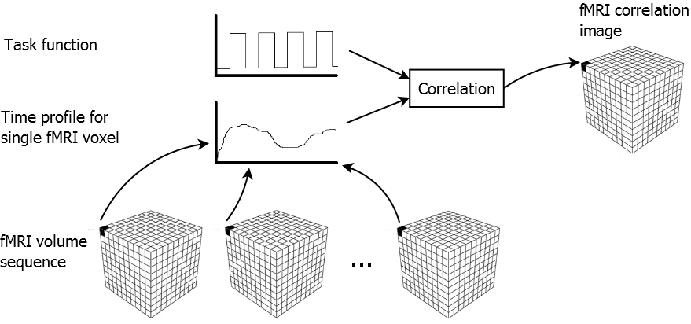
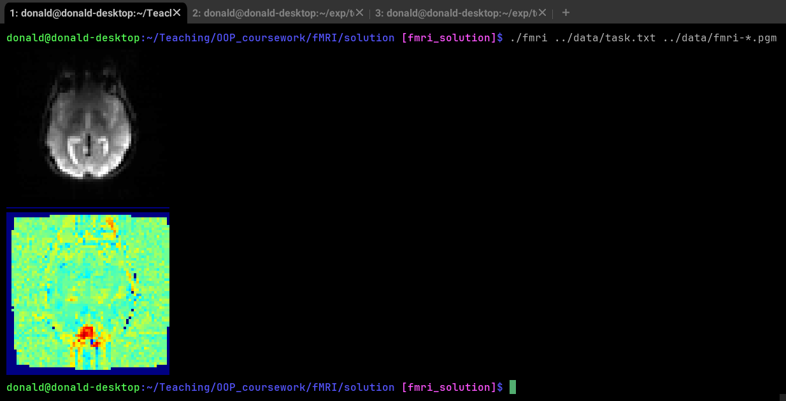

# functional MRI

## Introduction

Functional magnetic resonance imaging (fMRI) uses MRI scanning to measure brain activity by detecting changes associated with blood oxygenation. Typically, an fMRI scan involves acquisition of a sequence of time-resolved fMRI volumes. During acquisition, the subject will alternate performance of a 'task' with periods of 'rest'. For example, the task might be viewing visual stimuli or listening to audio stimuli. The aim of the scan is to discover which part(s) of the brain are active
during the task. 

Once the sequence of fMRI volumes has been acquired, it must be processed to produce an image showing which parts of the brain were active during the task. This image is known as a correlation image. Figure 1 illustrates the processing involved in producing this image. First, a task function is formed, which is a 1-D signal indicating the periods of task and rest during the scan. There will be one value in the task function for each fMRI volume. Next, for each fMRI volume voxel, a similar 1-D signal is formed consisting of the fMRI intensities from each volume in the sequence. The Pearson’s correlation coefficient between the task and fMRI 1-D signals represents the intensity of the correlation image for that voxel. The Pearson’s correlation coefficient $r$ of two signals $x$ and $y$ of length $N$ is defined as: 

$$r = \frac{\sum_{i=1}^{N} (x_i - \bar{x}) \times (y_i - \bar{y})}{\sqrt{\sum_{i=1}^{N} (x_i - \bar{x})^2} \times \sqrt{\sum_{i=1}^{N} (y_i - \bar{y})^2}} $$

where $\bar{x}$ and $\bar{y}$ represent the mean values of $x$ and $y$, The correlations are computed for all voxels, resulting in the full 3-D correlation image. Due to the noisy nature of the data, the correlation image is normally smoothed before visualisation. 

The figure below shows examples of a single fMRI volume and a correlation image computed from a sequence of such volumes.

---

*An illustration of how a sequence of fMRI volumes is correlated with a task function to produce an fMRI correlation image.*

---

## Instructions

Your task in this coursework is to write a simple program for fMRI analysis to compute correlation images from given sequences of fMRI data and the corresponding task timecourse. For simplicity, the data provided correspond to a single slice through the 3D dataset. The data themselves come from [a study on the visual system](https://openneuro.org/datasets/ds001553/versions/1.0.1), and consist of a flickering checkerboard task. The final output of the project should look like this:

---

*Example output for the project, showing the final fMRI correlation image to be produced. In these data, we see clear activation of the visual cortex, in the occipital pole at the back of the brain.*

---

The data to be processed are stored in the [data folder](data/). The imaging data are stored as a single file per timepoint, using the [plain PGM format](https://netpbm.sourceforge.net/doc/pgm.html#plainpgm), which is a simple text-only image format. The task information is stored as a simple text file, consisting of 0 & 1 for rest and active time points respectively. 

To display the data, we will rely on the functionality provided by the [terminal graphics project](https://github.com/jdtournier/terminal_graphics), which is a really simple single-file header-only library. It allows simple plots and images to be displayed on a sixel-compatible terminal. Please see the information on [that project's README](https://github.com/jdtournier/terminal_graphics/blob/main/README.md) for details, including [the documentation on how to use it](https://jdtournier.github.io/terminal_graphics/). 

