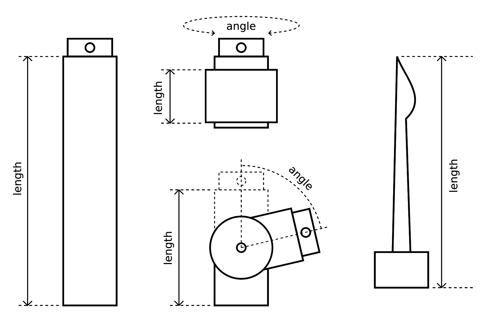
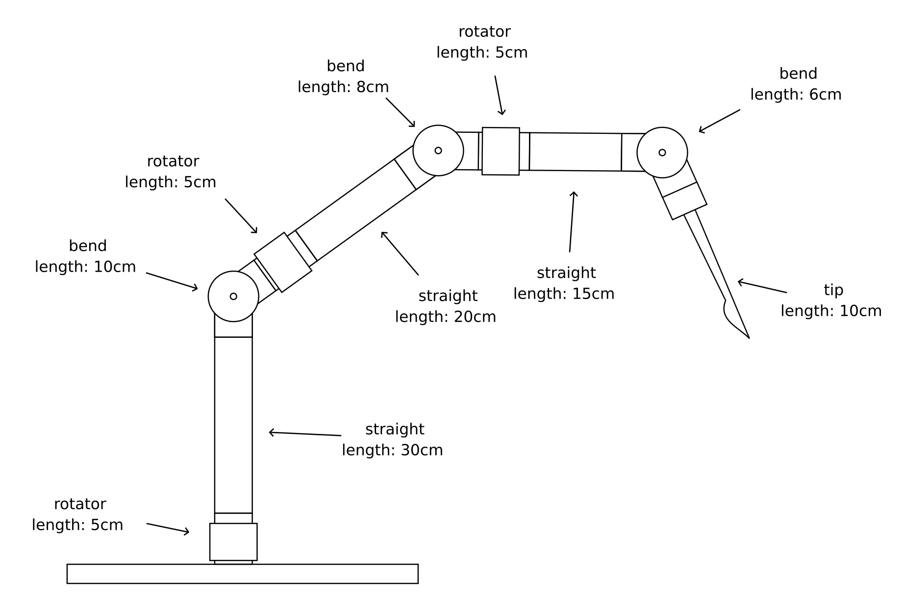
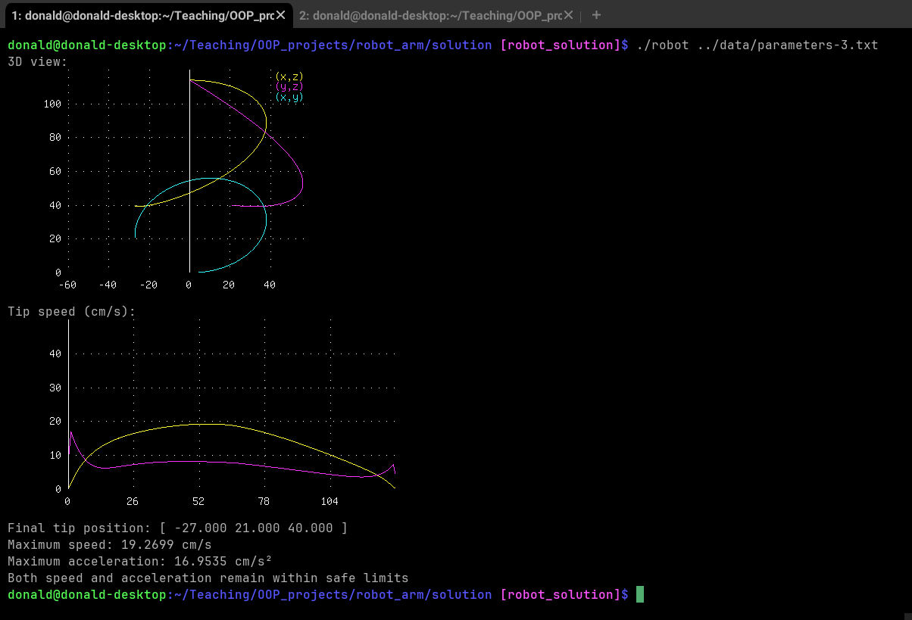

# Modular robot arm control

## Introduction

A new modular design is being trialled for application in surgery. The arm can be assembled from modular segments, designed to be assembled into arbitrary configuration by slotting the end connector of one segment into the matching slot of the next segment. Available segments consist of a straight connector, a rotating joint, a bending (revolute) joint, and the instrument tip, as shown in the figure below. 

---

*The various segment modules available for the robotic arm.*

---

These segments can be manufactured to various lengths. For the bending joint, the pivot point is always halfways along it length. The rotating and bending joint are the only two that can be controlled by setting their angle parameter, as illustrated above. 

A research team is investigating the possibility of using this modular design for a robotic arm to be used in surgery. They have settled on the design shown in the figure below:

---

*The full design for the robotic arm to be assembled in this project.*

---

The challenge to be tackled in this project is to compute the exact position, speed and acceleration of the surgical instrument tip given the angles for each of the joints. This information is critical in ensuring the accuracy and safety of any procedure using the robot.

## Instructions

Your task in this coursework is to write C++ code capable of representing the state of the robotic arm, which will eventually be used to control it. Your code will need to read a file containing the angles for each of the joints for each time point. From that, it will need to compute the position, speed and acceleration of the tip and ensure the parameters in the file do not exceed the device's safety thresholds: speed < 20 cm/s, and acceleration < 20 cm/s². 

Ideally, the code should also trace out the trajectory of the surgical tip and display it as a projection along the 3 main axes, as illustrated in the example terminal output below. 

---

*Example output from the program, showing the trajectory of the tip projected in the x-y, x-z and y-z planes, along with a plot of the expected speed and acceleration of the surgical tip as a function of time, based on the parameters provided.*

---

Note that while the configuration of the arm has already been finalised, your code should be designed to allow different configurations to be implemented, in case the design changes at a later stage. 

### The parameters file

The [data folder](data/) contains 3 parameter files for you to process. These are simple text files, consisting of one line per time point, with a 0.1s time interval. Each line lists the angles (in radians) for each of the joints in the robot arm. The angles are provided in radians, and ordered from the root to the tip of the arm.

### Representing the modular segments

The next challenge is to represent all these different segment types using standard C++ functionality, while ensuring the segments can be arranged in any arbitrary order. There are various ways of doing this, but the most obvious here is to use inheritance. 

The simplest way to track the position of the surgical tip is to request that each segment report the position of the tip relative to the frame of its own connector. For the tip segment, the position reported is simply a vector pointing along the *z*-axis corresponding to the length $l$ of the tip, with no reference to any downstream segments (since the tip should be the last segment):

$$p_n = \begin{pmatrix}
0 \\
0 \\
l
\end{pmatrix}$$

A **straight segment** would simply add own their length $l$ to *z* component of the tip position $p_{n+1}$ reported by its downstream connector:

$$p_n = \begin{pmatrix}
0 \\
0 \\
l
\end{pmatrix} + p_{n+1}$$

A **rotating connector** would take the position $p_{n+1}$ reported by its downstream segment, and impart a shift along the *z*-axis corresponding to its length $l$, and a rotation within the *x*-*y* plane according to its angle $\theta$ (in radians):

$$p_n = \begin{pmatrix}
0 \\
0 \\
l
\end{pmatrix} + \begin{pmatrix}
\cos(\theta) & -\sin(\theta) & 0 \\
\sin(\theta) & \cos(\theta) & 0 \\
0 & 0 & 1
\end{pmatrix} p_{n+1}$$

The **bending segment** is more complex, adding half its length $l$ to the position $p_{n+1}$ reported by its downstream segment, then imparting a rotation in the *x*-*z* plane according to its angle $\theta$, and then adding half its length again (this is to account for the fact that the pivot point is halfway up its length):

$$p_n = \begin{pmatrix}
0 \\
0 \\
l/2
\end{pmatrix} + \begin{pmatrix}
\cos(\theta) & 0 & \sin(\theta) \\
0 & 1 & 0 \\
-\sin(\theta) & 0 & \cos(\theta)
\end{pmatrix} \left[ p_{n+1} + \begin{pmatrix} 
0 \\
0 \\
l/2
\end{pmatrix} \right] $$

### Displaying the trajectory and associated information

As with the [fMRI project](), we will rely on the [terminal graphics project](https://github.com/jdtournier/terminal_graphics) project to display our results directly in a sixel-compatible terminal (see [the relevant section of the fMRI project](https://github.com/KCL-BMEIS/OOP_projects/blob/main/fMRI/assignment.md#inspecting-the-time-course-information) for details). 

### Checking speed and acceleration

To compute the speed of the surgical tip, we will first need to compute the positions $\\{ x_i \\}$ of the tip at each time point. From this, can we compute the speed using the central finite difference:

$$v_t = \frac{1}{2 \delta t} \left| x_{t+1} - x_{t-1} \right|$$ 

Similarly, the acceleration can be computed using the difference bewteen the speeds estimated using the forward and backward difference methods:

$$a_t = \frac{1}{\delta t^2} \left| \left( x_{t+1}-x_t \right) - \left( x_t - x_{t-1} \right) \right| $$

You can assume $x_t = x_0$ when $t<0$, and $x_t = x_N$ when $t>N$, where $N$ is the index of the last time point. 

For safe operation, you should ensure that the speed remains lower than 20 cm/s, and the acceleration also lower than 20 cm/s². 
