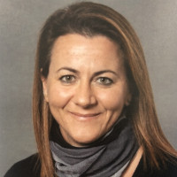

class: title

5CCYB041
# OBJECT-ORIENTED PROGRAMMING
## Week 1: Introduction

---

# Teaching team

## Module leads

.center[ .left-col[  <br> [J-Donald Tournier](mailto:jacques-donald.tournier@kcl.ac.uk) ] 
.right-col[  <br> [Michela Antonelli](mailto:michela.antonelli@kcl.ac.uk) ] ]

## Lecturers

.center[ .left-col[  <br> [Tobias Wood](mailto:tobias.wood@kcl.ac.uk) ]
.right-col[  <br> [Marc Modat](marc.modat@kcl.ac.uk) ] ]

---

# Week 1: Introduction

## Topics to be covered:

- the command-line
- navigating the filesystem
- invoking the compiler
- using an editor
- writing our first `hello_world.cpp`


---

# The command-line


In this course, we will be using a Unix-like terminal environment 
and running all of our code within the terminal. 

- This means we need to understand the Unix command-line.

--

On the KCL-managed Windows systems, we will rely on the [MSYS2
project](https://www.msys2.org/). 

- Use the **`MSYS2 MSYS` terminal** (ignore the other variants)
- This provides a Unix-like environment, preloaded with all the necessary software.
- Start it from the _Start_ Menu (search for "MSYS")

--

If you wish to install this on your own Windows computer, follow the instructions on KEATS.<br>
On macOS, you can immediately use the [Terminal
application](https://support.apple.com/en-gb/guide/terminal/welcome/mac).


---

# Hello World

```
#include <iostream>

int main ()
{
* std::cout << "Hello World!" << std::endl;
  return 0;
}
```

---

# Hello World

```
#include <iostream>

int main ()
{
  std::cout << "Hello World!" << std::endl;
  `return` 0;
}
```

