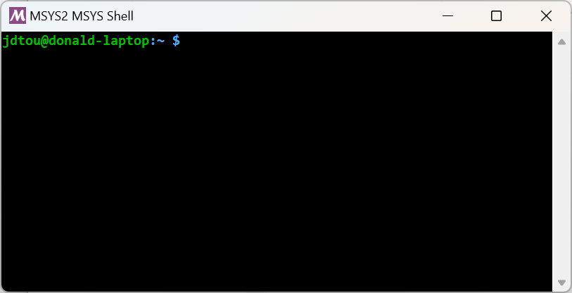

class: title

5CCYB041
# OBJECT-ORIENTED PROGRAMMING
## Week 1: Introduction

---

# Teaching team

## Module leads

.center[ .left-col[  <br> [J-Donald Tournier](mailto:jacques-donald.tournier@kcl.ac.uk) ] 
.right-col[  <br> [Michela Antonelli](mailto:michela.antonelli@kcl.ac.uk) ] ]

## Lecturers

.center[ .left-col[  <br> [Tobias Wood](mailto:tobias.wood@kcl.ac.uk) ]
.right-col[  <br> [Marc Modat](marc.modat@kcl.ac.uk) ] ]

---

# Course overview

## Structure

- 10 week course, with 2-hour tutorials twice a week
- on week 6, peer-assessed exercise (formative only)

--

## Assessment
.left-col[- first coursework (10%)
  - instructions available 6 February
  - submission due 25 February

- second coursework (30%)
  - instructions available 13 March
  - submission due 3 April
]

--
.right-col[- final exam (60%)
  - this is a _written_ exam
  - please look through example questions provided

]

---

# Course overview

## Objectives

This course is an introduction to object-oriented programming using C++.

--

It will provide you with an understanding of:

- the Unix command-line

--
- how to handle and manage files and commands in a Unix environments

--
- the basics of programming using C++

--
- the basics of the object-oriented programming paradigm

--
- how to manage and process complex data structures

--

Where possible, the course aims to provide with transferable skills that can be
applied in other situations

--

- for many of you, these skills will prove valuable for your final project
- _even if you don't use C++!_

---

# Course overview

## It is _not_ intended as a full C++ course

--

We will _not_ cover concepts that many other C++ courses would consider
fundamental, including:

--
- C-style arrays
- memory management
- pointers or smart pointers
- ...

--

Why are we avoiding these topics?

- They cause too much confusion too early. You can learn about these topics
  when you have become sufficiently familiar with the basics

--
- Many of these features are discouraged in modern C++, and are best avoided
  altogether where possible

--

Many other C++ topics will also not be covered as they are too advanced

---

# How to make the most of this course

Learning to program can only be done through experience
- please make every effort to attend all the tutorials!

--
- don't hesitate to ask if anything is unclear or you need any help

--
- go through all the examples

--
- search online for examples and explanations!
  - but bear in mind that online sources may use concepts we have
    purposefully left out of the course!

--

Good online resources include:

- [cplusplus.com](http://www.cplusplus.com/) C++ tutorial and reference, recommended
- [Bucky's C++ programming tutorials](https://www.youtube.com/playlist?embed=no&list=PLAE85DE8440AA6B83): collection of helpful videos on different C++ concepts
- [cprogramming.com](http://www.cprogramming.com/tutorial/c++-tutorial.html): C++ tutorials and discussion forum for questions and answers
- [cppreference.com](http://en.cppreference.com/w/cpp): very thorough C++ reference, recommended
- [Hackerrank](https://www.hackerrank.com/): interactive code exercises
- [C++ FAQ](https://isocpp.org/faq): great resource with answers to general or specific questions

---

# The command-line



In this course, we will be using a Unix-like terminal environment 
and running all of our code within the terminal. 

- This means we need to understand the Unix command-line.

--

On the KCL-managed Windows systems, we will rely on the [MSYS2
project](https://www.msys2.org/). 

- Use the **`MSYS2 MSYS` terminal** (ignore the other variants)
- This provides a Unix-like environment, preloaded with all the necessary software.
- Start it from the _Start_ Menu (search for "MSYS")

--

If you wish to install this on your own Windows computer, follow the instructions on KEATS.<br>
On macOS, you can immediately use the [Terminal
application](https://support.apple.com/en-gb/guide/terminal/welcome/mac).

---

# The command-line

The terminal is an application that allows you to enter _commands_ and displays
their output

--

The commands are _interpreted_ by another program called the _command
intrepreter_ 
- typically referred to as 'the shell'

--
- here, we are using the _Bourne-again shell_ (`bash`)

--

.note[
On Windows, the standard shell used to be the DOS shell, though MicroSoft
has since introduced the more modern PowerShell - we won't be using either of
them on this course!]

--

<br>
<br>

To get started, click on the _Start_ menu and search for the `MSYS2 MSYS`
application

.note[
ignore the other options, you need to use the `MSYS` variant!]

---

# The command prompt

When started, the terminal will (typically) show a _prompt_, and wait for you
to enter commands.

--

The prompt will (typically) take the form:
```
user@hostname:folder $
```

--
where:

- `user` is your current username

--
- `hostname` is the name of the computer this session is currently running on

--
- `folder` is the folder you are currently operating in (the _current working
  directory_)

.note[
The `~` symbol is used as a shorthand for your home folder]

---

# Navigating using the command-line

Try the following commands:

- `ls`: list the files & folders in the current folder
  - `ls -l`: list in long format (permissions, ownership, file sizes, ...)
  - `ls Desktop`: list the files in the `Desktop` folder 

- `pwd`: print the current working directory 

- `cd`: change directory
  - `cd`: change to your _home folder_
  - `cd ..`: change to the _parent directory_ relative to the current folder
  - `cd Documents`: change to the `Documents` folder 
  - `cd ../Desktop`: change to the `Desktop` folder in the parent directory


.note[
In computing, the terms _folder_ and _directory_ are often used interchangeably]

---

# Navigating using the command-line

You can see that the commands in the previous slide allow you to move around
and inspect the _filesystem_, in much the same way as you would using your file
manager. 

<br>
<br>
Try using the Windows Explorer to verify that the listings provided on the
command-line correspond to the folders on your account.

.note[
on macOS, you can use the _finder_ application instead]


---

# Hello World

```
#include <iostream>

int main ()
{
* std::cout << "Hello World!" << std::endl;
  return 0;
}
```

---

# Hello World

```
#include <iostream>

int main ()
{
  std::cout << "Hello World!" << std::endl;
  `return` 0;
}
```

