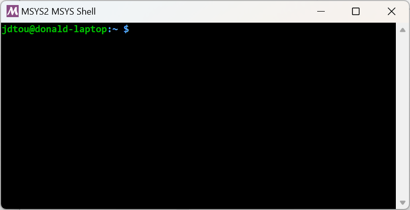
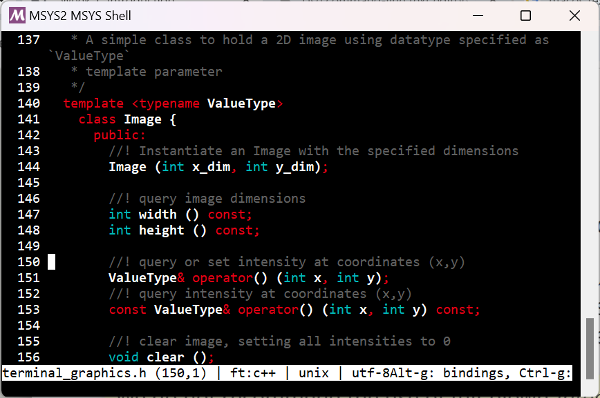
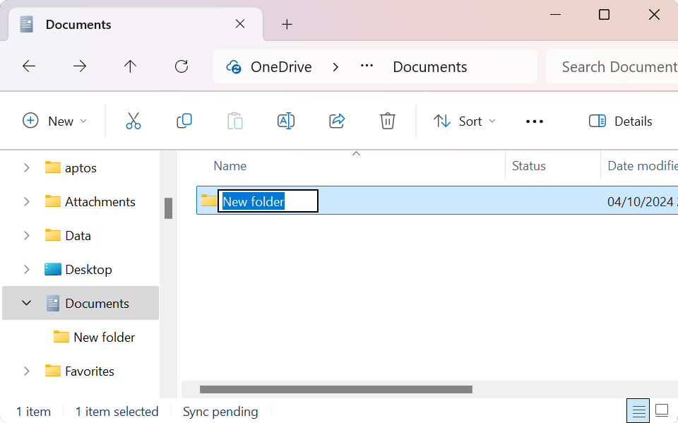

class: title

5CCYB041
# OBJECT-ORIENTED PROGRAMMING
### Week 1, session 1
## Introduction

---
name: team

# Teaching team

## Module leads

.center[.teamcols[
.col[ 
[J-Donald Tournier](mailto:jacques-donald.tournier@kcl.ac.uk) ]
.col[ 
] 
.col[ 
]
.col[
[Michela Antonelli](mailto:michela.antonelli@kcl.ac.uk) ]
] ]

## Lecturers

.center[.teamcols[
.col[
[Tobias Wood](mailto:tobias.wood@kcl.ac.uk) ]
.col[ 
 ] 
.col[ 
 ]
.col[ [Marc Modat](marc.modat@kcl.ac.uk) ] 
] ]

---

.center[.teamcols[
.col[
## Teaching assistants
]
.col[
&nbsp; ]
.col[ 
 ] 
.col[
[Abhijit Adhikary](mailto:abhijit.adhikary@kcl.ac.uk) ]
] ]

.center[.teamcols[
.col[ 
[Charel Junior Mangama Sindzi](mailto:charel.mangama_sindzi@kcl.ac.uk) ]
.col[ 
] 
.col[ 
]
.col[
[Yovin Yahathugoda](mailto:yovin.yahathugoda@kcl.ac.uk) ]
] ]

.center[.teamcols[
.col[
[Jakub Grzelak](mailto:jakub.grzelak@kcl.ac.uk) ]
.col[ 
 ] 
.col[ 
 ]
.col[ 
[Nashira Baena](mailto:paloma.rodriguez_baena@kcl.ac.uk) ]
] ]

.center[.teamcols[
.col[
[Adriana Namour](mailto:adriana.namour@kcl.ac.uk) ]
.col[ 
 ]
.col[ 
 ]
.col[ 
[Dewmini Hasara Wickremasinghe](mailto:dewmini.wickremasinghe@kcl.ac.uk) ]
] ]


---
name: course

# Course overview

## Structure

- 10 week course, with 2-hour tutorials twice a week
- on week 6, peer-assessed exercise (formative only)

--

## Assessment
.columns[
.col[
- first coursework (10%)
  - instructions available 6 February
  - submission due 25 February

- second coursework (30%)
  - instructions available 13 March
  - submission due 3 April
]

.col[
- final exam (60%)
  - this is a _written_ exam
  - please look through example questions provided
]
]

---

# Course overview

## Objectives

This course is an introduction to object-oriented programming using C++.

--

It will provide you with an understanding of:
- the Unix command-line
--
- how to handle and manage files and commands in a Unix environments
--
- the basics of programming using C++
--
- the basics of the object-oriented programming paradigm
--
- how to manage and process complex data structures

--

Where possible, the course aims to provide you with transferable skills that can be
applied in other situations

- for many of you, these skills will prove valuable for your final project
- _even if you don't use C++!_

---

# What is C++?

C++ is a widely-used general-purpose programming language. 
- ranked second on the [TIOBE programming community index](https://www.tiobe.com/tiobe-index/) (after [Python](https://www.python.org/))
- used for high-performance and/or resource-constrained software
- can be used for a wide range of applications: embedded systems, operating systems, desktop
  applications, telecoms infrastructure, ...

--

C++ was first released in 1985 by Bjarne Stroustrup as an extension to the [C language](https://en.wikipedia.org/wiki/C_(programming_language%29)
- first standardised by the [International Organization for Standardization (ISO)](https://www.iso.org/) in 1998
- There have been many versions of the standard since (bold denotes
  fundamental changes):
  - **C++98**, C++03, **C++11**, C++14, C++17, **C++20**, C++23, **C++26** (under development)

--

Specific features of C++:
- it supports [Object-Oriented Programming (OOP)](https://www.geeksforgeeks.org/introduction-of-object-oriented-programming/), as well as [generic](https://www.geeksforgeeks.org/generics-in-c/) and [functional programming](https://www.geeksforgeeks.org/functional-programming-paradigm/)
- it is a [compiled
  language](https://www.geeksforgeeks.org/difference-between-compiled-and-interpreted-language/)
(the code you write must be *compiled* to machine code before execution)
- it uses [static
  typing](https://www.geeksforgeeks.org/type-systemsdynamic-typing-static-typing-duck-typing/)
(data types are known and checked at compile-time, not runtime)

--

On this course, we will be using the **C++20 version of the standard**


---

# Course overview

## This is an *introductory* course to C++

--

We will *avoid* concepts that many other C++ courses would consider
fundamental, including:

--
- C-style arrays
- memory management
- pointers or smart pointers
- ...

--

Why are we avoiding these topics?
- They cause too much confusion too early. You can learn about these topics
  when you have become sufficiently familiar with the basics
--
- Many of these features are discouraged in modern C++, and are best avoided
  altogether where possible

--

We will initially cover a lot of topics quickly and superficially
- the point is to appreciate how the language works as a whole to solve problems
- **not everything will immediately make sense - but hang in there!**

---

# How to make the most of this course

Learning to program can only be done through experience
- please make every effort to attend all the tutorials!
--
- don't hesitate to ask if anything is unclear or you need any help
--
- go through all the examples
--
- search online for examples and explanations!
  - but bear in mind that online sources may use concepts we have
    deliberately left out of the course, or rely on a different version of the
    C++ standard!

--

Good online resources include:

- [learncpp](https://www.learncpp.com/cpp-tutorial/introduction-to-cplusplus/): a great tutorial, accessible and up to date
- [cppreference.com](http://en.cppreference.com/w/cpp): very thorough C++ reference, up to date and correct, but not easy for beginners
- [C++ FAQ](https://isocpp.org/faq): great resource with answers to general or specific questions

--

Other online sources (not as authoritative as the above):

- [geeksforgeeks.org](https://www.geeksforgeeks.org/c-plus-plus/): great as a quick introduction to key concepts, but can often be too simplistic
- [cplusplus.com](http://www.cplusplus.com/): C++ tutorial and reference, a little out of date

---
name: cmdline

class: section

# The Unix command-line

---

# The command-line



In this course, we will be using a
[Unix](https://en.wikipedia.org/wiki/Unix)-like terminal environment and
running all of our code within the terminal. 

- This means we need to understand the Unix command-line.

--

On the KCL-managed Windows systems, we will rely on the [MSYS2
project](https://www.msys2.org/). 

- Use the **`MSYS2 MSYS` terminal** (ignore the other variants)
- This provides a Unix-like environment, preloaded with all the necessary software.
- Start it from the _Start_ Menu (search for "MSYS")

--

To install this on your own Windows computer, follow the instructions on KEATS.<br>

On macOS, you can immediately use the [Terminal
application](https://support.apple.com/en-gb/guide/terminal/welcome/mac).

---

# The command-line

To get started, click on the _Start_ menu and search for the `MSYS2 MSYS`
application

.note[
ignore the other options, you need to use the `MSYS` variant!]


--

<br>

The terminal is an application that allows you to enter _commands_ and view
their output

--

The commands are _interpreted_ by another program called the _command
intrepreter_ 
- typically referred to as 'the shell'
--
- here, we are using the [Bourne-again shell (`bash`)](https://en.wikipedia.org/wiki/Bash_(Unix_shell%29)

--

<br>
.note[
On macOS, the standard shell is now the [Z
shell](https://en.wikipedia.org/wiki/Z_shell) (`zsh`), which is an extension of the
Bourne shell, and broadly compatible with `bash`.

<br>
On Windows, the standard shell used to be the DOS shell, though Microsoft
has since introduced the more modern PowerShell &ndash; we won't be using either of
them on this course!]

---

# The command prompt

When started, the shell will show a _prompt_, and wait for you to enter
commands.

--

The prompt will (typically) take the form:
```
user@hostname:folder $
```

--
<br>
where:
- `user` is your current username
--
- `hostname` is the name of the computer this session is currently running on
--
- `folder` is the folder you are currently operating in (the _current working
  directory_)

.note[
The `~` symbol is used as a shorthand for your home folder]

---

# Navigating using the command-line

Try the following commands:

- `ls` &emsp; list the files & folders in the current folder
  - `ls -l` &emsp; list in long format (permissions, ownership, file sizes, ...)
  - `ls Desktop` &emsp; list the files in the `Desktop` folder 

- `pwd` &emsp; print the current working directory 

- `cd` &emsp; change directory
  - `cd` &emsp; change to your _home folder_
  - `cd ..` &emsp; change to the _parent directory_ relative to the current folder
  - `cd Documents` &emsp; change to the `Documents` folder 
  - `cd ../Desktop` &emsp; change to the `Desktop` folder in the current folder's parent directory

<br>
.note[
In computing, the terms _folder_ and _directory_ are often used interchangeably]

---

# Navigating using the command-line

You can see that the commands in the previous slide allow you to move around
and inspect the _filesystem_, in much the same way as you would using your file
manager. 

<br>
<br>
Try using the Windows Explorer to verify that the listings provided on the
command-line correspond to the folders in your account.

<br>
.note[
on macOS, you can use the _finder_ application instead]


---

# Command-line tips & tricks

Typing long commands over and over again can quickly get tiresome.
Thankfully, modern command interpreters provide handy shortcuts to make life
easier
- please get used to them as early as you can!

--

The **up/down arrows** allow you recall previously typed commands, which you can
then edit and modify as required (using the left/right arrows)
- very useful when you've made a simple typo on a long command!

--

The **TAB key** asks the shell to complete the current word if it has enough
information to do so. For example, typing `cd Doc`, then pressing `TAB` will complete the
  command to `cd Documents` 
  - *provided* there is a `Documents` folder at that location
  - *and* there are no other folders that start with `Doc`

--

<br>
.note[You are **strongly** encouraged to learn more about how to use the shell.
Please take a look through any of the many tutorials available online, in
particular our own [Introduction to the Unix
command-line](https://command-line-tutorial.readthedocs.io/)]

---
name: first_program

class: section

# Coding in C++

## Compiling and running our first program

---


# Writing our first C++ program


We need to create and edit a text file to hold our code. 

To do this, we need to use a **text editor**
- There are many good editors available, but some are better suited for writing C++

--

- On KCL-managed systems, you can use a simple terminal-based editor called
  [micro](https://micro-editor.github.io/)

--

- other options include [Notepad++](https://notepad-plus-plus.org/) (Windows
  only), [Sublime Text](https://www.sublimetext.com/), 
  [VS Code](https://code.visualstudio.com/), [BBEdit](https://www.barebones.com/products/bbedit/) 
  (macOS only), ...

--

.note[
We do not recommend the use of full-blown [integrated development environments
(IDE)](https://www.geeksforgeeks.org/what-is-ide/) early on. While convenient, these hide the processes involved, making
it difficult for newcomers to understand where things might go wrong.
<br>
<br>
It is also very difficult to find an IDE that is both easy to install and works
flawlessly across all relevant platforms. We have
therefore decided to avoid the use of IDEs on this course.]


---

# Writing our first C++ program



We need to start by creating a folder to store our code
- We can use the Windows File Explorer (or Finder on macOS), then navigate to
  this folder using the command-line


--

<br>
<br>
- ... or we can use the command-line straight away!

---

# Create a folder on the command-line

- navigate to the location where you want to create the folder, for example:
  ```bash
  $ cd ~/"OneDrive - King's College London/Documents/"
  ```

--
- use the `mkdir` command to create the desired folder:
  ```bash
  $ mkdir OOP
  ```

--
- navigate to this folder, and create a subfolder for this first example:
  ```bash
  $ cd OOP/
  $ mkdir hello_world
  ```

--
- finally, change directory into this folder:
  ```
  $ cd hello_world
  ```


---

# Our first C++ program: Hello World

Once we are in the right folder, we need to create a new text file called
`main.cpp` with these contents:

```C++
#include <iostream>

int main ()
{
  std::cout << "Hello World\n";
  return 0;
}
```

--

<br>
Create a new text file called `main.cpp` using `micro` (or whichever editor you
have decided to use), type in the contents, and save the file.
```
$ micro main.cpp
```

---

# Useful shortcuts for the 'micro' text editor


.columns[
.col[
- `Ctrl+Q` &emsp; close current file
- `Ctrl+S` &emsp; save curent file
- `Ctrl+O` &emsp; open file


- `Crtl+C` &emsp; copy currently selected text
- `Crtl+X` &emsp; cut currently selected text
- `Crtl+K` &emsp; cut current line
- `Ctrl+V` &emsp; paste previously copied text
- `Crtl+D` &emsp; duplicate current line


- `Crtl+Z` &emsp; undo
- `Crtl+Y` &emsp; redo
]

.col[
- `Ctrl+T` &emsp; new tab
- `Ctrl+Alt+>` &emsp; Next Tab
- `Ctrl+Alt+<` &emsp; Prev Tab


- `Ctrl+F` &emsp; search
- `Ctrl+N` &emsp; next match
- `Ctrl+P` &emsp; previous match


- `Tab` &emsp; autocomplete / indent selection
- `Alt+Tab` &emsp; un-indent selection


- `Ctrl+G` &emsp; help
- `Ctrl+b` &emsp; shell prompt
]
]

See the [online documentation](https://github.com/zyedidia/micro/blob/master/runtime/help/keybindings.md#default-keybinding-configuration)
for the complete listing.


---

# Compiling our program

The *source code* we have written in the file `main.cpp` cannot be executed as it is.
- it is _human readable_ code, designed for us to more conveniently express
  what the program should do

--

To use the program, we need to _compile_ it
- we need to translate our code into _machine instructions_ that
  the computer can execute directly

--

We do this by running the appropriate
[compiler](https://www.geeksforgeeks.org/introduction-to-compilers/) on our code ([`g++`](https://gcc.gnu.org/)):
```
$ g++ -std=c++20 main.cpp
```
- the `-std=c++20` option instructs the compiler to use the C++20 version of the
C++ standard 

--

This should produce a new _executable_ file in the current working directory:
```
$ ls
a.exe  main.cpp
```

---

# Running our program

Now that we have an executable, we can run it.

--

By default, the shell looks for the command to execute by searching through a
predefined set of folders, as listed in the system `PATH`.
- simply typing `a.exe` will not (normally) work &ndash; *unless* `a.exe` is
  in one of these folders.

.note[To know more about the `PATH`, search online for more information, e.g.
[wikipedia](https://en.wikipedia.org/wiki/PATH_(variable%29)]

--

However, we can provide the explicit location of our executable when typing the
command &ndash; *without* modifying the system `PATH`

--

Our command is in the current folder, which we can refer to using the `.` symbol. <br>
We can therefore type:
```
$ ./a.exe
Hello, world!
```

--


---

# Difference between compiled and interpreted languages

[*Interpreted* programming languages](https://www.geeksforgeeks.org/difference-between-compiled-and-interpreted-language/) do not need to be compiled prior to execution
- examples include [Python](https://www.python.org/), [Java](https://www.java.com/), [JavaScript](https://developer.mozilla.org/en-US/docs/Web/JavaScript), [Perl](https://www.perl.org/), [Ruby](https://www.ruby-lang.org/), and even our [`bash` shell](https://www.geeksforgeeks.org/bash-scripting-introduction-to-bash-and-bash-scripting/)

--

Programs written using interpreted languages cannot be executed by themselves &ndash;
they need to be run via another program called the *interpreter*
- the source code needs to be [parsed](https://en.wikipedia.org/wiki/Parsing) by the interpreted at run-time
- if the code is deemed valid, the interpreter will perform the actions
  specified
- the interpreter must be installed and available on all target systems

--

In contrast, *compiled* languages are first translated into native machine
instructions
- examples include [C](https://en.wikipedia.org/wiki/C_(programming_language%29), C++, [Fortran](https://en.wikipedia.org/wiki/Fortran), [Pascal](https://en.wikipedia.org/wiki/Pascal_(programming_language%29), [Rust](https://www.rust-lang.org/), [Go](https://go.dev/), ...
- this (in theory) provides the highest performance, avoiding the overhead of
  interpreting the instructions at runtime
- it also provides an opportunity to detect certain classes of errors at an earlier stage
- it can also produce more efficient code through various optimisation
  techniques that would be too time-consuming to perform at runtime
--
- ... but the compile cycle can be lengthy, slowing down the development process


---

# Controlling the output of the compiler

By default, the compiler will produce an executable called `a.exe`
- this is true for MSYS2 &ndash; on many other platforms, this will be `a.out`

--

We can control the name of the executable using the `-o` [command-line
option](https://command-line-tutorial.readthedocs.io/introduction.html#command-line-options):
```
g++ -std=c++20 main.cpp -o main
```

--

And invoke the resulting executable as before:
```
$ ./main
Hello, world!
```

---
name: hello_world

class: section

# Coding in C++

## Understanding our code

---

# Understanding our 'hello world' example

```C++
#include <iostream>

int main ()
{
  std::cout << "Hello World\n";
  return 0;
}
```
Let's look through our example code again and go through each line

---

# Understanding our 'hello world' example

```C++
*#include <iostream>

int main ()
{
  std::cout << "Hello World\n";
  return 0;
}
```

Lines that start with a `#` symbol are so-called [preprocessor
directives](https://www.geeksforgeeks.org/cc-preprocessors/)

--

The `#include` directive requests inclusion of the contents of the `iostream` [header file](https://www.geeksforgeeks.org/header-files-in-c-c-with-examples/)

--

Header files are normal C++ files that *declare* functionality that we might need to use

--

The `iostream` header declares the input/output stream functionality for
printing to the terminal via `std::cout` &ndash; which is why we need to include it


---

# Understanding our 'hello world' example

```C++
#include <iostream>

*int main ()
{
  std::cout << "Hello World\n";
  return 0;
}
```

This is the declaration of the `main()` function

--

The `main()` function is the [*entry
point*](https://en.wikipedia.org/wiki/Entry_point) for any program

--

By convention, we declare it as returning an integer (`int`)

--

We'll see more about this when we cover functions

---

# Understanding our 'hello world' example

```C++
#include <iostream>

int main ()
{
* std::cout << "Hello World\n";
  return 0;
}
```

Next, we feed the
[*string*](https://en.wikipedia.org/wiki/String_(computer_science%29) "Hello World" to the *standard output*
stream, `std::cout`
- we enclose the string within inverted commas (`"`)

--

Note the use of the *insertion operator*, `<<`
- This line reads as: insert the string "Hello World" into the `std::cout` IO
  stream

--

Note also the trailing `\n` *escape sequence* at the end of the string
- The backslash `\` character can be used to *escape* the normal interpretation
  of the next character
- Here, the sequence `\n` translates into the [*newline*
  character](https://en.wikipedia.org/wiki/Newline)
- See [here for a full list of escape
  sequences](https://www.geeksforgeeks.org/escape-sequence-in-c/)

---

# Understanding our 'hello world' example

```C++
#include <iostream>

int main ()
{
  std::cout << "Hello World\n";
* return 0;
}
```

Finally, we return from `main()`, which marks the end of our program

--

We return the value `0` to indicate success (no errors)

--

This value is the [exit code](https://en.wikipedia.org/wiki/Exit_status) of our program. 
It can be queried by other programs, or by the shell, to detect any errors during execution
- by convention, any non-zero value signals that an error occurred
- different error codes can sometimes be used to signal different types of errors

---

# Understanding our 'hello world' example

```C++
#include <iostream>

int main ()
{
* std::cout << "Hello World\n";
* return 0;
}
```

Note the use of semicolons `;` to mark the end of each of these lines

--

These lines are individual *statements*
- in C++, the semicolon marks the end of the statement
- technically, these statements could both be on the same line &ndash; only the
  semicolon matters

---

# Understanding our 'hello world' example

```C++
#include <iostream>

int main ()
*{
  std::cout << "Hello World\n";
  return 0;
*}
```

Note also the use of curly brackets (or *braces*, or *curly braces*) to enclose
the code for the main function

--

In C++, braces are used to group statements together. We will see more about
this later


---

# Exercises

- Modify `main.cpp` to remove the newline character, then compile and run the
  executable. What effect does this have?

- Modify `main.cpp` to remove the `#include` line, then compile. What effect
  does this have?

- Modify `main.cpp` to remove the semicolon after `return 0;`, then compile.
  What effect does this have?

---
name: cmdline_args

class: section

# Coding in C++

## Handling command-line arguments

---

# Command-line arguments

To interact with our program, we need some way to pass information to it
- for example, the name of a file to process, or the value of some parameter

--

We can use [command-line arguments](https://command-line-tutorial.readthedocs.io/introduction.html#command-line-arguments) 
to do this. This requires a minor modification to the declaration of our `main()` function:
```
int main (int argc, char* argv[])
```

--

Unfortunately, the arguments are provided as an old-school C-style array of pointers &ndash; features that we are trying hard to avoid on this course!

--

For this reason, we recommend immediately converting these arguments into a more modern form: a vector of strings

---

# Command-line arguments

```
#include <iostream>
#include <vector>
#include <string>

int main (int argc, char* argv[])
{
  std::vector<std::string> args (argv, argv+argc);

  // now we can access the command-line arguments:
  std::cout << "first argument is " << args[1] << "\n";
  
  return 0;
}
```

This is the way we recommend handling command-line arguments on this course
- Please use this structure for your own programs

--

Let's step through the program to understand each step

---

# Command-line arguments

```
#include <iostream>
*#include <vector>
*#include <string>

int main (int argc, char* argv[])
{
  std::vector<std::string> args (argv, argv+argc);

  // now we can access the command-line arguments:
  std::cout << "first argument is " << args[1] << "\n";
  
  return 0;
}
```

We need to include two additional headers: `<vector>` and `<string>`
- these provide the functionality required to form a vector of strings

---

# Command-line arguments

```
#include <iostream>
#include <vector>
#include <string>

*int main (int argc, char* argv[])
{
  std::vector<std::string> args (argv, argv+argc);

  // now we can access the command-line arguments:
  std::cout << "first argument is " << args[1] << "\n";
  
  return 0;
}
```

We need to modify the declaration of the `main()` function to accept additional arguments
- these provide the information required to access the command-line arguments

---

# Command-line arguments

```
#include <iostream>
#include <vector>
#include <string>

int main (int argc, char* argv[])
{
* std::vector<std::string> args (argv, argv+argc);

  // now we can access the command-line arguments:
  std::cout << "first argument is " << args[1] << "\n";
  
  return 0;
}
```

This line declares a new variable called `args`, of type `std::vector<std::string>` (a vector of strings)
--
- It is initialised from the arguments passed to `main()`
--
- Don't worry about the syntax for now &ndash; we will fill in the blanks in due course

---

# Command-line arguments

```
#include <iostream>
#include <vector>
#include <string>

int main (int argc, char* argv[])
{
  std::vector<std::string> args (argv, argv+argc);

  // now we can access the command-line arguments:
* std::cout << "first argument is " << args[1] << "\n";
  
  return 0;
}
```

Here, we simply display the value of the first argument by feeding it to standard output
- each argument can be accessed using the subscript operator `[]`

---

# Command-line arguments

```
#include <iostream>
#include <vector>
#include <string>

int main (int argc, char* argv[])
{
  std::vector<std::string> args (argv, argv+argc);

* // now we can access the command-line arguments:
  std::cout << "first argument is " << args[1] << "\n";
  
  return 0;
}
```

A line starting with `//` denotes a *comment*
- The compiler will ignore any text after this until the end of the line

--

.note[
You are **strongly** encouraged to use comments to explain anything that isn't immediately obvious in your own code!]


---

# Command-line arguments

```
#include <iostream>
#include <vector>
#include <string>

int main (int argc, char* argv[])
{
  std::vector<std::string> args (argv, argv+argc);

  // now we can access the command-line arguments:
  std::cout << "first argument is " << args[1] << "\n";
  
  return 0;
}
```

Now modify your own code as shown above, compile it, and run it.
- What happens if you *don't* provide at least one command-line argument?


---
name: iteration

class: section

# Control flow

## Iteration

---

# Iterating over a vector

In your own code, you will often need to iterate over the contents of a vector

--

The easiest and safest way to do this is to use a [range-based for loop](https://www.geeksforgeeks.org/range-based-loop-c/):

```
for (auto item : vec) 
  statement;
```

---

# Iterating over a vector

In your own code, you will often need to iterate over the contents of a vector

The easiest and safest way to do this is to use a [range-based for loop](https://www.geeksforgeeks.org/range-based-loop-c/):

```
`for` (auto item : vec) 
  statement;
```

- the `for` keyword declares the start of the loop


---

# Iterating over a vector

In your own code, you will often need to iterate over the contents of a vector

The easiest and safest way to do this is to use a [range-based for loop](https://www.geeksforgeeks.org/range-based-loop-c/):

```
for (auto item : `vec`) 
  statement;
```

- the `for` keyword declares the start of the loop
- `vec` is the *container* (e.g. a `std::vector`) whose elements we wish to iterate over


---

# Iterating over a vector

In your own code, you will often need to iterate over the contents of a vector

The easiest and safest way to do this is to use a [range-based for loop](https://www.geeksforgeeks.org/range-based-loop-c/):

```
for (auto `item` : vec) 
  statement;
```

- the `for` keyword declares the start of the loop
- `vec` is the *container* (e.g. a `std::vector`) whose elements we wish to iterate over
- `item` is the variable that will contain a *copy* of each element for processing within the loop


---

# Iterating over a vector

In your own code, you will often need to iterate over the contents of a vector

The easiest and safest way to do this is to use a [range-based for loop](https://www.geeksforgeeks.org/range-based-loop-c/):

```
for (`auto` item : vec) 
  statement;
```

- the `for` keyword declares the start of the loop
- `vec` is the *container* (e.g. a `std::vector`) whose elements we wish to iterate over
- `item` is the variable that will contain a *copy* of each element for processing within the loop
- `auto` is a special keyword, requesting that the compiler *deduce* the type of `item` from the context


---

# Iterating over a vector

In your own code, you will often need to iterate over the contents of a vector

The easiest and safest way to do this is to use a [range-based for loop](https://www.geeksforgeeks.org/range-based-loop-c/):

```
for (auto item : vec) 
  `statement;`
```

- the `for` keyword declares the start of the loop
- `vec` is the *container* (e.g. a `std::vector`) whose elements we wish to iterate over
- `item` is the variable that will contain a *copy* of each element for processing within the loop
- `auto` is a special keyword, requesting that the compiler *deduce* the type of `item` from the context
- `statement` is the code to execute for each iteration (for each element in `vec`)


---

# Iterating over command-line arguments

Let's try using the range-based for loop to iterate over the command-line arguments:

```
#include <iostream>
#include <vector>
#include <string>

int main (int argc, char* argv[])
{
  std::vector<std::string> args (argv, argv+argc);

  for (auto a : args)
    std::cout << "argument: " << a << "\n";
  
  return 0;
}
```

Modify your own code to match and try it out.

Question: what is the *type* of `a` in the code above?


---

# The original for loop

The range-based for loop we just saw is a special case of the `for` loop
- more convenient and safer when iterating over *containers*
--
- it is also more modern (introduced in [C++11](https://en.cppreference.com/w/cpp/11))
--
- if you can use a range-based for loop, please do so &ndash; this is why we
  introduced it first

--

The original `for` loop is more general, and takes this form:
```
for (init-statement ; condition ; expression)
  statement;
```

---

# The original for loop

The range-based for loop we just saw is a special case of the `for` loop
- more convenient and safer when iterating over *containers*
- it is also more modern (introduced in [C++11](https://en.cppreference.com/w/cpp/11))
- if you can use a range-based for loop, please do so &ndash; this is why we
  introduced it first

The original `for` loop is more general, and takes this form:
```
for (`init-statement` ; condition ; expression)
  statement;
```

- `init-statement`: *(optional)* a declaration and/or expression to be evaluated before the first iteration. 


---

# The original for loop

The range-based for loop we just saw is a special case of the `for` loop
- more convenient and safer when iterating over *containers*
- it is also more modern (introduced in [C++11](https://en.cppreference.com/w/cpp/11))
- if you can use a range-based for loop, please do so &ndash; this is why we
  introduced it first

The original `for` loop is more general, and takes this form:
```
for (init-statement ; `condition` ; expression)
  statement;
```

- `init-statement`: *(optional)* a declaration and/or expression to be evaluated before the first iteration. 
- `condition`: a test to determine whether to perform the next iteration. If `false`, the loop will terminate.


---

# The original for loop

The range-based for loop we just saw is a special case of the `for` loop
- more convenient and safer when iterating over *containers*
- it is also more modern (introduced in [C++11](https://en.cppreference.com/w/cpp/11))
- if you can use a range-based for loop, please do so &ndash; this is why we
  introduced it first

The original `for` loop is more general, and takes this form:
```
for (init-statement ; condition ; `expression`)
  statement;
```

- `init-statement`: *(optional)* a declaration and/or expression to be evaluated before the first iteration. 
- `condition`: a test to determine whether to perform the next iteration. If `false`, the loop will terminate.
- `expression`: an action to perform after completion of each iteration


---

# The original for loop

```
#include <iostream>
#include <vector>
#include <string>

int main (int argc, char* argv[])
{
  std::vector<std::string> args (argv, argv+argc);

  for (int n = 0; n < args.size(); n++)
    std::cout << "argument " << n << ": " << args[n] << "\n";

  return 0;
}
```

Let's modify our program to use a regular for loop.


---

# The original for loop

```
#include <iostream>
#include <vector>
#include <string>

int main (int argc, char* argv[])
{
  std::vector<std::string> args (argv, argv+argc);

  for (`int n = 0`; n < args.size(); n++)
    std::cout << "argument " << n << ": " << args[n] << "\n";

  return 0;
}
```

For the `init-statement`: declare a variable of type `int` (an integer) and initialise it to zero
- this will serve as our *counter* for the loop

---

# The original for loop

```
#include <iostream>
#include <vector>
#include <string>

int main (int argc, char* argv[])
{
  std::vector<std::string> args (argv, argv+argc);

  for (int n = 0; `n < args.size()`; n++)
    std::cout << "argument " << n << ": " << args[n] << "\n";

  return 0;
}
```

For the `condition`: keep iterating while the counter is less than the size of our container

---

# The original for loop

```
#include <iostream>
#include <vector>
#include <string>

int main (int argc, char* argv[])
{
  std::vector<std::string> args (argv, argv+argc);

  for (int n = 0; n < args.size(); `n++`)
    std::cout << "argument " << n << ": " << args[n] << "\n";

  return 0;
}
```

For the `expression`: increment the counter by one

--
- note the use of the *postfix increment operator*
--
- this is equivalent to `n = n + 1`, or `n += 1` (more on that later)

---

# The original for loop

```
#include <iostream>
#include <vector>
#include <string>

int main (int argc, char* argv[])
{
  std::vector<std::string> args (argv, argv+argc);

  for (int n = 0; n < args.size(); n++)
*   std::cout << "argument " << n << ": " << args[n] << "\n";

  return 0;
}
```

For the `statement`, we display the argument along with its position (`n`) on
standard output
- with a regular `for` loop, we can also keep track of the *index* of the
  argument


---

# The original for loop

```
#include <iostream>
#include <vector>
#include <string>

int main (int argc, char* argv[])
{
  std::vector<std::string> args (argv, argv+argc);

  for (int n = 0; n < args.size(); n++)
    std::cout << "argument " << n << ": " << args[n] << "\n";

  return 0;
}
```

Modify your own code to match, compile it, and run your program with different
arguments to verify that everything works as expected.

---

# Other forms of iteration: `while` & `do ... while`

The `for` loop is by far the most commonly-used looping structure, but others exist and are sometimes more appropriate

--

The `while` loop takes this form:
```
while (condition)
  statement;
```
This will keep running `statement` as long as `condition` is true

--

The `do ... while` loop takes this form:
```
do 
  statement;
while (condition);
```
This will also run `statement` as long as `condition` is true. The difference with the regular `while` loop is that `condition` is tested *after* running `statement`


---
name: fundamentals

class: section

# C++ fundamentals

---

# The dot operator

In the previous example, you will have noticed the use of syntax of this form:
```
for (int n = 0; n < `args.size()`; n++)
  ...
```

--

We are using the [*dot
operator*](https://www.geeksforgeeks.org/dot-operator-in-cpp/), which provides
direct access to members of an object. It takes this general form:
```
variable.member
```
- `variable` is an *instance* of an object (a *class* or *struct* &ndash; we'll cover these later)
- `member` is a variable or function that is a member of that object

--
We will cover this in detail in future sessions. For now, it is sufficient to
think of the dot operator as a kind of possessive: `variable`'s `member` (or
the `member` of `variable`)
- for example, `mesg.size()` is equivalent to: `mesg`'s `size()`


---

# Array indexing

In the previous example, you may have noticed that the first entry in the
`args` vector is at index `0`
- this differs from Matlab, where the first element is at index `1`
- starting at zero is how arrays are indexed in many programming languages

--

For a vector `vec` of size `N`:
- the first element is at `vec[0]`
- the last element is at `vec[N-1]` (or alternatively: `vec[vec.size()-1]`)

--

What happens if you use an index less than zero, or greater than `N-1`?
--
- there is [no bounds checking](https://www.geeksforgeeks.org/accessing-array-bounds-ccpp/) (by default) in C++!
--
- an *out-of-bounds access* leads to so-called [undefined behaviour](https://en.wikipedia.org/wiki/Undefined_behavior):
  - the program may run fine with no visible side-effects
  - the program may crash
  - the program may run fine at that point, but crash later

--

.note[
An out-of-bounds access can be exploited by hackers, and is [the biggest
  security risk in
software](https://www.theregister.com/2023/06/29/cwe_top_25_2023/)!<br>
This is why you should use a range-based for loop if you can: it automatically uses
  the correct bounds]


---

# Data types


C++ is a [*statically-typed* language](https://www.geeksforgeeks.org/type-systemsdynamic-typing-static-typing-duck-typing/)
- every variable needs to have its type defined before use
- once defined, a variable cannot change its type

--

The compiler will check the validity of operations at compile time
- this contrasts with *dynamically-typed* languages, where the validity of operations is determined at run-time, based on the type of the variables at that point in time
- this is more computationally efficient, and leads to fewer run-time errors

--

We have already come across a number of different *data types*:
- `int`
- `std::string`
- `std::vector<std::string>`

--

Let's go over the basic types available in C++

---

# Basic data types

| type name | description | bits | range |
|:----:|:-----:|:---:|:----:|
| `bool` | true/false | ? | `true` or `false` |
| `char` | integer | 8 | -127 to 128 |
| `unsigned char` | integer | 8 | 0 to 256 |
| `short int` | integer | 16 | -32768 to 32767 |
| `short unsigned int` | integer | 16 | 0 to 65535 |
| `int` | integer | 32 | &pm;2.15&times;10<sup>9</sup> |
| `unsigned int` | integer | 32 | 0 to 4294967295 |
| `long int` | integer | 64 | &pm;9.22&times;10<sup>18</sup> |
| `long unsigned int` | integer | 64 | 0 to 1.85&times;10<sup>19</sup> |
| `float` | floating-point | 32 |  &pm;3.4<sup>-38</sup> to &pm;3.4<sup>38</sup> |
| `double` | floating-point | 64 |  &pm;1.7<sup>-308</sup> to &pm;1.7<sup>308</sup> |


---

# Arithmetic operators

Standard operators: `+`, `-`, `*`, `/`

--

Modulus (remainder): `%`

--

combined with assignment: `+=`, `-=`, `*=`, `/=`
- for example, always use `a += 5;` rather than `a = a + 5;`

--

Increment/decrement: `++x`, `x++`, `--x`, `x--`
- for example, always use `x++;` rather than `x += 1;` or `x = x + 1;`
--
- the difference between `++x` and `x++` is the *return value*
  - `x++` returns the original value of `x`, while `++x` returns the updated value of `x`
--
  - this only matters when the return value is used, for example:<br>
    ```
    int x = 5;
    std::cout << ++x << "\n";     // x is now 6, and the value printed will also be 6
    std::cout << x++ << "\n";     // x is now 7, but the value printed will still be 6!
    ```

---

# Arithmetic operators

Operator precedence:
- First: increment, decrement
- Second: multiply, divide, modulo
- Third: addition, subtraction

--

For example, what is output of `6 +  3 * 4 / 2 + 2` ?
--
- Answer: 14

--

Don't hesitate to use brackets to clarify!

---

# Operators and data types

Some operations only work for certain types
- e.g. you can add an `int` and a `double`
- you can't use the modulus operator on a `float` or `double`

--

Be mindful of [implicit type conversions](https://www.geeksforgeeks.org/type-conversion-in-c/) when mixing data type
- you can add a `bool` and a `char` &ndash; but they will first be converted to integer values <br>
(`true`=1, `false`=0 for `bool`, [ASCII](https://en.wikipedia.org/wiki/ASCII) values for `char`)
--
- you can add an `int` and a `float`, but the `int` will first be converted to a `float`
--
- the exact [rules for type conversion](https://en.cppreference.com/w/c/language/conversion) are fairly complex &ndash;
   but the general principle is simply to use the type with greatest range and/or precision

--

Integer arithmetic can be different to floating point arithmetic!
- for example: `1 / 3` evaluates to `0`<br>
  &rarr; two integer inputs will force an integer output
--
- but `1.0 / 3` evaluates to `0.33`<br>
  &rarr; the `int` will be implicitly converted to `float` thanks to the rules above


---

# More complex data types

We have already encountered some data types that are more advanced:

- `std::string`: a *class* to hold an array of characters, used to represent
  *text*

- `std::vector<...>`: a *template class* used to hold an array of any other
  type

--
We will cover *classes* and *templates* in more detail later in the course.
For now, we will simply look at how to use them.


---
name: string

# Using `std::string`

Declare a string called `mesg`:
```
std::string mesg;
```

--
Declare a string called `mesg`, initialised with the content "hello":
```
std::string mesg = "some text";
// or equivalently:
std::string mesg ("some text");
```

--
Retrieve the length of the string (returns an integer), or check whether it is
empty (zero-length):
```
mesg.size();
// or equivalently:
mesg.length();
// check if empty:
if (mesg.empty()) ...
```


---

# Using `std::string`

Retrieve a single character at index `n`:
```
mesg[n];
```

--
Set the character at index `n` to the letter `a`:
```
mesg[n] = 'a';
```

--
Set the string to a different set of text, discarding previous contents:
```
mesg = "Hello";
```

--
.note[Note the use of *single* inverted commas (`'`) to enclose single
characters, and *double* inverted commas (`"`) for full strings. 
<br>
<br>
This is important: single characters are of type `char`, while full strings are
*arrays* of `char` &ndash; they are fundamentally different types. ]


---

# Using `std::string`

Append text to a string:
```
mesg += " World!"    // mesg now contain "Hello World!"
```

--
Concatenate two strings together (this returns a new `std::string`):
```
mesg + " How are you?";

// typical use case:
std::cout << mesg + " How are you?\n";
```

--
Clear the string (empty it):
```
mesg.clear();
```

---

# Using `std::string`

Check whether two strings are identical:
```
if (mesg == "some string") ...
// or assuming there is another std::string called 'other':
if (mesg == other) ...
```

--
Check whether the string starts with (or ends with) a certain prefix or suffix:
```
if (mesg.starts_with ("prefix")) ...
if (mesg.ends_with ("suffix")) ...
```

--
Find the index of the first occurence of a given sub-string:
```cpp
auto n = mesg.find ("World");
// note: this returns the special value 'std::string::npos' if no match found
```


---

# Using `std::string`

The `std::string` class offers a lot more functionality than presented here.

However, the information on the previous slides should already provide
you with the necessary tools to tackle most tasks.

For full details, have a look online:
- [cppreference](https://en.cppreference.com/w/cpp/string/basic_string)
- [cplusplus](https://cplusplus.com/reference/string/string/)
- [GeeksForGeeks](https://www.geeksforgeeks.org/strings-in-cpp/)
- ...


---
name: vector

# Using `std::vector`

The `std::vector` class can be used in a similar way to the `std::string`
class. The main difference is the way the class is *declared*:
<br>
<br>

| code | description |
|----|----|
| `std::vector<int> ivec;` | Declare an empty vector of `int` |
| `std::vector<float> fvec;` | Declare an empty vector of `float` |
| `std::vector<std::string> svec (10);` | Declare a vector of `std::string`, with 10 elements |
| `std::vector<int> ivec (20, 0);` | Declare a vector of `int` of size 20, all initialised to zero |

--

Usage is otherwise similar to the `std::string` class:
```
std::vector<float> vec (10, 0.0);
int n = vec.size();
if (vec.empty()) ...
float val = vec[3];
vec[2] = val;
vec.clear();
```

---

# Using `std::vector`

The `std::vector` class is an example of a *template* class:
- It is a *generic* container, which can be used to contain other data types
- It is part of the [C++ Standard Template
  Library](https://www.geeksforgeeks.org/the-c-standard-template-library-stl/) (STL)

--

The *contained* data type is part of the type of a `std::vector`:
- `std::vector` itself is not a type &ndash; you cannot create a variable of type
  `std::vector`
- `std::vector<float>` is a proper data type

--

We will learn more about templates (much) later in the course

--

Look online for further details about the `std::vector` class:
- [cppreference](https://en.cppreference.com/w/cpp/container/vector)
- [cplusplus](https://cplusplus.com/reference/vector/vector/)
- [GeeksForGeeks](https://www.geeksforgeeks.org/vector-in-cpp-stl/)
- ...


---

## A simple `std::vector` example

.columns[
.col[
```
#include <iostream>
#include <vector>
#include <string>

int main (int argc, char* argv[])
{
  std::vector<std::string> args (argv, argv+argc);

  int from = std::stoi (args[1]);
  int to = std::stoi (args[2]);

  std::vector<int> vec;
  for (int n = from; n <= to; n++)
    vec.push_back (n);

  for (auto x : vec)
    std::cout << x << " ";
  std::cout << "\n";

  return 0;
}
```
]
.col[
Let's modify our code to demonstrate the use of the `std::vector` class to hold
a different data type

This program will create a vector containing all integers from the first
command-line argument provided to the second command-line argument provided.

Let's go through the code
]
]


---

## A simple `std::vector` example

.columns[
.col[
```
#include <iostream>
#include <vector>
#include <string>

int main (int argc, char* argv[])
{
  std::vector<std::string> args (argv, argv+argc);

* int from = std::stoi (args[1]);
* int to = std::stoi (args[2]);

  std::vector<int> vec;
  for (int n = from; n <= to; n++)
    vec.push_back (n);

  for (auto x : vec)
    std::cout << x << " ";
  std::cout << "\n";

  return 0;
}
```
]
.col[
First, we need to grab the two command-line arguments provided by the user to
specify the first and last values

We use the [std::stoi()](https://cplusplus.com/reference/string/stoi/) function to convert *text* to *integer* 

This take a `std::string` and returns an `int`

If the string cannot be interpreted as an integer, this will cause an error
- an *exception* will be thrown (we will cover this later in the course)

]
]


---

## A simple `std::vector` example

.columns[
.col[
```
#include <iostream>
#include <vector>
#include <string>

int main (int argc, char* argv[])
{
  std::vector<std::string> args (argv, argv+argc);

  int from = std::stoi (args[1]);
  int to = std::stoi (args[2]);

* std::vector<int> vec;
  for (int n = from; n <= to; n++)
    vec.push_back (n);

  for (auto x : vec)
    std::cout << x << " ";
  std::cout << "\n";

  return 0;
}
```
]
.col[
We declare the variable `vec` of type `std::vector<int>`: a vector of integers

`vec` will initially be empty
]
]


---

## A simple `std::vector` example

.columns[
.col[
```
#include <iostream>
#include <vector>
#include <string>

int main (int argc, char* argv[])
{
  std::vector<std::string> args (argv, argv+argc);

  int from = std::stoi (args[1]);
  int to = std::stoi (args[2]);

  std::vector<int> vec;
* for (int n = from; n <= to; n++)
    vec.push_back (n);

  for (auto x : vec)
    std::cout << x << " ";
  std::cout << "\n";

  return 0;
}
```
]
.col[
We then iterate over all values from the first argument provided (`from`) to
the second argument provided (`to`)

Note that in this case, we keep iterating while the value is less than *or equal*
to `to`
- This ensures the vector contains all values between `from` & `to`, *including*
  both `from` & `to` themselves

]
]


---

## A simple `std::vector` example

.columns[
.col[
```
#include <iostream>
#include <vector>
#include <string>

int main (int argc, char* argv[])
{
  std::vector<std::string> args (argv, argv+argc);

  int from = std::stoi (args[1]);
  int to = std::stoi (args[2]);

  std::vector<int> vec;
  for (int n = from; n <= to; n++)
*   vec.push_back (n);

  for (auto x : vec)
    std::cout << x << " ";
  std::cout << "\n";

  return 0;
}
```
]
.col[
We then iterate over all values from the first argument provided (`from`) to
the second argument provided (`to`)

Note that in this case, we keep iterating while the value is less than *or equal*
to `to`
- This ensures the vector contains all values between `from` & `to`, *including*
  both `from` & `to` themselves

We use the [push_back()](https://cplusplus.com/reference/vector/vector/push_back/) 
method to append each value to the end of the vector
- the vector increases in size dynamically to accommodate each new value

]
]


---

## A simple `std::vector` example

.columns[
.col[
```
#include <iostream>
#include <vector>
#include <string>

int main (int argc, char* argv[])
{
  std::vector<std::string> args (argv, argv+argc);

  int from = std::stoi (args[1]);
  int to = std::stoi (args[2]);

  std::vector<int> vec;
  for (int n = from; n <= to; n++)
    vec.push_back (n);

* for (auto x : vec)
*   std::cout << x << " ";
* std::cout << "\n";

  return 0;
}
```
]
.col[
Finally, we iterate over the contents of our vector to print out its elements
- the values are separated by spaces, with a final newline at the end

Note the use of the range-based for loop here
- its use is possible here, and hence recommended

]
]


---

## A simple `std::vector` example

.columns[
.col[
```
#include <iostream>
#include <vector>
#include <string>

int main (int argc, char* argv[])
{
  std::vector<std::string> args (argv, argv+argc);

  int from = std::stoi (args[1]);
  int to = std::stoi (args[2]);

  std::vector<int> vec;
  for (int n = from; n <= to; n++)
    vec.push_back (n);

  for (auto x : vec)
    std::cout << x << " ";
  std::cout << "\n";

  return 0;
}
```
]
.col[
Modify your code as shown here, compile it and run it. 

To run it, you will need to provide it with two arguments for the first and
last values:
```
$ ./main 2 5
2 3 4 5
```

What happens if you don't provide both arguments?

What happens if the second argument is *smaller* than the first?

What happens if one or both of the arguments isn't a number?
]
]

---
name: error_handling

# Error handling

As you can see from the previous example, when errors are encountered at runtime, there is no useful feedback to the user
--
- failing to provide one or both arguments may cause a crash, or nothing at all
- providing a lower value in the second argument produces no output

--
In general, it is essential for code to *validate* its inputs and check its assumptions before running the relevant section of code
--

It is also important to report the *reasons* for any failures, along with any relevant information
- this will be very helpful to you and your users when trying to figure out what might have gone wrong!

--

Let's add a little bit of error checking to our program

---

## Adding error handling to our code

```
...

int main (int argc, char* argv[])
{
  std::vector<std::string> args (argv, argv+argc);

  if (args.size() < 3) {
    std::cerr << "ERROR: expected min & max to be provided as arguments\n";
    return 1;
  }

  int from = std::stoi (args[1]);
  int to = std::stoi (args[2]);

  if (from > to) {
    std::cerr << "ERROR: max must be greater than min\n";
    return 1;
  }

  std::vector<int> vec;
...
```

---

## Adding error handling to our code

```
...

int main (int argc, char* argv[])
{
  std::vector<std::string> args (argv, argv+argc);

* if (args.size() < 3) {
*   std::cerr << "ERROR: expected min & max to be provided as arguments\n";
*   return 1;
* }

  int from = std::stoi (args[1]);
  int to = std::stoi (args[2]);

  if (from > to) {
    std::cerr << "ERROR: max must be greater than min\n";
    return 1;
  }

  std::vector<int> vec;
...
```

.explain-bottom[
First, we check whether enough command-line arguments have been provided. 
<br>
<br>
If we have fewer than 3 arguments, the command cannot run
- remember that the first argument (`args[0]`) corresponds to the command itself

We use an `if` statement to do the checking

]

---
name: if

class: section

# Control flow

## Conditional execution

---

# Conditional execution: the `if` statement

The `if` statement allows us to execute some code if a condition is `true`. 

In its simplest form, it looks like this:
```
if (condition)
  statement;
```

---

# Conditional execution: the `if` statement

The `if` statement allows us to execute some code if a condition is `true`. 

In its simplest form, it looks like this:
```
`if` (condition)
  statement;
```
The `if` keyword denotes the start of the conditional


---

# Conditional execution: the `if` statement

The `if` statement allows us to execute some code if a condition is `true`. 

In its simplest form, it looks like this:
```
if (`condition`)
  statement;
```
The `if` keyword denotes the start of the conditional

`condition` is an expression that can evaluate to `true` or `false`


---

# Conditional execution: the `if` statement

The `if` statement allows us to execute some code if a condition is `true`. 

In its simplest form, it looks like this:
```
if (condition)
  `statement`;
```
The `if` keyword denotes the start of the conditional

`condition` is an expression that can evaluate to `true` or `false`

`statement` is the section of code to run if `condition` is `true`

---

# Conditional execution: the `if` statement

The complete form looks like this:
```
if (condition)
  statement_if_true;
else
  statement_if_false;
```

This form allows code to be executed if `true`, and *different* code to be executed if `false`

--

If statements can also be *nested* or *chained*:

.columns[
.col[
```
if (condition) {
  if (some_additional_condition)
   statement_1;
  else
   statement_2;
}
```
]
.col[
```
if (condition)
  statement_1;
else if (other_condition)
  statement_2;
else
  statement_3;
```
]
]

---

# Conditional operators

Any expression that can be evaluated to `true` or `false` can be used as the `condition` in an `if` statement
--
- this includes any number: zero will evaluate to `false`, anything else to `true`

--

Any of the following operators will return a `bool`:
```
a == b        // true if a is equal to b
a != b        // true if a is NOT equal to b
a < b         // true if a is less than b
a > b         // true if a is greater than b
a <= b        // true if a is less than or equal to b
a >= b        // true if a is greater than or equal to b
```

--

These can also be combined using *logical operators* to form compound expressions:
```
cond1 && cond2        // true if cond1 and cond2 are both true
cond1 || cond2        // true if either cond1 or cond2 are true
!condition            // true is condition is false
```

---

# Compound statements

The form we gave for the `if` statement only allows for a single statement to be executed:
```
if (condition)
  statement;
```
What if we need to execute more than a single statement?

--

We can use curly brackets (braces) to group multiple statements into a single [compound statement](https://www.geeksforgeeks.org/compound-statements-in-cpp/) (also known as a *block*):
```
if (condition) `{`
  statement 1;
  statement 2;
  ...
  statement N;
`}`
```
--

This also applies to the `for` loop!


---

## Adding error handling to our code

```
...

int main (int argc, char* argv[])
{
  std::vector<std::string> args (argv, argv+argc);

  if (args.size() < 3) {
*   std::cerr << "ERROR: expected min & max to be provided as arguments\n";
    return 1;
  }

  int from = std::stoi (args[1]);
  int to = std::stoi (args[2]);

  if (from > to) {
    std::cerr << "ERROR: max must be greater than min\n";
    return 1;
  }

  std::vector<int> vec;
...
```
--

.explain-bottom[
If fewer than 3 arguments have been provided:
- feed an appropriate error message to the [standard error](https://en.wikipedia.org/wiki/Standard_streams#Standard_error_(stderr%29) stream
- the *standard error* stream is similar to *standard output*, but is more appropriate for error messages

.note[
*For information only:* this is because the *standard output* stream can be [redirected](https://en.wikipedia.org/wiki/Redirection_(computing%29) for use in other applications. In such a situation, the error messages would not be displayed on the terminal, and would corrupt the normal expected output of the program.
]
]

---

## Adding error handling to our code

```
...

int main (int argc, char* argv[])
{
  std::vector<std::string> args (argv, argv+argc);

  if (args.size() < 3) {
    std::cerr << "ERROR: expected min & max to be provided as arguments\n";
*   return 1;
  }

  int from = std::stoi (args[1]);
  int to = std::stoi (args[2]);

  if (from > to) {
    std::cerr << "ERROR: max must be greater than min\n";
    return 1;
  }

  std::vector<int> vec;
...
```

.explain-bottom[
We then return from the `main()` function with a non-zero [exit code](https://en.wikipedia.org/wiki/Exit_status)
]


---

## Adding error handling to our code

```
...

int main (int argc, char* argv[])
{
  std::vector<std::string> args (argv, argv+argc);

  if (args.size() < 3) {
   std::cerr << "ERROR: expected min & max to be provided as arguments\n";
   return 1;
  }

  int from = std::stoi (args[1]);
  int to = std::stoi (args[2]);

* if (from > to) {
*   std::cerr << "ERROR: max must be greater than min\n";
*   return 1;
* }

  std::vector<int> vec;
...
```
.explain-top[
We also check that the second value provided is greater than (or equal to) the first. Otherwise there will be no output from our program.
<br>
<br>
We do that in the same way as we did for the first `if` statement.
]

---

## Adding error handling to our code

```
...

int main (int argc, char* argv[])
{
  std::vector<std::string> args (argv, argv+argc);

  if (args.size() < 3) {
   std::cerr << "ERROR: expected min & max to be provided as arguments\n";
   return 1;
  }

  int from = std::stoi (args[1]);
  int to = std::stoi (args[2]);

  if (from > to) {
    std::cerr << "ERROR: max must be greater than min\n";
    return 1;
  }

  std::vector<int> vec;
...
```
.explain-bottom[
Modify your own code to add these checks, then compile and test it
]

---
name: switch

# Other forms of conditional execution

The `if` statement is by far the most common structure for conditional execution, but other forms exist.

The `switch` statement allows you to execute different section of code depending on the *value* of a variable. It takes this general form:
```
switch (variable) {
  case value1: 
    statement;
    ...
    statement;
    break;
  case value2:
    statement;
    break;
  ...
  default:
    statement; 
}
```


---

# Other forms of conditional execution

The `if` statement is by far the most common structure for conditional execution, but other forms exist.

The `switch` statement allows you to execute different section of code depending on the *value* of a variable. It takes this general form:
```
`switch` (variable) {
  case value1: 
    statement;
    ...
    statement;
    break;
  case value2:
    statement;
    break;
  ...
  default:
    statement; 
}
```
.explain-bottom[
the `switch` keyword denotes the start of our conditional section of code
]


---

# Other forms of conditional execution

The `if` statement is by far the most common structure for conditional execution, but other forms exist.

The `switch` statement allows you to execute different section of code depending on the *value* of a variable. It takes this general form:
```
switch (`variable`) {
  case value1: 
    statement;
    ...
    statement;
    break;
  case value2:
    statement;
    break;
  ...
  default:
    statement; 
}
```
.explain-bottom[
`variable` is the variable whose value will determine the code to run
]


---

# Other forms of conditional execution

The `if` statement is by far the most common structure for conditional execution, but other forms exist.

The `switch` statement allows you to execute different section of code depending on the *value* of a variable. It takes this general form:
```
switch (variable) {
* case value1: 
    statement;
    ...
    statement;
    break;
  case value2:
    statement;
    break;
  ...
  default:
    statement; 
}
```
.explain-bottom[
for each value of `variable` that we want to handle (e.g `value1`), we use the `case` keyword to label the matching section of code, using this syntax
]


---

# Other forms of conditional execution

The `if` statement is by far the most common structure for conditional execution, but other forms exist.

The `switch` statement allows you to execute different section of code depending on the *value* of a variable. It takes this general form:
```
switch (variable) {
  case value1: 
*   statement;
*   ...
*   statement;
    break;
  case value2:
    statement;
    break;
  ...
  default:
    statement; 
}
```
.explain-bottom[
immediately after the `case` label, we insert the code to be run. This can consist of multiple lines &ndash; no need for braces here.
]


---

# Other forms of conditional execution

The `if` statement is by far the most common structure for conditional execution, but other forms exist.

The `switch` statement allows you to execute different section of code depending on the *value* of a variable. It takes this general form:
```
switch (variable) {
  case value1: 
    statement;
    ...
    statement;
*   break;
  case value2:
    statement;
    break;
  ...
  default:
    statement; 
}
```
.explain-bottom[
... but we do need to close off the last statement of the code for that case with the `break` keyword!

More on the `break` statement shortly...
]

---

# Other forms of conditional execution

The `if` statement is by far the most common structure for conditional execution, but other forms exist.

The `switch` statement allows you to execute different section of code depending on the *value* of a variable. It takes this general form:
```
switch (variable) {
  case value1: 
    statement;
    ...
    statement;
    break;
  case value2:
    statement;
    break;
  ...
* default:
    statement; 
}
```
.explain-middle[
We can also have a catch-all `default` label at the end, which will be executed in case none of the other labels matched
]

---

# Early termination: `break`

The `break` statement can also be used with loops

In this case, it is used to terminate the current iteration and immediately
return control to the code after the corresponding loop. 

--

For example:
```
bool match_found = false;
for (int n = 0; n < 100; ++n) {
  if (matches_criterion (n)) {
    match_found = true;
    break;
  }
}
```

---

# Skipping to the next iteration: `continue`

The `continue` statement can also be used with loops

It also stops the current iteration, but in this case it immediately moves onto
the next one

--

For example:
```
for (int n = 0; n < data.size(); ++n) {
  if (!need_to_process (n))
    continue;
  perform_intense_processing (data[n]);
}

```


---

# Exercises

To be added...

