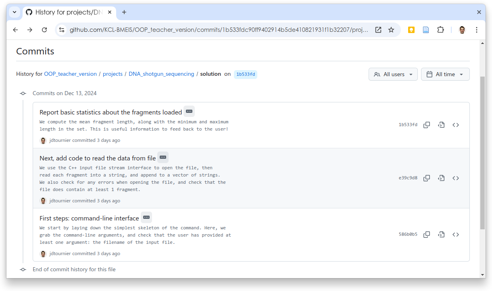
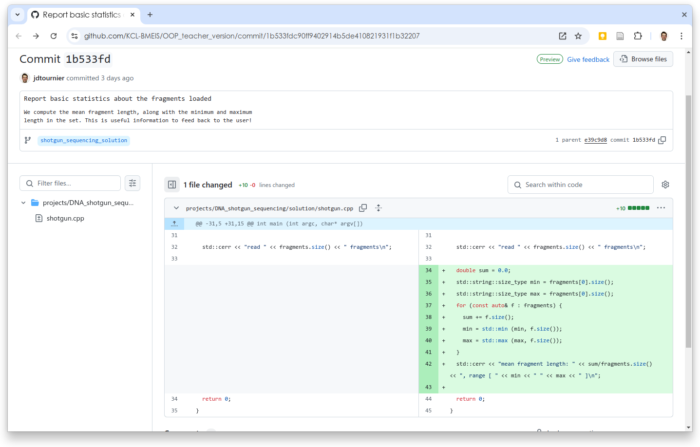

class: title

5CCYB041
# OBJECT-ORIENTED PROGRAMMING
### Week 1, session 2
## Starting our first project

---
name: shotgun

# Project: DNA shotgun sequencing

We will use a selection of short projects to illustrate the use of C++ in
various practical situations. 

The first of these projects will focus on sequencing DNA using the shotgun
sequencing approach. 

- [Please take a look at the project description by following this
link](https://github.com/KCL-BMEIS/OOP/blob/main/projects/DNA_shotgun_sequencing/assignment.md)

--
<br>

As you can see, there is a lot to do! Let's get started one step at a time...

When writing code, it's best to start from a simple working solution, and build
up from there. 

--
<br>

We'll begin by writing a simple `main()` function, make sure that compiles,
then add some basic command-line argument handling to make sure we have the
filename of the input file

---

# First step: set up a simple skeleton

**shotgun.cpp:**

```
#include <iostream>
#include <vector>
#include <string>
int main (int argc, char* argv[])
{
  std::vector<std::string> args (argv, argv+argc);
  if (args.size() < 2) {
    std::cerr << "ERROR: expected filename as first argument\n";
    return 1;
  }
  std::cerr << "reading fragments from file \"" << args[1] << "\"...\n";
  return 0;
}
```

--

Compile with:
```
$ g++ -std=c++20 shotgun.cpp -o shotgun
```

---

# Standard output or standard error?

When printing to the terminal, should be we print to `std::cout` or
`std::cerr`? 

- after all, both print to the terminal - what's the difference?

--

The reason there are two output streams is that these can be used as
independent inputs for other processes. 

One example of this is [shell
redirection](https://linuxconfig.org/introduction-to-bash-shell-redirections)
 
- we will learn more about this later in the course

--

It is therefore common to reserve _standard output_ (`std::cout`) for the
expected result of the program, and _standard error_ (`std::cerr`) for error
and progress reporting.

- In our skeleton code, we therefore use `std::cerr` for now, since all of the
  output we've produced so far are simple progress updates, rather than usable
  output as such.

---
name: stdin

# Standard input

All programs also have a *standard input* stream: `std::cin`.<br>
This can be used to received input from the terminal, for example:
```
  double value;
  std::cout << "Please enter a value: ";
  std::cin >> value;
```
---
name: stdin

# Standard input

All programs also have a *standard input* stream: `std::cin`.<br>
This can be used to received input from the terminal, for example:
```
  double value;
  std::cout << "Please enter a value: ";
* std::cin >> value;
```

This time, we use the extraction operator, `>>`

--

Standard input can be used to receive input from the user (via the terminal)
--
... but also from other files or programs (via
[redirection](https://tldp.org/LDP/intro-linux/html/sect_05_01.html))


--

In general, the best way to provide user input to a program is via the command-line 
- we do not recommend using `std::cin` to provide information such as
  filenames, etc.

--
You can use `std::cin` when:
- your program *needs* to interact with the user
- your program is designed to process data provided via `std::cin` (e.g. for use in [Unix pipes](https://www.geeksforgeeks.org/piping-in-unix-or-linux/))


---
name: file_io

class: section

# File input & output

## Using the C++ streams library

---

# Next step: load data from file

The next logical thing to do is add code to load some data. 

- We could work on other aspects of the code, but without data to apply them
  to, it will be difficult to test them

--

In C++, files are typically handled using the [*streams input/output
library*](https://www.geeksforgeeks.org/basic-input-output-c/)

--

There are two main classes that we can use:
- `std::ifstream` for inputs: this provides functionality to _read_ from a file
- `std::ofstream` for outputs: this provides functionality to _write_ to a file
--
- there is also the `std::fstream` class which provides both input and output
  functionality
  - rarely needed: most of the time, we need to read _or_ write, not both. 
--

These are declared in the `<fstream>` header. 

---

# Next step: load data from file


```
#include <iostream>
#include <vector>
#include <string>
*#include <fstream>

int main (int argc, char* argv[])
{
```

```
  std::cerr << "reading fragments from file \"" << args[1] << "\"...\n";

* std::ifstream infile (args[1]);
* if (!infile) {
*   std::cerr << "ERROR: failed to open file \"" << args[1] << "\" - aborting\n";
*   return 1;
* }

  return 0;
}
```

---

# Next step: load data from file


```
#include <iostream>
#include <vector>
#include <string>
*#include <fstream>

int main (int argc, char* argv[])
{
```

```
  std::cerr << "reading fragments from file \"" << args[1] << "\"...\n";

  std::ifstream infile (args[1]);
  if (!infile) {
    std::cerr << "ERROR: failed to open file \"" << args[1] << "\" - aborting\n";
    return 1;
  }

  return 0;
}
```

.explain-top[
To use the functionality, we first need to `#include` the header where it is declared
]


---

# Next step: load data from file


```
#include <iostream>
#include <vector>
#include <string>
#include <fstream>

int main (int argc, char* argv[])
{
```

```
  std::cerr << "reading fragments from file \"" << args[1] << "\"...\n";

* std::ifstream infile (args[1]);
  if (!infile) {
    std::cerr << "ERROR: failed to open file \"" << args[1] << "\" - aborting\n";
    return 1;
  }

  return 0;
}
```

.explain-top[
To read a file, we need to create a variable of type `std::ifstream`
- this is an instance of an _input file stream_

We call this variable `infile` 
- a name that will hopefully provide some insight into what its purpose will be. 

We immediately _construct_ this instance by giving it the name of the file
to open (`args[1]`). 
]


---

# Next step: load data from file


```
#include <iostream>
#include <vector>
#include <string>
#include <fstream>

int main (int argc, char* argv[])
{
```
```
  std::cerr << "reading fragments from file \"" << args[1] << "\"...\n";

  std::ifstream infile (args[1]);
* if (!infile) {
    std::cerr << "ERROR: failed to open file \"" << args[1] << "\" - aborting\n";
    return 1;
  }

  return 0;
}
```

.explain-top[
It is _always_ a good idea to check for errors when opening a file
- maybe the file doesn't exist, or the name is mis-spelled, or we do not have
  permissions to access the file

The simplest way to check for errors is to use the `std::ifstream` class' _not_ (`!`) operator 
- this is an example of _operator overloading_ (to be covered later in the
  course)
]


---

# Next step: load data from file


```
#include <iostream>
#include <vector>
#include <string>
#include <fstream>

int main (int argc, char* argv[])
{
```
```
  std::cerr << "reading fragments from file \"" << args[1] << "\"...\n";

  std::ifstream infile (args[1]);
  if (!infile) {
*   std::cerr << "ERROR: failed to open file \"" << args[1] << "\" - aborting\n";
*   return 1;
  }

  return 0;
}
```

.explain-top[
If an error is detected, it is good practice to:
- report as much information about the error as we can 
  - this will help anyone using our program (including ourselves!) figure out
    what went wrong
- interrupt execution of the program in some appropriate way 
  - unless there is some reasonable way to deal with the error
  - Here, the cleanest strategy is to return from `main()` with a non-zero exit
    code
]


---
name: exit_code

# Exit code

In computing, programs will always provide an [*exit
code*](https://en.wikipedia.org/wiki/Exit_status) when they terminate.

--

The exit code is used to report success or failure to other programs
- and sometimes (though rarely) the _reason_ for the failure 

--

We can query the exit code of the last command in the terminal using the
special shell variable `$?` - for example:
```
$ g++ -std=c++20 shotgun.cpp -o shotgun
$ ./shotgun bogus.txt
ERROR: failed to open file "bogus.txt" - aborting
$ echo $?
1
```

---

class: info

# Using exit code with the shell `&&` operator

We can already use these exit codes to make our lives a little bit easier:

We can instruct the shell to compile our code, and _if successful_, also run
the program we've just compiled. 

--

We can do this very easily using [the `&&` operator](https://medium.frnn.dev/understanding-and-in-linux-bash-navigating-command-sequences-like-a-pro-fe5e72489da1):
```
$ g++ -std=c++20 shotgun.cpp -o shotgun && ./shotgun bogus.txt
```

--

In the above, the `&&` operator means: run the command on the left, and if its exit
code is zero (success), run the command on the right

- since `g++` is a regular program, its exit code should also reflect
  successful execution

--
<br>

If needed, we can also use the `||` operator, with the opposite meaning:
- only run the second command if the first reports failure (non-zero exit code)

---
name: filesystem

class: section

# The filesystem

## Absolute & relative paths

---

# Specifying files on the command-line

When we invoke our command, how do we tell it where the file is _exactly_?

```
$ ./shotgun fragments-1.txt
ERROR: failed to open file "fragments-1.txt" - aborting
```

--

We know we have such a file in the `data/` folder, so how do we specify its
location?

--

To get this right, we need to understand these concepts:
- the [current working
  directory](https://en.wikipedia.org/wiki/Working_directory)
- [absolute and relative
  paths](https://www.geeksforgeeks.org/absolute-relative-pathnames-unix/)

--

Every program that runs has an associated **current working directory**
- it can be thought of as the folder within which the program is currently running
--

It can be queried using the `pwd` (print working directory) command
- It is also often shown in the *terminal prompt*

---

# Relative and absolute paths

When the program tries to open a file, the filename will be assumed *relative*
to the _current working directory_

--

For example, if we are currently in the
`/home/donald/OOP/projects/DNA_shotgun_sequencing` folder:
```
$ pwd
/home/donald/OOP/projects/DNA_shotgun_sequencing
```

--

and there is a file in the folder called `fragments.txt`:
```
$ ls
data/ fragments.txt  shotgun.cpp shotgun 
```

--

Then `fragments.txt` would be interpreted by
the operating system as equivalent to:
`/home/donald/OOP/projects/DNA_shotgun_sequencing/fragments.txt`


---

# Relative and absolute paths

In this example:

- `fragments.txt` is a *relative path*
  - it is relative to the _current working directory_

- `/home/donald/OOP/projects/DNA_shotgun_sequencing/fragments.txt` is an
  *absolute path*
  - it is fully specified, _irrespective_ of the current working directory
  - on Unix systems, an absolute path starts with a forward slash (`/`): the
    _root_ of the _filesystem_


--

But what if the file is in a different folder from the current working
directory?

---

# Relative and absolute paths

Let's say we are currently in the folder:<br>
`/home/donald/OOP/projects/DNA_shotgun_sequencing/solution`
```
$ pwd
/home/donald/OOP/projects/DNA_shotgun_sequencing/solution
```

--

and the file we wish to load is in the folder:<br>
`/home/donald/OOP/projects/DNA_shotgun_sequencing/data`

--

Remember that the special folder `..` corresponds to the current folder's
parent folder!

--

We can still access the file using the *relative path* `../data/`
```
$ ls ../data/
fragments-1.txt          fragments-2.txt         fragments-3.txt
```

---

# Specifying files on the command-line

Therefore, we can run our command using a *relative path* to the neighbouring
folder as follows:
```
$ ./shotgun ../data/fragments-1.txt
```
--

.note[
For more detail about this, please take a look through the relevant section of
our [Introduction to the Unix
command-line](https://command-line-tutorial.readthedocs.io/paths.html)]

--
<br>

Putting it all together, we can write the full compile and run command as:
```
$ g++ -std=c++20 shotgun.cpp -o shotgun && ./shotgun ../data/fragments-1.txt
```

--

The next time we need to run it, we can simply retrieve it from the command
history with the Up arrow, and hit Enter to run it again!


---
name: file_io_2

class: section

# File input & output

## Back to loading data

---

# Next step: load data from file

Now we have a `std::ifstream` open and ready to read from, we can use the same
interface as we have already used with `std::cout` and `std::cerr`:

--

```
  ...

  std::ifstream infile (args[1]);
  if (!infile) {
    std::cerr << "ERROR: failed to open file \"" << args[1] << "\" - aborting\n";
    return 1;
  }

* std::string frag;
* infile >> frag;

  return 0;
}
```

---

# Next step: load data from file

Now we have a `std::ifstream` open and ready to read from, we can use the same
interface as we have already used with `std::cout` and `std::cerr`:

```
  ...

  std::ifstream infile (args[1]);
  if (!infile) {
    std::cerr << "ERROR: failed to open file \"" << args[1] << "\" - aborting\n";
    return 1;
  }

* std::string frag;
  infile >> frag;

  return 0;
}
```

.explain-top[
Here, we create an _instance_ of `std::string`, and call this variable `frag`
- this will hold the value of the string we are about to read from file
]

---

# Next step: load data from file

Now we have a `std::ifstream` open and ready to read from, we can use the same
interface as we have already used with `std::cout` and `std::cerr`:

```
  ...

  std::ifstream infile (args[1]);
  if (!infile) {
    std::cerr << "ERROR: failed to open file \"" << args[1] << "\" - aborting\n";
    return 1;
  }

  std::string frag;
* infile >> frag;

  return 0;
}
```

.explain-top[
Next, we use the extraction operator (`>>`) to read the first string from the
file into our variable `frag`
- like we did with `std::cin`
]

---

# Next step: load data from file

But we need to read more than one string from the file. To do this, we are
going to read the data into a *vector* of strings

--

```
  ...

  std::ifstream infile (args[1]);
  if (!infile) {
    std::cerr << "ERROR: failed to open file \"" << args[1] << "\" - aborting\n";
    return 1;
  }

  std::string frag;
* std::vector<std::string> fragments;
* while (infile >> frag)
*   fragments.push_back (frag);

  return 0;
}
```

---

# Next step: load data from file

But we need to read more than one string from the file. To do this, we are
going to read the data into a vector of strings

```
  ...

  std::ifstream infile (args[1]);
  if (!infile) {
    std::cerr << "ERROR: failed to open file \"" << args[1] << "\" - aborting\n";
    return 1;
  }

  std::string frag;
* std::vector<std::string> fragments;
  while (infile >> frag)
    fragments.push_back (frag);

  return 0;
}
```

.explain-bottom[
We start by defining a new variable of type `std::vector<std::string>`, called
`fragments`
]

---

# Next step: load data from file

But we need to read more than one string from the file. To do this, we are
going to read the data into a vector of strings

```
  ...

  std::ifstream infile (args[1]);
  if (!infile) {
    std::cerr << "ERROR: failed to open file \"" << args[1] << "\" - aborting\n";
    return 1;
  }

  std::string frag;
  std::vector<std::string> fragments;
* while (infile >> frag)
    fragments.push_back (frag);

  return 0;
}
```

.explain-middle[
We then use a `while` loop to keep reading from the input file stream until the
stream reports `false`
- this should signify the end-of-file
]

---

# Next step: load data from file

But we need to read more than one string from the file. To do this, we are
going to read the data into a vector of strings

```
  ...

  std::ifstream infile (args[1]);
  if (!infile) {
    std::cerr << "ERROR: failed to open file \"" << args[1] << "\" - aborting\n";
    return 1;
  }

  std::string frag;
  std::vector<std::string> fragments;
  while (infile >> frag)
*   fragments.push_back (frag);

  return 0;
}
```

.explain-middle[
Every time we successfully read a string from the input file, we append it to
our vector of strings (`fragments`) using the `.push_back()` method.
]

---

# More about `std::ifstream`

The `std::ifstream` class provides a lot more functionality, most of which we
will not cover in this course. However, the methods below are commonly used:

- `.open(const std::string& filename)`: open the file specified in `filename`.
  This is useful when declaring a `std::ifstream` variable with no filename,
  with a view to actually opening the file later, e.g.:
  ```
  std::ifstream infile;
  ...
  infile.open (filename);
  ```

- `.is_open()`: check whether the file is open and ready for reading

- `.close()`: close the file once we are done reading. Note that we rarely need
  to invoke this method explicitly since it will be invoked automatically when
  the `infile` variable is destroyed (goes out of scope).


---
name: reporting

class: section

# Progress and error reporting

## How to keep track of what's going on

---

# Add more error checking and reporting

It is _always_ a good idea to check for errors where relevant. Here, we can
check that the vector of fragments that we just loaded contains at least one
entry, and report the number of fragments loaded

--

.explain-bottom[
Exercise: modify your code to do this. 
]

---

# Add more error checking and reporting

Possible solution:

```
  std::string frag;
  std::vector<std::string> fragments;
  while (infile >> frag)
    fragments.push_back (frag);

* if (fragments.empty()) {
*   std::cerr << "ERROR: file \"" << args[1] 
*             << "\" contains no fragments - aborting\n";
*   return 1;
* }
*
* std::cerr << "read " << fragments.size() << " fragments\n";

  return 0;
}
```

---


# Report basic statistics about the data

Now that we have code to load the data, we can run it and check that it works:

```
$ g++ -std=c++20 shotgun.cpp -o shotgun && ./shotgun ../data/fragments-1.txt
reading fragments from file "../data/fragments-1.txt"...
read 190 fragments
```

--

But how do we know we read the data correctly?

--

We can print out the first few fragments, and check they match what we see in
the file. 

--

We can also report basic statistics about the data, such as mean, minimum and
maximum fragment size

--

.explain-bottom[
Exercise: implementing the changes required to do this
]

---

# Report basic statistics about the data

Possible solution:
```
  ...

  std::cerr << "read " << fragments.size() << " fragments\n";

* double sum = 0.0;
* std::string::size_type min = fragments[0].size();
* std::string::size_type max = fragments[0].size();
* for (const auto& f : fragments) {
*   sum += f.size();
*   min = std::min (min, f.size());
*   max = std::max (max, f.size());
* }
* std::cerr << "mean fragment length: " << sum/fragments.size() 
*           << ", range [ " << min << " " << max << " ]\n";

  return 0;
}
```

---

# Report basic statistics about the data

Possible solution:
```
  ...

  std::cerr << "read " << fragments.size() << " fragments\n";

  double sum = 0.0;
  std::string::size_type min = fragments[0].size();
  std::string::size_type max = fragments[0].size();
  for (const auto& f : fragments) {
    sum += f.size();
*   min = std::min (min, f.size());
*   max = std::max (max, f.size());
  }
  std::cerr << "mean fragment length: " << sum/fragments.size() 
            << ", range [ " << min << " " << max << " ]\n";

  return 0;
}
```

.explain-top[
Note the use of the `std::min()` and `std::max()` functions
- these return the minimum or maximum (respectively) value of the two arguments
  provided

These are part of the C++ Standard Template Library (STL)
- the STL provides a lot of functionality, but we can only cover
  a fraction of it in this course. 
]


---

# Report basic statistics about the data

Possible solution:
```
  ...

  std::cerr << "read " << fragments.size() << " fragments\n";

  double sum = 0.0;
  std::string::size_type min = fragments[0].size();
  std::string::size_type max = fragments[0].size();
  for (`const auto& f` : fragments) {
    sum += f.size();
    min = std::min (min, f.size());
    max = std::max (max, f.size());
  }
  std::cerr << "mean fragment length: " << sum/fragments.size() 
            << ", range [ " << min << " " << max << " ]\n";

  return 0;
}
```

.explain-bottom[
Note also the use of a _const reference_ to an `auto` variable (whose type is
deduced by the compiler from the context). 
]


---
name: reference

# References in C++

A *reference* in C++ is essentially another name for an existing variable. 

It is declared by adding an ampersand (`&`) after the type, and before the name
of the variable:
```
data_type& ref_name = variable;
```

--

A reference must be initialised at the same time as it is declared
- we cannot change which variable it refers to later!

--

This is useful in situations where:
- making a copy of the variable is potentially (computationally) expensive
- we want to pass a reference to a variable so that it can be modified in other parts
  of the code (more on that later)

--

*Const references* are most useful to avoid needlessly copying variables, while
still providing guarantees that the original variable(s) will *not be modified*

---

# *Const* references in C++

In our `for` loop example, we could have written:
```
  for (auto f : fragments) {
```
--

In this case, the compiler would have deduced the type of `f` as `std::string`
- each iteration would entail copying the contents of the current element of
  `fragments` into `f` &#10060; 
--
- any modifications made to `f` within the loop would be guaranteed to have no
  effect on the original &#9989; 

--


Instead, we wrote:
```
  for (const auto& f : fragments) {
```
In this case, the compiler deduces the type of `f` as `const std::string&` &ndash; a *const reference* to a
`std::string`
- no copies will be made &#9989;
- any attempt at modifying `f` will lead to a compiler error &#9989; 


---
name: project_repo

class: section

# The project repository

---

# Accessing current version of project code

Throughout the course, we will be gradually merging the code for our solutions
to the course repository. 

You will find the most up to date version in the project's `solution/` folder. 
- [click here](https://github.com/KCL-BMEIS/OOP/tree/shotgun_sequencing_solution/projects/DNA_shotgun_sequencing/solution)
  for the DNA shotgun sequencing project

--
<br>

You can also inspect [the *history* of the changes](https://github.com/KCL-BMEIS/OOP/commits/shotgun_sequencing_solution/projects/DNA_shotgun_sequencing/solution) by clicking on the *History*
button 


---

# Version history



---

# Changes made in a specific *commit*



---

class: section

# Back to the project

---

# Next step: identify the longest fragment

Now that we have the data loaded, the next step is to figure out which fragment
is the longest. 

--

.explain-bottom[
Exercise: modify your code to do this
]

---

# Next step: identify the longest fragment

Possible solution (there are many others!):

```
  ...

  unsigned int size_of_longest = 0;
  unsigned int index_of_longest = 0;
  for (unsigned int n = 0; n < fragments.size(); ++n) {
    if (fragments[n].size() > size_of_longest) {
      index_of_longest = n;
      size_of_longest = fragments[n].size();
    }
  }
  std::string sequence = fragments[index_of_longest];
  std::cerr << "initial sequence has size " << sequence.size() << "\n";

  return 0;
}
```

---

# Next step: write out output DNA sequence

Although we don't yet have code to stitch the full sequence back together, we
will need the ability to write out the results while we are working on the code
- we will need to inspect what our code has produced!

--

We can simply print out the result to the terminal via *standard output*
(`std::cout`)
- if necessary, we can
  [*redirect*](https://www.gnu.org/software/bash/manual/html_node/Redirections.html) the output to a file of our choice:
  ```
  $ ./shotgun ../data/fragments-no-reserve-1.txt > out.txt
  ```

--

But there is little point in printing the full sequence to terminal, as it
will be far too long for us to make sense of, and produce far too much output
for us to process

The best thing to do is to write the output sequence to file, using the
`std::ofstream` class
- we will need to provide a second command-line argument to specify the output
  filename

--

.explain-bottom[
Exercise: modify your code to do this
]

---

# Next step: write out output DNA sequence

```
* if (args.size() < 3) {
*   std::cerr << "ERROR: expected 2 arguments: input_fragments output_sequence\n";
    return 1;
  }
```
```
* std::cerr << "writing sequence to file \"" << args[2] << "\"...\n";
* std::ofstream outfile (args[2]);
* if (!outfile) {
*   std::cerr << "ERROR: failed to open output file \"" 
*             << args[2] << "\" - aborting\n";
*   return 1;
* }
* outfile << sequence << "\n";
* if (!outfile) {
*   std::cerr << "ERROR: error occurred while writing to output file \"" 
*             << args[2] << "\" - aborting\n";
*   return 1;
* }
```

---

# The full program so far

```
#include <iostream>
#include <vector>
#include <string>
#include <fstream>

int main (int argc, char* argv[])
{
  std::vector<std::string> args (argv, argv+argc);

  if (args.size() < 3) {
    std::cerr << "ERROR: expected 2 arguments: input_fragments output_sequence\n";
    return 1;
  }
  std::cerr << "reading fragments from file \"" << args[1] << "\"...\n";

  std::ifstream infile (args[1]);
  if (!infile) {
    std::cerr << "ERROR: failed to open file \"" << args[1] << "\" - aborting\n";
    return 1;
  }

  std::vector<std::string> fragments;
  std::string frag;
  while (infile >> frag)
    fragments.push_back (frag);

  if (fragments.empty()) {
    std::cerr << "ERROR: file \"" << args[1] 
              << "\" contains no fragments - aborting\n";
    return 1;
  }

  std::cerr << "read " << fragments.size() << " fragments\n";

  double sum = 0.0;
  std::string::size_type min = fragments[0].size();
  std::string::size_type max = fragments[0].size();
  for (const auto& f : fragments) {
    sum += f.size();
    min = std::min (min, f.size());
    max = std::max (max, f.size());
  }
  std::cerr << "mean fragment length: " << sum/fragments.size() 
            << ", range [ " << min << " " << max << " ]\n";


  unsigned int size_of_longest = 0;
  unsigned int index_of_longest = 0;
  for (unsigned int n = 0; n < fragments.size(); ++n) {
    if (fragments[n].size() > size_of_longest) {
      index_of_longest = n;
      size_of_longest = fragments[n].size();
    }
  }
  std::string sequence = fragments[index_of_longest];
  std::cerr << "initial sequence has size " << sequence.size() << "\n";


  std::cerr << "writing sequence to file \"" << args[2] << "\"...\n";
  std::ofstream outfile (args[2]);
  if (!outfile) {
    std::cerr << "ERROR: failed to open output file \"" 
              << args[2] << "\" - aborting\n";
    return 1;
  }
  outfile << sequence << "\n";
  if (!outfile) {
    std::cerr << "ERROR: error occurred while writing to output file \"" 
              << args[2] << "\" - aborting\n";
    return 1;
  }

  return 0;
}
```
--

.explain-top[
It's getting a bit too long and difficult to follow &ndash; we need to organise
it better!
]

---
name: functions

class: section

# Functions

## How to keep code organised

---

# Functions

One way to organise our code is via *functions*

They provide a way to
- **break up the code** into smaller sections that are easier to manage and reason
  about
- **reuse code** in different places
- **reduce maintenance** by ensuring any changes are made only once in the relevant
  function
- **make the code more readable** by using descriptive names for our functions

--

We can use functions to break up the functionality in our program into distinct responsibilities, for example:
- load the data
- compute and provide statistics
- identify longest fragment
- write out the data

---

# Function declaration

In C++, functions are *declared* using this type of syntax:
```
return_type function_name (arg_type1 arg1, arg_type2 arg2, ...);
```

---

# Function declaration

In C++, functions are *declared* using this type of syntax:
```
`return_type` function_name (arg_type1 arg1, arg_type2 arg2, ...);
```

- `return_type`: the type of the variable returned by the function. 
  - In C & C++, functions can return one variable of a type of our choosing. 
  - This could be a simple `int`, or a more complex `std::vector<std::string>`

---

# Function declaration

In C++, functions are *declared* using this type of syntax:
```
return_type `function_name` (arg_type1 arg1, arg_type2 arg2, ...);
```

- `return_type`: the type of the variable returned by the function. 
  - In C & C++, functions can return one variable of a type of our choosing. 
  - This could be a simple `int`, or a more complex `std::vector<std::string>`
- `function_name`: the name that we wish to give to our function. Valid
  characters include all letters (lowercase or uppercase), numbers, and the
  underscore (`_`). 
  - function names cannot start with a number
  - function names should not start with an underscore, as this is reserved for
    internal use by the C++ standard
  - different naming conventions are in use for different projects. In this
    course, we will tend to use so-called 
    [`snake_case`](https://www.freecodecamp.org/news/snake-case-vs-camel-case-vs-pascal-case-vs-kebab-case-whats-the-difference/)
    (lowercase, with words separated by underscores). In general, use whichever
    convention is used by the project you are working on.
  - make sure to use a *descriptive* name! The name should always reflect what
    the function does 

---

# Function declaration

In C++, functions are *declared* using this type of syntax:
```
return_type function_name (`arg_type1 arg1`, arg_type2 arg2, ...);
```

- `return_type`: the type of the variable returned by the function. 
  - In C & C++, functions can return one variable of a type of our choosing. 
  - This could be a simple `int`, or a more complex `std::vector<std::string>`
- `function_name`: the name that we wish to give to our function. Valid
  characters include all letters (lowercase or uppercase), numbers, and the
  underscore (`_`). 
  - function names cannot start with a number
  - function names should not start with an underscore, as this is reserved for
    internal use by the C++ standard
  - different naming conventions are in use for different projects. In this
    course, we will tend to use so-called
    [`snake_case`](https://www.freecodecamp.org/news/snake-case-vs-camel-case-vs-pascal-case-vs-kebab-case-whats-the-difference/)
    (lowercase, with words separated by underscores). In general, use whichever
    convention is used by the project you are working on.
  - make sure to use a *descriptive* name! The name should always reflect what
    the function does 
- `arg_typeN argN`: any arguments that should be passed to the function, including
  their type, and what the corresponding variable will be called within your
  function. 
  - Note that functions can (and often do) have no arguments.

---

# Function definition

The function *declaration* is also often called the *function prototype*. 

It provides the minimum information required to *use* the
function:
- name of function
- argument number and types
- return type

--

The function *definition* is also often called the *function implementation* or
*function body*
- it consists of the statements to be executed when the function is invoked
- these statements are enclosed within a *block*, delimited with *braces*
  (`{}`)

--

The definition can be provided at the point of declaration, but is often
provided elsewhere
- in this case, the definition needs to provide the matching declaration to
  ensure the compiler can unequivocally match the declaration with its matching
definition
- we will cover this later in the course

---

# Our first function: loading the data

Let's set up our first function to load the data from the file, given its
filename

- We'll call it `load_fragments ()`
--
- It will only require a single argument: the name of the file
--
- It will return a vector of strings containing the fragments loaded from the
  file

--

The function *declaration* could therefore be:
```
std::vector<std::string> load_fragments (std::string filename);
```
--

In practice however, we would typically expect the `filename` to be passed by *const
reference*

```
std::vector<std::string> load_fragments (const std::string& filename);
```
--
This is because in C++, function arguments are passed *by copy*
-  passing a lightweight reference can be much more efficient than passing a
   full copy
- marking the reference as `const` provides a compiler-enforced guarantee that
  the function will not modify the original variable.

---

# Our first function: loading the data

Let's get started on the function *definition*:
```
std::vector<std::string> load_fragments (const std::string& filename)
{
  std::vector<std::string> fragments;

  ...

  return fragments;
}
```


---

# Our first function: loading the data

Let's get started on the function definition:
```
*std::vector<std::string> load_fragments (const std::string& filename)
{
  std::vector<std::string> fragments;

  ...

  return fragments;
}
```

- The definition start with the full declaration


---

# Our first function: loading the data

Let's get started on the function definition:
```
std::vector<std::string> load_fragments (const std::string& filename)
*{
  std::vector<std::string> fragments;

  ...

  return fragments;
*}
```

- The definition start with the full declaration
- The body of the function is enclosed within *braces*

---

# Our first function: loading the data

Let's get started on the function definition:
```
std::vector<std::string> load_fragments (const std::string& filename)
{
  std::vector<std::string> fragments;

  ...

* return fragments;
}
```

- The definition start with the full declaration
- The body of the function is enclosed within *braces*
- The `return` statement marks the end of the function, where the return value is
  provided back to the invoking code


---

# Our first function: loading the data

Let's get started on the function definition:
```
std::vector<std::string> load_fragments (const std::string& filename)
{
* std::vector<std::string> fragments;

  ...

  return fragments;
}
```

- The definition start with the full declaration
- The body of the function is enclosed within *braces*
- The `return` statement marks the end of the function, where the return value is
  provided back to the invoking code
- To be able to return our vector of fragments, we need to declare a *local
  variable* to hold the data while in the function, which can then be returned


---

# Our first function: loading the data

Let's fill in the body of the function:

```
std::vector<std::string> load_fragments (const std::string& filename)
{
  std::vector<std::string> fragments;

  std::ifstream infile (filename);

  std::string frag;
  while (infile >> frag)
    fragments.push_back (frag);

  return fragments;
}
```

This is essentially what we already had in our `main()` function

--

Note that the above is a very short version of this function
- in practice, we would also have progress reporting and error handling (full
  version on next slide)


---


```
std::vector<std::string> load_fragments (const std::string& filename)
{
* std::cerr << "reading fragments from file \"" << filename << "\"...\n";
  std::vector<std::string> fragments;

  std::ifstream infile (filename);
* if (!infile) {
*   std::cerr << "ERROR: failed to open file \"" << filename << "\" - aborting\n";
*   std::exit (1);
* }

  std::string frag;
  while (infile >> frag)
    fragments.push_back (frag);

* if (fragments.empty()) {
*   std::cerr << "ERROR: file \"" << filename 
*             << "\" contains no fragments - aborting\n";
*   std::exit (1);
* }

* std::cerr << "read " << fragments.size() << " fragments\n";

  return fragments;
}
```

--

.explain-bottom[
Note the use of `std::exit()` instead of `return` here. Previously, we could
just return from `main()`, and this would end the program. However, we are no
longer in `main()`, and returning from this function will not end the program. 

<br>
Using `std::exit()` will terminate the program immediately, but is not ideal.
We will introduce better ways to handle errors using exceptions later in the
course.
]

---

# Using functions

Now that we have defined our function, we can use it elsewhere in our code

For this, we need to ensure the function has been *declared* before the point
of use
- if we want to use our new function within our `main()` function, we need to
  add the declaration *before* `main()`

--
```
#include <iostream>
#include <vector>
#include <string>
#include <fstream>

*std::vector<std::string> load_fragments (const std::string& filename)
*{
* ... 
*}

int main (int argc, char* argv[])
{
  ...
```

---

# Using functions

We can now use our function within `main()`

```
...

int main (int argc, char* argv[])
{
  std::vector<std::string> args (argv, argv+argc);
  if (args.size() < 3) {
    std::cerr << "ERROR: expected 2 arguments: input_fragments output_sequence\n";
    return 1;
  }
  
* auto fragments = load_fragments (argv[1]);

  double sum = 0.0;
  std::string::size_type min = fragments[0].size();
  std::string::size_type max = fragments[0].size();
  for (const auto& f : fragments) {
    ...
```


--

.explain-bottom[
Exercise: modify your code to do this
]

---

# The `void` return type

Sometimes we don't need to return anything from our function

In this case, we can specify `void` as the return type

In this case, we don't need to explicitly `return` from our function
- we can simply reach the end of the function block
- nonetheless, if we need to return early, we can do this with a simple `return;`


--

.explain-bottom[
Exercise: add functions to your code to:
- report basic statistics about the fragments
- write out the final sequence
]


---

# Function to report basic statistics

```
void fragment_statistics (const std::vector<std::string>& fragments)
{
  double sum = 0.0;
  std::string::size_type min = fragments[0].size();
  std::string::size_type max = fragments[0].size();

  for (const auto& f : fragments) {
    sum += f.size();
    min = std::min (min, f.size());
    max = std::max (max, f.size());
  }

  std::cerr << "mean fragment length: " << sum/fragments.size() 
            << ", range [ " << min << " " << max << " ]\n";
}
```


---

# Function to write out final sequence

```
void write_sequence (const std::string& filename, const std::string& sequence)
{
  std::cerr << "writing sequence to file \"" << filename << "\"...\n";
  std::ofstream outfile (filename);
  if (!outfile) {
    std::cerr << "ERROR: failed to open output file \"" 
              << filename << "\" - aborting\n";
    std::exit (1);
  }

  outfile << sequence << "\n";

  if (!outfile) {
    std::cerr << "ERROR: error occurred while writing to output file \"" 
              << filename << "\" - aborting\n";
    std::exit (1);
  }
}

```

---

```
int main (int argc, char* argv[])
{
  std::vector<std::string> args (argv, argv+argc);
  if (args.size() < 3) {
    std::cerr << "ERROR: expected 2 arguments: input_fragments output_sequence\n";
    return 1;
  }

* auto fragments = load_fragments (args[1]);
* fragment_statistics (fragments);

  unsigned int size_of_longest = 0;
  unsigned int index_of_longest = 0;
  for (unsigned int n = 0; n < fragments.size(); ++n) {
    if (fragments[n].size() > size_of_longest) {
      index_of_longest = n;
      size_of_longest = fragments[n].size();
    }
  }
  std::string sequence = fragments[index_of_longest];
  std::cerr << "initial sequence has size " << sequence.size() << "\n";

* write_sequence (args[2], sequence);
  return 0;
}
```

---
class: section
name: exercises

# Exercises


---

# Exercise 1

Write a program to display all the prime numbers up to a user-provided maximum.
Use any prime-finding algorithm you wish.  

Add an option to your program so that when the user specifies a filename as the
second argument, the list of primes is written to the file instead of to the
terminal.

---

# Exercise 2

Run-Length Encoding (RLE) is a basic compression technique where _runs_ of the
same value occuring consecutively are replaced by the value and the
_run-length_. For example, the string `abbcccabdddd` would be represented as `a
1 b 2 c 3 a 1 b 1 c 4`. 

1. Write a program that takes two filenames as input, reads the contents of the
  first filename, applies run-length encoding, and writes the result to the
second filename.  

2. Modify the program to instead decode the input file, i.e. apply run-length decoding.  

3. Modify the program to have a third argument that specifies whether it should
   encode or decode. Check that encoding then decoding a file produces the
   original input.  

<br>
.note[
Hint: it will be useful to structure your code into functions as you go, to
keep the encode function available for part 3.]
