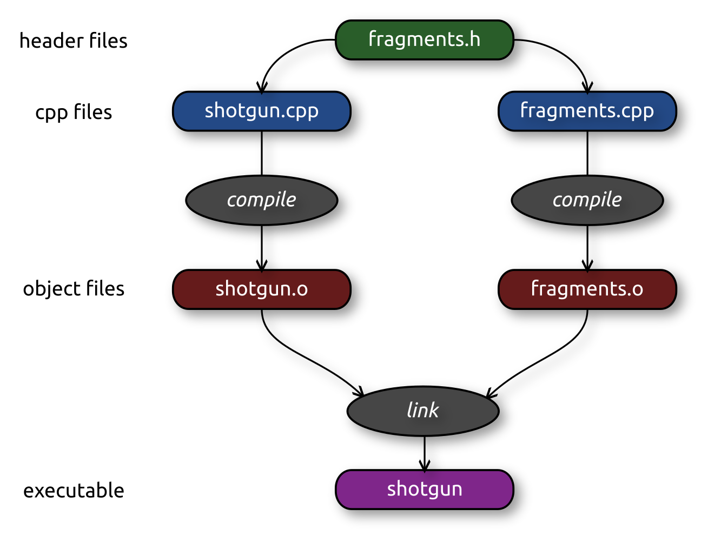

class: title

5CCYB041
# OBJECT-ORIENTED PROGRAMMING
### Week 2, session 1
## Multi-file projects, error handling

---

# Picking up where we left off

Last week, we had started working on our [DNA shotgun sequencing
project](https://github.com/KCL-BMEIS/OOP/blob/main/projects/DNA_shotgun_sequencing/assignment.md)

You can find the most up to date version in [the project's `solution/`
folder](https://github.com/KCL-BMEIS/OOP/tree/shotgun_sequencing_solution/projects/DNA_shotgun_sequencing/solution)

.explain-bottom[
Make sure your code is up to date now!
]


---
name: multifile

class: section

# Multi-file projects

---

# Splitting projects over multiple files

We've barely started on our project, and our `.cpp` file is already ~100 lines
- it will grow and eventually become difficult to manage

--

In practice, C++ projects are spread over many files
- it helps to keep our code logically organised
- it keeps each individual file small enough to manage
- it allows for incremental and/or parallel compilation
- it allows for code re-use

--

Of these, the last two points are probably the most important!

---

# Splitting projects over multiple files

In C & C++, we can use the `#include` directive to import another file into our
current code

--

Files designed to be `#include`d in this way are called *header files*
- they typically have the `.h` extension (though `.hpp`, `.H` are also sometimes
  used)

--

We have already imported such header files in our project:
- `<iostream>`
- `<fstream>`
- `<string>`
- `<vector>`
- ...

--

These are *system headers*, provided as part of the standard C++ library
- C++ standard system headers do not have the `.h` extension
- They should be `#include`d within *angled brackets*, e.g.: 
  ```
  #include <iostream>
  ```

---

# Splitting projects over multiple files

We can write our own header files, and request they be included in some other
file in the same way. 

--

To illustrate how this works, we create a new *header file* called
`fragments.h`
- this will contain the *declarations* of our functions

--
We will also need a corresponding `fragments.cpp` file
- this will contain the matching *definitions* for our functions

--
We will then `#include` our header in our main `shotgun.cpp` file, but this
time using *inverted commas*, and with the `.h` extension:
```
#include "fragments.h"
```

--

Make sure to always use angled brackets (`<>`) for system headers, and inverted commas (`""`) for
your own project headers ([as recommended
here](https://gcc.gnu.org/onlinedocs/cpp/Include-Syntax.html), for example)

---

# Splitting projects over multiple files

This is what our `fragments.h` file should look like:

```
#pragma once

#include <vector>
#include <string>

std::vector<std::string> load_fragments (const std::string& filename);

void fragment_statistics (const std::vector<std::string>& fragments);

void write_sequence (const std::string& filename, const std::string& sequence);
```


---

# Splitting projects over multiple files

This is what our `fragments.h` file should look like:

```
*#pragma once

#include <vector>
#include <string>

std::vector<std::string> load_fragments (const std::string& filename);

void fragment_statistics (const std::vector<std::string>& fragments);

void write_sequence (const std::string& filename, const std::string& sequence);
```


.explain-bottom[
The `#pragam once` preprocessor directive ensures that our header file will
only be included once. We will cover this in more detail shortly.
]


---

# Splitting projects over multiple files

This is what our `fragments.h` file should look like:

```
#pragma once

*#include <vector>
*#include <string>

std::vector<std::string> load_fragments (const std::string& filename);

void fragment_statistics (const std::vector<std::string>& fragments);

void write_sequence (const std::string& filename, const std::string& sequence);
```

.explain-bottom[
Our header should `#include` any headers required to make sense of
the code in our header

<br>
Here, we need to make sure the compiler knows about `std::string` and
`std::vector` &ndash; so the corresponding system headers both need to be
`#include`d 
]

---

# Splitting projects over multiple files

This is what our `fragments.h` file should look like:

```
#pragma once

#include <vector>
#include <string>

*std::vector<std::string> load_fragments (const std::string& filename);
*
*void fragment_statistics (const std::vector<std::string>& fragments);
*
*void write_sequence (const std::string& filename, const std::string& sequence);
```


.explain-bottom[
Next, we list our function *declarations*. Note that we do not include the full
*definitions* (function body) here &ndash; they will go in the corresponding
`.cpp` file
]


---

# Splitting projects over multiple files

This is what our `fragments.cpp` file should look like:
```
#include <iostream>
#include <fstream>
#include <vector>
#include <string>

#include "fragments.h"

std::vector<std::string> load_fragments (const std::string& filename)
{ ...
}

void fragment_statistics (const std::vector<std::string>& fragments)
{ ...
}

void write_sequence (const std::string& filename, const std::string& sequence)
{ ...
}
```

---

# Splitting projects over multiple files

This is what our `fragments.cpp` file should look like:
```
*#include <iostream>
*#include <fstream>
*#include <vector>
*#include <string>

#include "fragments.h"

std::vector<std::string> load_fragments (const std::string& filename)
{ ...
}

void fragment_statistics (const std::vector<std::string>& fragments)
{ ...
}

void write_sequence (const std::string& filename, const std::string& sequence)
{ ...
}
```

.explain-bottom[
As for the main `shotgun.cpp` file, we start by `#include`ing the system headers
needed for our code
]

---

# Splitting projects over multiple files

This is what our `fragments.cpp` file should look like:
```
#include <iostream>
#include <fstream>
#include <vector>
#include <string>

*#include "fragments.h"

std::vector<std::string> load_fragments (const std::string& filename)
{ ...
}

void fragment_statistics (const std::vector<std::string>& fragments)
{ ...
}

void write_sequence (const std::string& filename, const std::string& sequence)
{ ...
}
```

.explain-bottom[
We can then `#include` the matching header for our code file &ndash; and indeed
any other header that we may have written that our code might need. 
]

---

# Splitting projects over multiple files

This is what our `fragments.cpp` file should look like:
```
#include <iostream>
#include <fstream>
#include <vector>
#include <string>

#include "fragments.h"

*std::vector<std::string> load_fragments (const std::string& filename)
*{ ...
*}
*
*void fragment_statistics (const std::vector<std::string>& fragments)
*{ ...
*}
*
*void write_sequence (const std::string& filename, const std::string& sequence)
*{ ...
*}
```

.explain-bottom[
We can then insert the full *definitions* for our functions (the actual
contents have been omitted here for brevity). 

<br>
The definitions need to match the declarations in the header file *exactly*
&ndash; otherwise the compiler may throw an error, or assume you are defining
a different function altogether.
]


---

# Splitting projects over multiple files

Finally, this is what our main `shotgun.cpp` file should look like:
```
#include <iostream>
#include <vector>
#include <string>

#include "fragments.h"

int main (int argc, char* argv[])
{
  std::vector<std::string> args (argv, argv+argc);

  ...

  return 0;
}
```

---

# Splitting projects over multiple files

Finally, this is what our main `shotgun.cpp` file should look like:
```
#include <iostream>
#include <vector>
#include <string>

*#include "fragments.h"

int main (int argc, char* argv[])
{
  std::vector<std::string> args (argv, argv+argc);

  ...

  return 0;
}
```

.explain-bottom[
We can replace all the function definitions we had previously with a single
`#include` statement!
]

---

# Splitting projects over multiple files

So we now have a project split over 3 files:

- `shotgun.cpp` 
  - `#include "fragments.h"`
  - contains our `main()` function
  - uses functions declared in `fragments.h`

- `fragments.h` 
  - contains the *declarations* for the functions used in `main()`

- `fragments.cpp` 
  - `#include "fragments.h"`
  - contains the *definitions* for the functions declared in
  `fragments.h`

--

How do we compile this project?


---
name: multifile_build

class: info

# Building a multi-file project

We could compile everything in one go:
```
$ g++ -std=c++20 shotgun.cpp fragments.cpp -o shotgun
```
--

That works, but it negates the benefits of incremental or parallel builds

--
What is normally done is:

- *compile* each `.cpp` file independently into an intermediate file format
  called an *object file*
  - these contain the functions and symbols defined in our `.cpp` file
    translated into machine (binary) code

- *link* the resulting object files together to generate the final *executable*
  - this resolves all the references to different functions, and makes sure
    they can all be found for inclusion into the final executable
  - at this stage, we may also link our code with external (static or
    dynamic) libraries (we will not cover this in great detail, interested
    readers can [read up on this 
online](https://www.geeksforgeeks.org/static-and-dynamic-linking-in-operating-systems/))


---

class: info

## The compile & link process




---

class: info

# Commands to compile & link

Compile:
```
$ g++ -std=c++20 -c shotgun.cpp -o shotgun.o
$ g++ -std=c++20 -c fragments.cpp -o fragments.o
```

Link:
```
$ g++ shotgun.o fragments.o -o shotgun
```

---

class: info

# Commands to compile & link

Compile:
```
$ g++ -std=c++20 `-c` shotgun.cpp -o shotgun.o
$ g++ -std=c++20 `-c` fragments.cpp -o fragments.o
```

Link:
```
$ g++ shotgun.o fragments.o -o shotgun
```

.explain-bottom[
The `-c` option instructs `g++` to *compile* only

<br>
Otherwise it would both compile *and* link
]


---

class: info

# Commands to compile & link

Compile:
```
$ g++ -std=c++20 -c shotgun.cpp -o `shotgun.o`
$ g++ -std=c++20 -c fragments.cpp -o `fragments.o`
```

Link:
```
$ g++ shotgun.o fragments.o -o shotgun
```

.explain-bottom[
Note that the output files from these commands are now *object files*, with the
`.o` extension
]


---

class: info

# Commands to compile & link

Compile:
```
$ g++ -std=c++20 -c shotgun.cpp -o shotgun.o
$ g++ -std=c++20 -c fragments.cpp -o fragments.o
```

Link:
```
$ g++ `shotgun.o fragments.o` -o shotgun
```

.explain-bottom[
The final link stage takes the object files only to produce the final
executable
]


---

class: info

# Commands to compile & link

Compile:
```
$ g++ -std=c++20 -c shotgun.cpp -o shotgun.o
$ g++ -std=c++20 -c fragments.cpp -o fragments.o
```

Link:
```
$ g++ shotgun.o fragments.o -o shotgun
```

Why bother when this could all be done with one command?

--

Because each of these tasks can be performed independently, and therefore in
parallel
- faster builds for large projects

--
and each of these tasks only needs to be performed if there has been a change
in its inputs
- e.g. if we edit `shotgun.cpp`, we do not need to re-compile `fragments.cpp`
- allows for *incremental builds* &ndash; can save huge amounts of time when
  working on large projects


---

class: info

# Commands to compile & link

Compile:
```
$ g++ -std=c++20 -c shotgun.cpp -o shotgun.o
$ g++ -std=c++20 -c fragments.cpp -o fragments.o
```

Link:
```
$ g++ shotgun.o fragments.o -o shotgun
```

.explain-bottom[
Exercise: split up your code as shown previously, then compile and
link the different files using the commands above
]

---
name: build_system

class: info

# When do we need to recompile?

When we make changes to a file, it is not necessarily trivial to determine
which `.cpp` files need to be recompiled

--

If we edit `fragments.h`, we will need to recompile both `fragments.cpp` and
`shotgun.cpp`

--

If we edit `fragments.cpp`, we only need to recompile `fragments.cpp`
- `shotgun.cpp` does not include any part of `fragments.cpp`
- similarly for `shotgun.cpp`

--

The situation becomes much more complex for large projects
- a header file can `#include` other header files, which themselves can
  `#include` other header files, etc.

--

To manage this web of dependencies, we use *C++ build systems* &ndash; of which
there are many...
- well-known build systems include `GNU make`, `cmake`, `qmake`, `ninja`, `meson`, `scons`, ...
- these can be very complex to understand and manage well
- some of these tools handle different aspects as well as building
  - external dependencies, different operating systems, testing, packaging, ...

---

class: info

# How do C++ build systems work?

A comprehensive overview of C++ build systems is beyond the scope of this
course

--

At their most basic, build systems work by:
- knowing which *targets* depends on which inputs, e.g.:
  - `shotgun.o` depends on `shotgun.cpp` & `fragments.h`
  - `shotgun` depends on `shotgun.o` & `fragments.o`
--
- knowing which command to use to regenerate each *target* when necessary
  - this could be an explicit command for each target, or a more generic *rule*
    for each type of target
--
- establishing whether any of the dependencies have been modified more recently than
  the *target*
  - this is typically done via *timestamps*: the time of last modification
--
- if the *target* is older than any of its dependencies (or doesn't exist yet), then
  it need to be regenerated

--

This needs to be done *recursively*:
- all dependencies of a target must themselves be up to date before working out
  if the target needs to be regenerated
  - e.g. both `shotgun.o` and `fragments.o` must be up to date
    before deciding whether we need to relink them
- this can become quite messy in large projects...

---
name: oop_build

# What C++ build system is used in this course?


To keep things as simple as possible on this course, we will use a simple
script of our own design (the
[simple_build](https://github.com/jdtournier/simple_build) project)

On KCL systems, this script has already been made available as the command
`oop_build`
- if you need to install this on your own system, please [follow the
  instructions
here](https://github.com/KCL-BMEIS/OOP/wiki/How-to-install-the-build-script-used-on-the-OOP-course)

--

This script is capable of handling small projects, and does not require any
setting up or editing
- change directory (using `cd`) to your project folder, and run `oop_build`

--

The project must however follow some simple rules:
- `cpp` files have the extension `.cpp`
- system headers are *all* `#include`d within angled brackets (`<>`)
- project headers are *all* `#include`d within inverted commas (`""`)
- any `cpp` file that contains a `main()` function will produce a matching
  executable of the same name (minus the `.cpp` extension)
- any `cpp` file that needs to be compiled and linked into other executables
  needs to have a matching header of the same name, and this header needs to be
  `#include`d in at least one other `cpp` file 


---

# Building our project using `oop_build`

Make sure your code has been split up as shown in this session
- or fetch the latest version [from the website](https://github.com/KCL-BMEIS/OOP/tree/shotgun_sequencing_solution/projects/DNA_shotgun_sequencing/solution)

The listing should show (at least) these files:
```
$ ls
fragments.cpp    fragments.h    shotgun.cpp
```

--

When ready, run the `oop_build` command:
```
$ oop_build
g++ -Wall -O2 -DNDEBUG -std=c++20 -I. -c shotgun.cpp -o shotgun.o
g++ -Wall -O2 -DNDEBUG -std=c++20 -I. -c fragments.cpp -o fragments.o
g++ shotgun.o fragments.o -o shotgun
```

--

You'll note there are more options in these commands than we've used so far
- you don't need to know about them &ndash; but if interested, feel free to look
  them up online!


---

# Building our project using `oop_build`

Try running `oop_build` again
- the script should work out that everything is already up to date, and do nothing

--

Try modifying one of the project files, then run `oop_build` again
- the script should only perform the minimum actions required to bring the
  project up to date

--

Have a look at the contents of the project folder after a successful
`oop_build` run:
```
$ ls
build_log.txt  fragments.cpp  fragments.h  fragments.o  shotgun  shotgun.cpp  shotgun.o
```
--

Try clearing out all the temporary outputs:
```
$ oop_build clean
removed 'shotgun'
removed 'shotgun.o'
removed 'fragments.o'
```


---

# Building our project using `oop_build`

Try adding a mistake in one of the file, and running `oop_build` again:
```
$ oop_build
g++ -Wall -O2 -DNDEBUG -std=c++20 -I. -c shotgun.cpp -o shotgun.o
shotgun.cpp: In function ‘int main(int, char**)’:
shotgun.cpp:9:3: error: ‘wrong’ was not declared in this scope
    9 |   wrong;
      |   ^~~~~
build_log.txt (END)
```
Note: these errors will be displayed through an interactive viewer called
[`less`](https://www.geeksforgeeks.org/less-command-linux-examples/)
- this is useful when there is a long list of errors...
- press `q` to exit back to the command prompt

--

These errors will also be recorded in the `build_log.txt` file for you to
refer to later if necessary
- You can view the contents using:
  - `cat build_log.txt` (straight dump of file contents to terminal)
  - `less build_log.txt` (interactive viewer if the output is too long)


---

# Building our project using `oop_build`

Try using the `-verbose` option to see the rationale behind the script's
actions:
```
$ oop_build -verbose
# target executables detected: shotgun
# shotgun.o depends on shotgun.cpp fragments.h
# - shotgun.o is older than dependency shotgun.cpp - needs update
g++ -Wall -O2 -DNDEBUG -std=c++20 -I. -c shotgun.cpp -o shotgun.o
# fragments.o depends on fragments.cpp fragments.h
# - fragments.o is already up to date
# shotgun depends on shotgun.o fragments.o
# - shotgun is older than dependency shotgun.o - needs update
g++ shotgun.o fragments.o -o shotgun
```
--

You can view the help page for the script
[online](https://github.com/jdtournier/simple_build), or using the special `help`
target:
```
$ oop_build help
```

--

.explain-bottom[
If you find anything isn't working as it should, please get in touch with 
[J-Donald Tournier](mailto:jacques-donald.tournier@kcl.ac.uk)!
]


---
name: compile_link

class: section

# The preprocessor,<br>compiler, and linker

## What is *really* going on?

---

class: info

# What is the compiler really doing?

When everything works, programming in C++ is great (though opinions may
vary...)
- but things rarely work first time...

For you to understand what has gone wrong and how to fix it, we need to explain
what is going on in more detail

--

What we call the compiler is itself composed of several programs:
- the *preprocessor*
- the *compiler*
- the *linker*

--

Problems can occur at each stage, and may manifest differently. It really helps
to understand the role of each of these stages to quickly identify the source
of any potential problem

---

# The preprocessor

We have already used two *preprocessor directives* in our project:
- `#include`
- `#pragma once`

[Many more preprocessor directives are
available](https://www.geeksforgeeks.org/cpp-preprocessors-and-directives/), although their use is
discouraged in modern C++

--

The preprocessor's task is to process all the preprocessor directives it comes
across, and feed the resulting output as a single input to the compiler

--

The output of the preprocessor is a single text file
- this single chunk of C++ code is called a [*translation
unit*](https://tinyurl.com/ytas97jp)
- a *translation unit* is the actual input to the compiler
- all the code in a translation unit is to be compiled as a single independent
  batch

---

# The preprocessor

## `#include`

The `#include` directive instructs the preprocessor to find the specified
header file and insert its contents wholesale into the output translation unit

--

We can see the output of the preprocessor using `g++`'s `-E` option:
```
$ g++ -E shotgun.cpp | less
```
You'll see that the output of this stage is very long (~42,000 lines on my
system) &ndash; which is why the command above
[*pipes*](https://www.geeksforgeeks.org/piping-in-unix-or-linux/) its output
through to the `less` interactive text viewer.
- you'll find the code we wrote at the very end: all the rest is code that has
  been imported through our `#include` directives


---

# The preprocessor

## `#pragma once` 

The [`#pragma once` directive](https://en.wikipedia.org/wiki/Pragma_once) is
actually *not* part of the C++ standard
- but it is very widely supported

--

It instructs the preprocessor to only `#include` this file once per translation
unit, at the point where it is first encountered
- even if it is `#include`d by multiple headers

--

For example, imagine we introduce another header file `debug.h` to our
project
- it may be `#include`d by both `shotgun.cpp` and `fragments.h`
- but `shotgun.cpp` already `#include`s `fragments.h`
- without the `#pragma once` directive, the contents of `debug.h` would be
  included twice, potentially leading to compiler errors

---

class: info

# The preprocessor

## Header guards

The standard way of dealing with the multiple header inclusion problem is via [*header guards*](https://www.geeksforgeeks.org/header-guard-in-c/):
```
#ifndef __my_header_h__
#define __my_header_h__

// header contents

#endif
```
We will not be using header guards on this course, but you may encounter this form in other projects

--

The `#pragma once` directive is preferred since header guards require the use
of three other preprocessor directives, and are more error prone
- there is no guarantee that the *preprocessor macro* we used
  (`__my_header_h__`) is not already in use in some other part of the code


---

class: info

# The compiler

The actual compiler's task is to translate our human-readable C++ code into
machine instructions in binary format that can be directly executed by the
target architecture

--

The compiler operates on a single *translation unit* at a time, and performs
lots of checks and optimisations in the process to ensure the code is both
correct and efficient

--

The output of the compiler is an *object file*, which is essentially a
collection of our functions and global variables translated into the target
architecture's instruction set.
- these are stored in a specific format that make it easy to list the contents
  and locate the binary code for these functions


---

class: info

# The linker

The linker's task is to produce an executable (or *library*) from a collection
of object files. 

--

For our executable, the linker needs to locate:
- the `main()` function: this is the [entry
  point](https://en.wikipedia.org/wiki/Entry_point) for any program
- any functions used in `main()`, and any functions they use, etc.
- any
  [libraries](https://www.geeksforgeeks.org/static-and-dynamic-linking-in-operating-systems/) that our program will need
- any functions within these libraries that are in use in any part of our code

Errors will occur if the linker can't find any function that our code refers
to, or if it finds duplicate versions of the same function

--

It will then collate all the *symbols* (functions or global variables) into the
output executable file, in the format expected by the operating system

--
<br>
.note[
Technically, we are talking about the *static linker* here &ndash; the *dynamic
linker* is a different process relevant when *running* our program
]

---
name: exceptions

class: section

# Exception handling

## Error handling in C++

---

# Error handling in C++: exceptions

We have already seen some simple error handling &ndash; but there were issues
with it:
- We can use the return value of each function to indicate success or failure 
  - but then the return code of every function call needs to be checked for errors at the point of use
  - we can't use the return value to return any other useful information
--
- We can simply terminate the program via e.g. `std::exit()`
  - but this does not allow our code to handle the error more gracefully
  - it may also prevent our program for performing any tidying up operations
    that it might need to do upon exit

--

C++ does however provide a framework for error handling using
[*exceptions*](https://www.geeksforgeeks.org/exception-handling-c/)

---

# Throwing exceptions

```
#include <stdexcept>

...

*if (some_error) 
* throw std::runtime_error ("something horrible happened!");

...
```

If an error is detected, the code may *throw* an exception

---

# Throwing exceptions

```
#include <stdexcept>

...

if (some_error) 
  `throw` std::runtime_error ("something horrible happened!");

...
```

If an error is detected, the code may *throw* an exception
- this is done using the `throw` keyword


---

# Throwing exceptions

```
#include <stdexcept>

...

if (some_error) 
  throw `std::runtime_error ("something horrible happened!")`;

...
```

If an error is detected, the code may *throw* an exception
- this is done using the `throw` keyword
- followed by an instance of the exception we wish to throw
  - technically this can be any variable of any type
  - in practice, it is best to use the dedicated classes provided for this
    purpose by the standard, such as `std::runtime_error`

---

# Throwing exceptions

```
*#include <stdexcept>

...

if (some_error) 
  throw std::runtime_error ("something horrible happened!");

...
```

If an error is detected, the code may *throw* an exception
- this is done using the `throw` keyword
- followed by an instance of the exception we wish to throw
  - technically this can be any variable of any type
  - in practice, it is best to use the dedicated classes provided for this
    purpose by the standard, such as `std::runtime_error`
  - the standard exceptions are declared in the `<stdexcept>` header, which
    needs to be `#include`d

---

# Throwing exceptions

```
#include <stdexcept>

...

if (some_error) 
  throw std::runtime_error (`"something horrible happened!"`);

...
```

If an error is detected, the code may *throw* an exception
- this is done using the `throw` keyword
- followed by an instance of the exception we wish to throw
  - technically this can be any variable of any type
  - in practice, it is best to use the dedicated classes provided for this
    purpose by the standard, such as `std::runtime_error`
  - the standard exceptions are declared in the `<stdexcept>` header, which
    needs to be `#include`d
  - standard exceptions allow a message to be provided, which will then be
    accessible to the error handling code

---

# Handling exceptions

```
#include <stdexcept>

*try {
...
  if (some_error) 
    throw std::runtime_error ("something horrible happened!");
...
*}
catch (std::exception& except) {
  // handle the error here
}
```

To handle the exception:
- we need to enclose the code that might throw an exception within a `try`
  block

---

# Handling exceptions

```
#include <stdexcept>

try {
...
  if (some_error) 
    throw std::runtime_error ("something horrible happened!");
...
}
*catch (std::exception& except) {
*  // handle the error here
*}
```

To handle the exception:
- we need to enclose the code that might throw an exception within a `try`
  block
- if an exception is thrown, control passes to the matching `catch` block

---

# Handling exceptions

```
#include <stdexcept>

try {
...
  if (some_error) 
    throw `std::runtime_error` ("something horrible happened!");
...
}
catch (`std::exception`& except) {
  // handle the error here
}
```

To handle the exception:
- we need to enclose the code that might throw an exception within a `try`
  block
- if an exception is thrown, control passes to the matching `catch` block
- by *matching*, we mean that the *type* of the exception thrown matches the
  argument type stated in the `catch()` call
  - note that `std::runtime_error` is *derived* from the more generic `std::exception`
    class, and is therefore itself a type of `std::exception` (we will learn
    about this later when we cover *inheritance*)

---

# Handling exceptions

```
#include <stdexcept>

try {
...
  if (some_error) 
    throw std::runtime_error ("something horrible happened!");
...
}
catch (std::exception& except) {
  // handle the error here
}
*catch (...) {
* // unexpected exception type! 
*}
```

We can specify multiple `catch` blocks to handle different types of exceptions


---

# Handling exceptions

```
#include <stdexcept>

try {
...
  if (some_error) 
    throw std::runtime_error ("something horrible happened!");
...
}
catch (std::exception& except) {
  // handle the error here
}
catch (`...`) {
  // unexpected exception type! 
}
```

We can specify multiple `catch` blocks to handle different types of exceptions
- the special notation `...` is used to denote the catch-all block:
  an exception that doesn't match any of the previous blocks will be handled
  here


---

# Unhandled exceptions

What happens if we throw an exception in one of our functions *outside* of a
`try`/`catch` block?
- or if the exception we threw doesn't match any of our `catch` blocks?

--

In this case, control returns to the parent function
- importantly, all the local variables in our current function will be properly
  *destroyed* (we will cover exactly what this means later on)

--

If the parent function catches the exception, it will handle it there

--

If the parent function *doesn't* catch the expection, control returns to *its*
parent function, and so on
- this is called [*stack
  unwinding*](https://www.geeksforgeeks.org/stack-unwinding-in-c/) &ndash; we will see why later in the course
  when we cover the [*call stack*](https://en.wikipedia.org/wiki/Call_stack)

--

If the exception reaches our `main()` function and still isn't handled there,
the *default handler* will be invoked
- this typically terminates the program and prints out the message contained in
  the exception 
  - assuming it was of a standard type
- For some reason, this isn't the case on our MSYS2 installs...

---

# How to handle exceptions once caught?


```
...
}
catch (std::exception& except) {
* // what to do?!?
}
```

What do you put in a `catch` block?

--

This depends on what the error is, and whether there is anything that *can*
be done 

--

If the error is a failure to interpret some user input, it may be appropriate
to report this to the user and ask them to try again 

--

Often however, there isn't much that the program can do to recover
- in this case, the best course of action is to provide the most informative
  error message possible so the user can understand what the problem is
- and terminate the program cleanly...


---

# Adding exception handling to our project

Let's use exceptions in our `load_fragments()` function (in `fragments.cpp`):
```
#include <fstream>
#include <vector>
#include <string>
*#include <stdexcept>

...
  std::cerr << "reading fragments from file \"" << filename << "\"...\n";

  std::ifstream infile (filename);
* if (!infile)
*   throw std::runtime_error ("failed to open file \"" + filename + "\"");

  ...
}
```

--

.explain-bottom[
Exercise: modify the `fragments.cpp` file to throw appropriate exceptions
at each point where relevant
]

---

# Adding exception handling to our project

We then need to handle these exceptions (in `shotgun.cpp`):
```
  ...
* try {
    if (args.size() < 3)
*     throw std::runtime_error ("expected 2 arguments: fragments_in sequence_out");
    ...
    write_sequence (args[2], sequence);
* }
* catch (std::exception& excp) {
*   std::cerr << "ERROR: " << excp.what() << " - aborting\n";
*   return 1;
* }
* catch (...) {
*   std::cerr << "ERROR: unknown exception thrown - aborting\n";
*   return 1;
* }
  return 0;
}
```
---

# Adding exception handling to our project

We then need to handle these exceptions (in `shotgun.cpp`):
```
  ...
  try {
*   if (args.size() < 3)
*     throw std::runtime_error ("expected 2 arguments: fragments_in sequence_out");
*   ...
*   write_sequence (args[2], sequence);
  }
  catch (std::exception& excp) {
    std::cerr << "ERROR: " << excp.what() << " - aborting\n";
    return 1;
  }
  catch (...) {
    std::cerr << "ERROR: unknown exception thrown - aborting\n";
    return 1;
  }
  return 0;
}
```

.explain-bottom[
All of our code is concentrated together within the `try` block, without any error
handling getting in the way &ndash; the logic of the program can be kept clear
and easily understood
]


---

# Adding exception handling to our project

We then need to handle these exceptions (in `shotgun.cpp`):
```
  ...
  try {
    if (args.size() < 3)
      throw std::runtime_error ("expected 2 arguments: fragments_in sequence_out");
    ...
    write_sequence (args[2], sequence);
  }
* catch (std::exception& excp) {
*   std::cerr << "ERROR: " << excp.what() << " - aborting\n";
*   return 1;
* }
  catch (...) {
    std::cerr << "ERROR: unknown exception thrown - aborting\n";
    return 1;
  }
  return 0;
}
```

.explain-bottom[
For any standard exceptions, report the error message, formatted appropriately,
and return with a non-zero exit code to indicate failure
]


---

# Adding exception handling to our project

We then need to handle these exceptions (in `shotgun.cpp`):
```
  ...
  try {
    if (args.size() < 3)
      throw std::runtime_error ("expected 2 arguments: fragments_in sequence_out");
    ...
    write_sequence (args[2], sequence);
  }
  catch (std::exception& excp) {
    std::cerr << "ERROR: " << excp.what() << " - aborting\n";
    return 1;
  }
* catch (...) {
*   std::cerr << "ERROR: unknown exception thrown - aborting\n";
*   return 1;
* }
  return 0;
}
```

.explain-middle[
For any other exception of unknown type, there is no specific error message to
report, but we should nonetheless report that something has gone wrong!
As before, we return with a non-zero exit code to indicate failure
]


---

# Adding exception handling to our project

We then need to handle these exceptions (in `shotgun.cpp`):
```
  ...
  try {
    if (args.size() < 3)
      throw std::runtime_error ("expected 2 arguments: fragments_in sequence_out");
    ...
    write_sequence (args[2], sequence);
  }
  catch (std::exception& excp) {
    std::cerr << "ERROR: " << excp.what() << " - aborting\n";
    return 1;
  }
  catch (...) {
    std::cerr << "ERROR: unknown exception thrown - aborting\n";
    return 1;
  }
  return 0;
}
```

.explain-bottom[
Exercise: modify your code as shown
]

---

# Separating error handling from core functionality

We can further separate function from error handling:
```
void run (std::vector<std::string>& args)
{
  // core function goes here
}


int main (int argc, char* argv[])
{
  try {
    std::vector<std::string> args (argv, argv+argc);
    run (args);
  }
  catch (std::exception& excp) {
    ...
}
```

---

# Separating error handling from core functionality

We can further separate function from error handling:
```
*void run (std::vector<std::string>& args)
{
  // core function goes here
}


int main (int argc, char* argv[])
{
  try {
    std::vector<std::string> args (argv, argv+argc);
    run (args);
  }
  catch (std::exception& excp) {
    ...
}
```
.explain-bottom[
We define a new function `run()`, which accepts our arguments in a modern C++
format: a `std::vector<std::string>`
]


---

# Separating error handling from core functionality

We can further separate function from error handling:
```
void run (std::vector<std::string>& args)
{
* // core function goes here
}


int main (int argc, char* argv[])
{
  try {
    std::vector<std::string> args (argv, argv+argc);
    run (args);
  }
  catch (std::exception& excp) {
    ...
}
```
.explain-bottom[
We place all our core functionality within this function. This is what was
previously within our `try` block
]


---

# Separating error handling from core functionality

We can further separate function from error handling:
```
void run (std::vector<std::string>& args)
{
  // core function goes here
}


int main (int argc, char* argv[])
{
  try {
*   std::vector<std::string> args (argv, argv+argc);
*   run (args);
  }
  catch (std::exception& excp) {
    ...
}
```
.explain-bottom[
In `main()`, we simply invoke this new `run()` function within the `try` block,
passing the command-line arguments in the expected format. 
]


---

# Separating error handling from core functionality

We can further separate function from error handling:
```
void run (std::vector<std::string>& args)
{
  // core function goes here
}


int main (int argc, char* argv[])
{
  try {
    std::vector<std::string> args (argv, argv+argc);
    run (args);
  }
  catch (std::exception& excp) {
    ...
}
```
.explain-bottom[
Now, our `main()` function's role is purely to convert the command-line
arguments, and to handle any exceptions that haven't already been handled.

<br>
We can now focus our effort on the new `run()` function
]


---

# Separating error handling from core functionality

We can further separate function from error handling:
```
void run (std::vector<std::string>& args)
{
  // core function goes here
}


int main (int argc, char* argv[])
{
  try {
    std::vector<std::string> args (argv, argv+argc);
    run (args);
  }
  catch (std::exception& excp) {
    ...
}
```
.explain-bottom[
Exercise: make these modifications on your own version of the code
]

---

class: section

# Back to the project

---

# Next steps

We are going to write a function to:
- identify the longest fragment from the list
- *remove* it from the list
- return the fragment as a string

--

To do the second step, we need to know how to remove an element from a `std::vector`

--

The `std::vector` class provides a method called `.erase()` to do this. To
erase a single element, this method takes this form:
```
iterator erase (iterator position);
```

--

But what is an *iterator*???

---
name: iterators

# Understanding STL iterators

The STL relies heavily on the concept of *iterators* to allow the same
*algorithms* to operate on different types of *containers*
- `std::vector` is an STL container, but there are [other types of
  containers](https://www.geeksforgeeks.org/containers-cpp-stl/)
  - `std::array`, `std::list`, `std::set`, `std::map`, ...

--

An *iterator* is a small object whose function is to *point to* or *refer to*
an element from a container
- It also provides functionality to *iterate* to the next element (hence the
name)

--

To get an *iterator* to the first element of a container, use the `.begin()`
method:
```
auto first = fragments.begin();
```
--

Similarly, the `.end()` method provide an iterator to the end of the container
- note this is *not* the last element, but one *beyond* the last element
  &ndash; it does *not* refer to a valid element!

```
auto end = fragments.end();
```

---

# Removing an element from a `std::vector`

We can *add* a number *n* to an iterator to get an iterator to the element *n*
positions further along:
```
auto element = fragments.begin() + 5;
```

--

With all this, we are now in a position to erase the element at a given `index`:
```
fragments.erase (fragments.begin() + index);
```

--

.explain-bottom[
Exercise: add a function to your code to:
- identify the longest fragment from the list
- remove it from the list
- return the fragment as a string
]

---

# Possible solution

```
std::string extract_longest_fragment (std::vector<std::string>& fragments)
{
  unsigned int size_of_longest = 0;
  unsigned int index_of_longest = 0;

  for (unsigned int n = 0; n < fragments.size(); ++n) {
    if (fragments[n].size() > size_of_longest) {
      index_of_longest = n;
      size_of_longest = fragments[n].size();
    }
  }

  std::string longest_fragment = fragments[index_of_longest];
  fragments.erase (fragments.begin()+index_of_longest);

  return longest_fragment;
}
```

---
class: section
name: exercises

# Exercises

---

# Exercises

Add a function to compute the overlap between the current sequence and a
  candidate fragment
- make sure it works for both ends of the string
- ignore the possibility that fragments might be reversed for now

Use this function to identify the candidate fragment with the largest overlap
  with current sequence

Add a function to merge this candidate fragment with the current sequence,
  given the computed overlap


