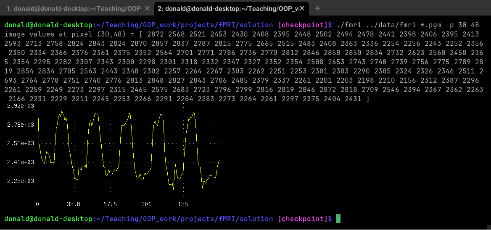
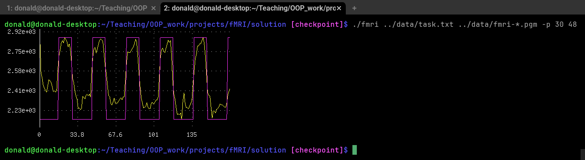
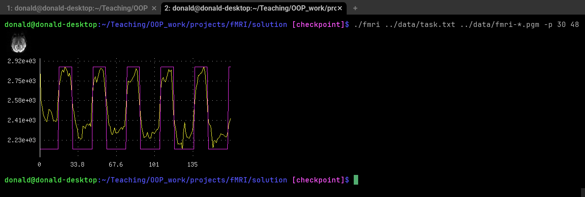

class: title

5CCYB041
# OBJECT-ORIENTED PROGRAMMING
### Week 4, session 2
## using external libraries<br>operator overloading

---

# Picking up where we left off

We continue working on our [fMRI analysis
project](https://github.com/KCL-BMEIS/OOP/blob/main/projects/fMRI/assignment.md)

You can find the most up to date version in [the project's `solution/`
folder](https://github.com/KCL-BMEIS/OOP/tree/main/projects/fMRI/solution)

.explain-bottom[
Make sure your code is up to date now!
]

---

# Exercise

Implement a class called `Dataset` to represent a *time series* of image slices

This class should:
- store a vector of `Image`s
- provide methods to:
  - load the images
  - query the size of the data set (the number of time points / slices)
  - get one of the image slices given its index
  - get the full timecourse for a pixel of interest, given its *x* & *y*
    coordinates
- have a default constructor
- have a non-default constructor that will also load the data from the
  relevant file(s)
  
Modify your own code to use this new class

---

**`dataset.h`:**
```
#pragma once

#include <vector>
#include <string>

#include "image.h"

class Dataset
{
  public:
    Dataset () = default;
    Dataset (const std::vector<std::string>& filenames) { load (filenames); }

    void load (const std::vector<std::string>& filenames);

    unsigned int size () const { return m_slices.size(); }
    const Image& get (int n) const { return m_slices[n]; }
    std::vector<int> get_timecourse (int x, int y) const;

  private:
    std::vector<Image> m_slices;
};
```

---

**`dataset.cpp`:**
```
#include <vector>
#include <string>
#include <format>
#include <stdexcept>

#include "debug.h"
#include "pgm.h"
#include "dataset.h"

std::vector<int> Dataset::get_timecourse (int x, int y) const
{
  std::vector<int> vals (size());
  for (unsigned int n = 0; n < size(); ++n)
    vals[n] = m_slices[n].get(x,y);
  return vals;
}

...
```

---

**`dataset.cpp`:** *(continued)*
```
...

void Dataset::load (const std::vector<std::string>& filenames)
{
  m_slices.clear();
  if (filenames.empty())
    throw std::runtime_error ("no filenames supplied when loading dataset");

  for (const auto& fname : filenames)
    m_slices.push_back (load_pgm (fname));

  // check that dimensions all match up:
  for (unsigned int n = 1; n < m_slices.size(); ++n) {
    if ( (m_slices[n].width() != m_slices[n-1].width()) ||
         (m_slices[n].height() != m_slices[n-1].height()) )
      throw std::runtime_error ("dimensions do not match across slices");
  }

  debug::log (std::format (
      "loaded {} slices of size {}x{}\n",
      m_slices.size(), m_slices[0].width(), m_slices[0].height()));
}
```

---
class: section
name: cmdline_option_with_args

# Command-line handling

## handling options with extra arguments

---

# Selecting the pixel of interest

Currently, our code can print the intensity at a pixel of interest
- but the location of that pixel is hard-coded

It would be better to provide a mechanism to allow us (and our users) to select
different pixels

--

&rArr; we can do this using a command-line option, for example:
```
$ ./fmri ../data/fmri-*.pgm `-p 30 48`
```

--

.explain-bottom[
Exercise: implement code to handle such an option, and use it to print out the
timecourse of the intensity at various locations

<br>
Hint: you will most likely find the following methods useful:
- [`std::ranges::find()`](https://en.cppreference.com/w/cpp/algorithm/ranges/find), [`std::distance()`](https://www.geeksforgeeks.org/stddistance-in-c/), [`std::vector::erase()`](https://www.geeksforgeeks.org/vector-erase-in-cpp-stl/), [`std::stoi()`](https://www.geeksforgeeks.org/stdstoi-function-in-cpp/)
]

---

**In `fmri.cpp`:**
```
...

void run (std::vector<std::string>& args)
{
  debug::verbose = std::erase (args, "-v");

* int x = -1, y = -1;
* auto pixel_option = std::ranges::find (args, "-p");
* if (pixel_option != args.end()) {
*   if (std::distance (pixel_option, args.end()) < 3)
*     throw std::runtime_error (
*            "not enough arguments to '-p' option (expected '-p x y')");
*   x = std::stoi (*(pixel_option+1));
*   y = std::stoi (*(pixel_option+2));
*   args.erase (pixel_option, pixel_option+3);
* }

  ...
```

---
class: section
name: external_library

# Using external libraries

---

# Why use external libraries?

We could write code to do everything ourselves
- but that is rarely a good use of our time
- often, it is simply not possible, or at best highly impractical

--

For example, we may wish to perform matrix multiplications
- but it is [remarkably difficult to write efficient
  code](https://gist.github.com/nadavrot/5b35d44e8ba3dd718e595e40184d03f0) to do this!
- what if we need to solve more complex matrix problems, involving matrix
  inversions, etc?

--

As another example, we may wish to perform Fourier transforms
- but this is not trivial to code up, particularly if performance matters

--

&rArr; much better to use an external, well-maintained library, written by experts
- it saves us time 
- it means (a lot) fewer bugs
- less code for us to maintain, document, etc
- other developpers will likely already be familiar with well-known libraries
--
- ... and it often means we can do something that we simply wouldn't be able to
  do otherwise!

---
class: info 

# Using external libraries

Libraries come in many formats:

## [Header-only libraries](https://en.wikipedia.org/wiki/Header-only)

- this is the simplest form
- the library consists only of a set of header files
- we only need to `#include` the appropriate header in our own code and
  compile and link as before

--

## [Static libraries](https://en.wikipedia.org/wiki/Static_library)

- the library consists of a set of header files, and a static archive file
  - this is essentially a collection of multiple object files
  - typically with the suffix `.a` 
- we only need to:
  - `#include` the appropriate header in our own code and compile 
  - inform the linker to include the archive file when linking

---
class: info 

# Using external libraries

## [Shared (dynamic) libraries](https://en.wikipedia.org/wiki/Shared_library)

- the library consists of a set of header files, and a shared library file
  - this is also a collection of multiple object files, but produced using
    different compiler options
  - typically with the suffix `.dll` (Windows), `.dylib` (macOS), or `.so`
    (Unix/Linux)
- we now need to:
  - `#include` the appropriate header in our own code and compile
  - inform the linker to include the dynamic library file when linking
  - ensure the dynamic library is available in the expected location at
    run-time on the target system

--

When using dynamic libraries, the final executable *does not contain the functionality* in the library
- this differs from header-only and static libraries
- at run-time, the system will need to locate the shared library file and load it into our 
  program

--

When deploying your program on other systems, you need to take steps to ensure
the required shared libraries are also installed and available
- otherwise the program will fail to run on those systems!


---

# Using a (very) simple header-only library

We would like to display the images we have loaded, and plot the signal
intensity across time points for selected pixels
- we could output the required information to file, and display it using a
  different program
  - for example, write the intensities to a file, load that file in Matlab, and
    plot it from there

--

But we could also use a library that provides that functionality
- there are *many* libraries available for graphical output
--
- unfortunately, most of them are much more complex than we can cover on this course

--

To keep things simple, we have produced a very simple, header-only library that
provides just the functionality we need: the [`terminal_graphics`
library](https://github.com/jdtournier/terminal_graphics)

---

# How to use the terminal_graphics library

Let's have a look at the
[README](https://github.com/jdtournier/terminal_graphics/blob/main/README.md) for the project to get an idea of how to use it. 
- for more specific information, you can refer to the [`terminal_graphics.h` header file](https://github.com/jdtournier/terminal_graphics/blob/main/terminal_graphics.h)
- ... or look at the [automatically-generated documentation](https://jdtournier.github.io/terminal_graphics/) (produced from that header using
  [Doxygen](https://www.doxygen.nl/)) 

--

We need to:
- make sure we are using a [sixel](https://en.wikipedia.org/wiki/Sixel)-capable terminal
  - MSYS2 uses the [`minTTY` terminal](https://www.msys2.org/docs/terminals/), which already fits that criterion
  - on macOS, the default Terminal application is not appropriate &ndash; use
    [WezTerm](https://wezfurlong.org/wezterm/index.html) or [iTerm2](https://iterm2.com/)
- grab the [`terminal_graphics.h`](https://github.com/jdtournier/terminal_graphics/blob/main/terminal_graphics.h) header file, and place it in our project
- `#include "terminal_graphics.h"` in our own code
- use the functionality we're interested in
  - we can plot the signal time course using e.g.
    `TG::plot().add_line (values);`

--

.explain-bottom[
Exercise: take the steps described here to display the signal time course for
the pixel of interest
]

---

**Project folder should now contain:**
```
$ ls
dataset.cpp  dataset.h  debug.h  fmri.cpp  image.h  pgm.cpp  pgm.h  `terminal_graphics.h`
```


**In `fmri.cpp`:**

```
*#include "terminal_graphics.h"

...

void run (std::vector<std::string>& args)
{
  ...
  Dataset data ({ args.begin()+1, args.end() });
  ...

* TG::plot().add_line (data.get_timecourse (x,y));
}
```

---

# Expected output



---

# Exercises

Add functionality to load the time course for the *task*
- we recommend the task file be provided as the *first* argument

Add functionality to plot the time course of the task after the signal itself

Add functionality to display the task *on the same plot* as the signal
- to do this, you will need to *rescale* the task to match the min & max
  intensities of the signal
- you can display multiple lines on the same plot with additional `.add_line()`
  calls, specifying a non-default colour index, for example:
  ```
  TG::plot().add_line (signal).add_line (task, 3);
  ```


---

**`task.h`:**
```
#pragma once

#include <vector>
#include <string>

std::vector<int> load_task (const std::string& filename);

std::vector<float> rescale (const std::vector<int>& task, int min, int max);
```

**In `fmri.cpp`:**
```
  ...
  auto signal = data.get_timecourse (x,y);
* auto minval = std::ranges::min (signal);
* auto maxval = std::ranges::max (signal);
* TG::plot()
*   .add_line (signal)
*   .add_line (rescale (task, minval, maxval), 3);
}
```

---

**`task.cpp`:**
```
#include <vector>
#include <string>
#include <fstream>
#include <stdexcept>

#include "task.h"
#include "debug.h"

std::vector<int> load_task (const std::string& filename)
{
  debug::log ("loading task file \"" + filename + "\"...");
  std::vector<int> task;
  std::ifstream intask (filename);
  if (!intask)
    throw std::runtime_error ("error opening file \"" + filename + "\"");

  int val;
  while (intask >> val)
    task.push_back (val);

  debug::log ("task file \"" + filename + "\" loaded OK");
  return task;
}
```

---

**`task.cpp`:** *(continued)*
```
...

std::vector<float> rescale (const std::vector<int>& task, int min, int max)
{
  std::vector<float> out (task.size());
  for (unsigned int n = 0; n < task.size(); ++n)
    out[n] = min + task[n] * (max-min);
  return out;
}
```

---

# Displaying the images themselves

How about displaying the image slices themselves?
- there is a [`TG::imshow()`](https://jdtournier.github.io/terminal_graphics/)
  method that looks appropriate!
--
- ... but the documentation states that our image class needs to implement these
  methods:
  - `int width() const`
  - `int height() const`
  - `integer_type operator() (int x, int y) const`

--

&rArr; We already have `width()` and `height()` methods, but what is this `operator()` method?

--

To understand this, we need to learn about [operator
overloading](https://www.geeksforgeeks.org/operator-overloading-cpp/)

---
class: section
name: operator_overloading

# Operator overloading

---

# Operator overloading

C++ allows us to specify the action of the different operators for our classes

--

Most standard C++ operators can be overloaded:
- `!`, `+`, `-`, `*`, `/`, `%`, `++`, `--`, `=`, `==`, `<`, `>`, `<<`, `>>`, `()`, `[]`, ...
- we have already used overloaded operators:
  ```
  std::ifstream infile (filename);
  if (`!infile`) ...
  ```

--

Different operators need to be defined differently depending on whether they
are [*unary* or *binary*
operators](https://www.geeksforgeeks.org/difference-between-unary-and-binary-operators/)
- i.e. whether act on one or two operands

--

Let's look at how to overload the `()` operator

---
name: overload_bracket

# Overloading the bracket operator

[Overloading the bracket
operator](https://www.learncpp.com/cpp-tutorial/overloading-the-parenthesis-operator/)
allows us to use our class almost like a function:
```
Image image;

// use the bracket operator as a getter method:
std::cout << "value at (12,21) = " << image(12,21) << "\n";

// ... or use it as a setter method:
image(12,21) = 1023;
```
By overloading the bracket operator, we can replace our `.get()` & `.set()`
method with a simpler and more intuitive syntax

--

The bracket operator is allowed to take any number of arguments
- you can even multiple overloads with different numbers of arguments in
  the same class!
- in our case, we just need it to take 2 arguments: the coordinates of the
  desired pixel 


---
layout: true

# Overloading the bracket operator

To overload this operator, we declare it like any other method
- but with the special name `operator()`
- to be able to modify the intensities values, we need to
  return a *reference* to the pixel intensity
- to use our class in a `const` context, we need to
  provide both a `const` *and* a non-`const` version 

---

```
class Image {
  public:
    ...
    int&       operator() (int x, int y)       { return m_data[x + m_xdim*y]; }
    const int& operator() (int x, int y) const { return m_data[x + m_xdim*y]; }
};
```

---

```
class Image {
  public:
    ...
    `int&`       operator() (int x, int y)       { return m_data[x + m_xdim*y]; }
    `const int&` operator() (int x, int y) const { return m_data[x + m_xdim*y]; }
};
```

Both methods return a *reference* to the pixel intensity
- technically, the `const` version could just return the value itself, since
  an `int` is a small object

---

```
class Image {
  public:
    ...
    int&       operator() (int x, int y)       { return m_data[x + m_xdim*y]; }
    `const` int& operator() (int x, int y) `const` { return m_data[x + m_xdim*y]; }
};
```

The `const` version returns a `const` reference
- otherwise this method could not be considered `const`

---

```
class Image {
  public:
    ...
    int&       `operator()` (int x, int y)       { return m_data[x + m_xdim*y]; }
    const int& `operator()` (int x, int y) const { return m_data[x + m_xdim*y]; }
};
```

The method name is specified as `operator()`

---

```
class Image {
  public:
    ...
    int&       operator() (int x, int y)       { `return m_data[x + m_xdim*y];` }
    const int& operator() (int x, int y) const { `return m_data[x + m_xdim*y];` }
};
```

Both methods otherwise do exactly the same thing!
- the only difference is whether the reference returned is `const`

---

```
class Image {
  public:
    ...
    `int&       operator() (int x, int y)      ` { return m_data[x + m_xdim*y]; }
    `const int& operator() (int x, int y) const` { return m_data[x + m_xdim*y]; }
};
```

Why do we need two almost identical `const` and non-`const` versions?
- When we pass our class to a function as a `const` value or reference, that
  function can *only* use `const` methods of our class
  - otherwise the compiler can't guarantee that the class won't be modified!
- In a context where our class is not `const`, the compiler will use
  the non-`const` version


---

```
class Image {
  public:
    ...
    int&       operator() (int x, int y)       { return m_data[x + m_xdim*y]; }
    const int& operator() (int x, int y) const { return m_data[x + m_xdim*y]; }
};
```

.explain-bottom[
Exercise: add overloaded bracket operators to your own `Image` class, and
modify your code to display the first image slice.

<br>You can then remove your `.get()` & `.set()` methods
]

---
layout: false

**In `image.h`:**
```
class Image {
  public:
    ...
*   int&       operator() (int x, int y)       { return m_data[x + m_xdim*y]; }
*   const int& operator() (int x, int y) const { return m_data[x + m_xdim*y]; }
    ...
};
```

**In `fmri.cpp`:**
```
void run (std::vector<std::string>& args)
{
  ...
  Dataset data ({ args.begin()+2, args.end() });
  ...
* TG::imshow (data.get(0), 0, 4000);
  ...
}
```

---

**In `dataset.cpp`:**
```
std::vector<int> Dataset::get_timecourse (int x, int y) const
{
  std::vector<int> vals (size());
  for (unsigned int n = 0; n < size(); ++n)
*   vals[n] = m_slices[n](x,y);
  return vals;
}
```

---

# Expected output



--

That image is a bit too small...
- thankfully, the `terminal_graphics` library provides a convenience function
  to upscale an image: 
  `TG::magnify (image, scale_factor)`

---

**In `fmri.cpp`:**
```
void run (std::vector<std::string>& args)
{
  ...
  Dataset data ({ args.begin()+2, args.end() });
  ...
  TG::imshow (`TG::magnify (data[0], 4)`, 0, 4000);

  ...
}
```

---

# Expected output

.center[

]


---
name: overload_subscript

# Overloading the subscript operator

Another commonly-overloaded operator is the [subscript (square brackets)
operator
(`[]`)](https://www.learncpp.com/cpp-tutorial/overloading-the-subscript-operator/)

This time however, the operator can only take a single argument
- Note: [C++23 relaxes this restriction to allow multidimensional
  subscripting](https://www.sandordargo.com/blog/2023/08/09/cpp23-multidimensional-subscription-operator)

The syntax is otherwise identical to the bracket operator
- Let's illustrate by overloading the subscript operator for our `Dataset`
  class

---

# Overloading the subscript operator

We declare it in the same way as the bracket operator
- but with the special name `operator[]` and a single argument

```
class Dataset {
  public:
    ...
    Image&       operator[] (int n)       { return m_slices[n]; }
    const Image& operator[] (int n) const { return m_slices[n]; }
    ...
};
```

--

Note that in our solution (online), we only provide the `const` version
- this is because our `Dataset` class only had a `.get()` method previously
- you are free to make different design decisions!

--

.explain-bottom[
Exercise: add a subscript operator to the `Dataset` class, and use it in your
own code. Remove the now-redundant `.get()` method
]


---

**In `dataset.h`:**
```
class Dataset {
  public:
    ...
*   Image&       operator[] (int n)       { return m_slices[n]; }
*   const Image& operator[] (int n) const { return m_slices[n]; }
    ...
};
```

**In `fmri.cpp`:**
```
  // default values if x & y not set (<0):
  if (x < 0 || y < 0) {
*   x = data[0].width()/2;
*   y = data[0].height()/2;
  }
  else {
*   if (x >= data[0].width() || y >= data[0].height())
      throw std::runtime_error ("pixel position is out of bounds");
  }
```


---
name: overload_insertion

# Overloading the insertion operator

Another operator that is often overloaded in C++ is the stream insertion
operator (`<<`)
- this can be useful for debugging and other purposes

--

This differs from the bracket and subscript operators because it is a *binary
operator*
- there are two operands: the stream and the object being
  inserted
- the operator sits *between* the operands

--

The object to be fed into the stream is on the *right-hand side* of the
operator
- this means this operator cannot be a member function of our class
- ... but we also can't simply add it as a member of the stream class!

--

This operator (and many other binary operators) are therefore best written as
*independent functions*

---
layout: true

# Overloading the insertion operator

We need to declare a function outside of either class that overloads the stream
insertion operator.
<br> This is what it looks like:

---

```
std::ostream& operator<< (std::ostream& stream, const Image& image);
```

---

```
std::ostream& `operator<<` (std::ostream& stream, const Image& image);
```

As before, this looks like a regular function, but with the special name `operator<<`

---

```
std::ostream& operator<< (`std::ostream& stream`, `const Image& image`);
```

It takes two arguments:

&bull; the stream object (as a non-`const` reference)
- we use the `std::ostream` class, which is the *base class* for all output
  streams (this will make more sense when we cover inheritance)
- we take a non-`const` reference since pushing data into the stream is
  clearly a modifying operation

--
&bull; the object to the inserted (typically as a `const` reference)
- here, we use our `Image` class to illustrate

---

```
`std::ostream&` operator<< (std::ostream& stream, const Image& image);
```

It returns a reference to the stream that was originally provided as the
first argument

--
This allows insertion statements to be daisy-chained:
```
stream << "Image is " << image << "\n";
```

---

```
`std::ostream&` operator<< (std::ostream& stream, const Image& image);
```

It returns a reference to the stream that was originally provided as the
first argument

This allows insertion statements to be daisy-chained:
```
`stream << "Image is "` << image << "\n";
```

If you think about it:
- this returns the original `stream`

---

```
`std::ostream&` operator<< (std::ostream& stream, const Image& image);
```

It returns a reference to the stream that was originally provided as the
first argument

This allows insertion statements to be daisy-chained:
```
`stream << "Image is " << image` << "\n";
```

If you think about it:
- this returns the original `stream`
- ... and so does this!
