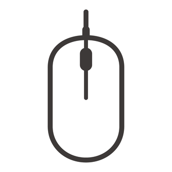

class: title

5CCYB041
# OBJECT-ORIENTED PROGRAMMING
### Week 6, session 1
## next project: robot arm project<br>inheritance

---

# Our next project: fMRI analysis

This week, we start off on a new project: a simple system to control a modular
robot arm
- Have a look at the [assignment instructions](https://github.com/KCL-BMEIS/OOP/blob/main/projects/robot_arm/assignment.md)

You will find the most up to date version of the project in [the project's `solution/`
folder](https://github.com/KCL-BMEIS/OOP/tree/robot_solution/projects/robot_arm/solution)

<br>
Let's take a look at the assignment to figure out what needs to be done

--

.explain-bottom[
You will find some code to start from in the solution folder

<br>
&rArr; [Make sure your code is up to date
now!](https://github.com/KCL-BMEIS/OOP/blob/main/projects/code_updater.md)
]

---

# Designing the project

The problem calls for defining:
- a *base class* for a generic 'segment'
- *derived classes* for each segment sub-type

--

This is exactly the kind of problem that Object-Oriented Programming is
designed to address

This kind of design can be implemented through
[inheritance](https://www.learncpp.com/cpp-tutorial/introduction-to-inheritance/)
- this is one of the four core features of OOP

---

# Inheritance

Inheritance refers to the ability to define a *derived* class that extends a *base* class
- the derived class *inherits* all the properties of the base class
- the derived class can provide its own implementation of some methods
- the derived class can store additional data members in addition to those
  inherited from its base class

--

This is used to address a broad range of problems, where:
- there is generic type of object, with defined interactions (the base class)
- there are one or more syb-types of this object, with their own implementation
  of these interactions (derived classes)
  - these can also provide additional functionality specific to the derived
    class

---
layout: true

# Example of inheritance

There are many examples of inheritance relationships

Consider a computer mouse (pointing device):
.center[
  &ensp;  &emsp;  &emsp; 
]

---

<br>
- there are different types of pointing devices:
  - connected via PS/2, USB, bluetooth, ...
  - with/without scroll wheel, middle button, extra buttons, ...
  - sometimes users use a touchscreen or tablet
- the software on the computer shouldn't need to know what *type* of pointing
  device is connected
  - it just needs to know how to *interact* with these devices in a consistent
    manner

---

We can design a *base class* to represent a pointing device
- this provide the basic information and the *interface* required for *any*
  pointing device

We can then create *derived classes* that *inherit* from this base class
- each derived class can provide specific *implementations* of the interface

The software application can then be provided with an instance of the
appropriate derived class
- the application only needs to know how to interact with the base class


---
layout: false

# How inheritance applies to our problem

For our robot arm project:
- we can set up a base class to represent (and interact with) a *segment*
- we can set up a derived class for each type of segment that inherits the base
  class

--

The task requires us to track the position of the surgical tip
- each segment should be able to report on the position of the tip *relative to
  its base connector*
- ... given the position of the tip *relative to the previous segment's base
  connector*

---

# Tracking the tip position &ndash; tip

tip position relative to base:
$$
\begin{bmatrix}
0 \\\\
0 \\\\
\textrm{length}
\end{bmatrix}
$$
.center[

]

---

# Tracking the tip position &ndash; bend

tip position relative to base:
$$
\begin{bmatrix}
0 \\\\
0 \\\\
\textrm{length}/2
\end{bmatrix} + \begin{bmatrix}
\cos(\textrm{angle}) & 0 & \sin(\textrm{angle}) \\\\
0 & 0 & 0 \\\\
-\sin(\textrm{angle}) & 0 & \cos(\textrm{angle}) \\\\
\end{bmatrix} \times \left( \begin{bmatrix}
0 \\\\
0 \\\\
\textrm{length}/2
\end{bmatrix} + \textrm{previous tip position}
\right)
$$

.center[

]

---

# Tracking the tip position &ndash; bend

tip position relative to base:
$$
\begin{bmatrix}
0 \\\\
0 \\\\
\textrm{length}
\end{bmatrix} + \textrm{previous tip position}
$$

.center[

]

---

# Designing the Segment base class

Each segment needs functionality to:
- report its type
- compute and report the position of the tip relative to its own base connector
- hold a *reference* to the next segment

--

```
Segment (rotate)
├── type
└── next_segment → Segment (straight)
                     ├── type
                     └── next_segment → Segment (bend)
                                          ├── type
                                          └── next_segment → Segment (tip)
                                                               ├── type
                                                               └── next_segment → `?`
```
--

We will need a way to terminate the chain &ndash; more on that later
- not too important since tip segment has no need to refer to next segment

---

## Designing the Segment base class

```
namespace Segment {
  class Base {


  };
}
```
We start by defining a class called `Segment`, as we normally would
- since we anticipate many different types of segments, it makes sense to set
  them up within their own `Segment` namespace

---

## Designing the Segment base class

```
namespace Segment {
  class Base {


    private:
      Segment& m_next;
      const std::string m_type;
  };
}
```

We only need to 2 data members: 
- a string to hold the type
  - this will not need to be modified after construction &rArr; declare it `const`
--
- a *reference* to the next segment
  - *note:* this cannot be a *copy* &ndash; we will see why later

---

## Designing the Segment base class

```
namespace Segment {
  class Base {
    public:
      Base (const Base& next_segment, const std::string& type) :
         m_type (type),
         m_segment (segment) { }
  
  
  
  
    private:
      Segment& m_next;
      const std::string m_type;
  };
}
```

Both data members are *immutable*:
- [references](https://www.geeksforgeeks.org/references-in-cpp/) cannot be made to refer to a different variable after construction
- the `m_type` member is `const`

&rArr; they must both be initialised in the constructor, using the [member initialiser list](https://www.geeksforgeeks.org/when-do-we-use-initializer-list-in-c/)


---

## Designing the Segment base class

```
namespace Segment {
  class Base {
    public:
      Base (const Base& next_segment, const std::string& type) :
         m_type (type),
         m_segment (segment) { }
  
      const std::string& type () const { return m_type; }
  
  
    private:
      Segment& m_next;
      const std::string m_type;
  };
}
```

Add a getter / accessor method for the type
- technically, we could make the `m_type` member public, since it is `const`
  anyway
  - there is no risk of it being modified unexpectedly
  - but it is considered good practice to provide a getter method

---

## Designing the Segment base class

```
namespace Segment {
  class Base {
    public:
      Base (const Base& next_segment, const std::string& type) :
         m_type (type),
         m_segment (segment) { }
  
      const std::string& type () const { return m_type; }
      std::array<double,3> tip_position () const;
  
    private:
      Segment& m_next;
      const std::string m_type;
  };
}
```

We need a method to compute and report the position of the tip relative to the
base of the current segment
- the *implementation* needs to be type-dependent
- but the *interface* needs to be well-defined and identical for all segment
  types
  - *interface* in this context means the method signature / declaration

---

## Designing the Segment base class

```
namespace Segment {
  class Base {
    public:
      Base (const Base& next_segment, const std::string& type) :
         m_type (type),
         m_segment (segment) { }
  
      const std::string& type () const { return m_type; }
      `virtual` std::array<double,3> tip_position () const;
  
    private:
      Segment& m_next;
      const std::string m_type;
  };
}
```

If the implementation of a method depends on the sub-type, it must be declared
[virtual](https://www.geeksforgeeks.org/virtual-function-cpp/)
- this means that *derived* classes are allowed to *override* the
  implementation
- this is what allows [runtime polymorphism](https://www.geeksforgeeks.org/cpp-polymorphism/) (more on that later)

---

## Designing the Segment base class

```
namespace Segment {
  class Base {
    public:
      Base (const Base& next_segment, const std::string& type) :
         m_type (type),
         m_segment (segment) { }
  
      const std::string& type () const { return m_type; }
      virtual std::array<double,3> tip_position () const { `return { };` }
  
    private:
      Segment& m_next;
      const std::string m_type;
  };
}
```

For now, we can provide a default implementation for the `tip_position()`
method
- this just returns a default-initialised `std::array` using a braced initialiser list
- technically, there is no way to provide a reasonable implementation for the base
  class
- we will see how to deal with this later

---

# Type aliasing

We are currently using the type `std::array<double,3>` to store a position

We can simplify our code slightly by defining a [type
alias](https://www.learncpp.com/cpp-tutorial/typedefs-and-type-aliases/):
- we can provide a *shorthand* name for this type, reducing the amount of code
  we need to write elsewhere
- we can make our intended purpose for this type more explicit

--

We can create a type alias with the `using` keyword:
```
using Point = std::array<double,3>;
```
We can now use `Point` as our type: the compiler will know this means
`std::array<double,3>`

--

Another advantage: if needed, we can change this type later 
by modifying a single line of code
- e.g. we might at some point decide to switch to `std::array<float,3>`

--

We should place this definition in a separate header (e.g. `point.h`)
- it will be needed in many different code files

---

**In `point.h`:**
```
#pragma once
#include <array>
using Point = std::array<double,3>;
```

**In `segment/base.h`:**
```
#include <point.h>
namespace Segment {
  class Base {
    public:
      Base (const Base& next_segment, const std::string& type) :
         m_type (type),
         m_segment (segment) { }
  
      const std::string& type () const { return m_type; }
      virtual `Point` tip_position () const { return { }; }
  
    private:
      Segment& m_next;
      const std::string m_type;
  };
}
```


---

# Writing our first derived class

We now have a functional base class
- but we can't do anything with it yet
- it is designed to be derived, and the derived classes will provide meaningful
  implementations

--

We also need an existing `Segment` to initialise it with!
- this will be true for all segments 
- ... apart from the tip!


&rArr; Let's start with the tip segment

---

## Designing the Tip segment class

```
namespace Segment {
* class Tip : public Base {


  };
}
```

We define our `Tip` class as a regular class, with one key difference:
- we specify that it inherits from `Base` using the syntax shown
- `public` here means that public methods of the base class will also be
  public in the derived class
  - it is the most common mode of inheritance (`private` and `protected` are
    also possible, but rarely used)

---

## Designing the Tip segment class

```
namespace Segment {
  class Tip : public Base {


*   private:
*     const double m_length;
  };
}
```


Note that the `Tip` class only not needs one additional data member: its length
- it will already have the `m_type` and `m_next` data members from the base class!
- the length should not change once initialised: we declare it `const`


---

## Designing the Tip segment class

```
namespace Segment {
  class Tip : public Base {
    public:
*     Tip (double length) :
        Base (*this, "tip"),
        m_length (length) { }


    private:
      const double m_length;
  };
}
```

The constructor for the `Tip` segment only needs one piece of information: 
- its own length


---

## Designing the Tip segment class

```
namespace Segment {
  class Tip : public Base {
    public:
      Tip (double length) :
*       Base (*this, "tip"),
        m_length (length) { }


    private:
      const double m_length;
  };
}
```

Note that the constructor of the derived class must invoke the constructor for
its base class first
- if not explicitly stated, the base class default constructor will
  implicitly be invoked (if one exists)
- this ensures the base class is fully initialised in case the derived class depends on any of its functionality 
- this must be done within the [member initialiser list](https://www.geeksforgeeks.org/when-do-we-use-initializer-list-in-c/)
  - before initialising any other members!

---

## Designing the Tip segment class

```
namespace Segment {
  class Tip : public Base {
    public:
      Tip (double length) :
        Base (`*this`, "tip"),
        m_length (length) { }


    private:
      const double m_length;
  };
}
```

The constructor for the `Base` object needs a reference to an existing
`Segment`
- where do we find an existing object of type `Segment`?

&rArr; we can use the current object!
- the `Tip` segment will refer to *itself* as the next segment

---

# The `this` pointer

All objects have a [`this`
pointer](https://www.geeksforgeeks.org/this-pointer-in-c/), which points to the current instance
- it holds the *memory address* of the current instance

The `this` pointer is valid even before the class is fully initialised
- this makes sense: the class needs somewhere to store its data *before* that
  data can be initialised

--

The `this` pointer is often used in the return value for various methods and
operators
- this allows operations to be *chained*
- this is the mechanism used in the  [terminal_graphics library](https://github.com/jdtournier/terminal_graphics):
  ```
  TG::plot()              // <- returns an object of type TG::Plot
      .set_ylim (...)       // <- returns *this
      .add_line (...)       // <- also returns *this
      .add_line (...);
  ```
--

We can use `*this` to get a reference to the current instance
- although it is not initialised yet, we only need to a reference to it &ndash;
  OK as long as we don't try to access values via the reference

---

## Designing the Tip segment class

```
namespace Segment {
  class Tip : public Base {
    public:
      Tip (double length) :
        Base (`*this`, "tip"),
        m_length (length) { }


    private:
      const double m_length;
  };
}
```

We can therefore use `*this` as the parameter to the `Base` object
- this allows us to *terminate* the chain: `m_next` refers back to the tip!

Moreover, the `Tip` class will not need to access the next segment anyway


---

## Designing the Tip segment class

```
namespace Segment {
  class Tip : public Base {
    public:
      Tip (double length) :
        Base (*this, "tip"),
        m_length (length) { }

*     Point Tip::tip_position () const {
*       return { 0.0, 0.0, m_length };
*     }

    private:
      const double m_length;
  };
}
```


Finally, we can provide our implementation for the *virtual* `tip_position()`
method
- its declaration must match that from the base class exactly

For the `Tip`, we just need to report a position a distance *length* away along
the *z*-axis


---

## Designing the Tip segment class

```
namespace Segment {
  class Tip : public Base {
    public:
      Tip (double length) :
        Base (*this, "tip"),
        m_length (length) { }

      Point Tip::tip_position () const `override` {
        return { 0.0, 0.0, m_length };
      }

    private:
      const double m_length;
  };
}
```

When overriding a virtual method, it is good practice to add the `override`
keyword
- this ensures that a matching virtual method really does exist in the base class
- this alerts users of our class that we intend this method to override the
  base class implementation
- this helps to avoid a number of subtle errors 

---

# Testing our design

We can now write a program to use our classes:
- We now have a class that can be instantiated!

```
#include <segment/tip.h>

...

void run (std::vector<std::string>& args) 
{

  ...
  Segment::Tip tip (20.0);

  return 0;
}
```

This won't do anything interesting, but at least we can check that it compiles
and runs without errors

---

# Exercise

Create the `Segment` and `Tip` classes
- use separate headers for both, and place method definitions in corresponding `.cpp` files

Organise your code by grouping all the segment files within a distinct folder
to match the `Segment` namespace:
```
robot_arm
├── segment
│    ├── base.h
│    ├── base.cpp
│    ├── tip.h
│    └── tip.cpp
└── robot.cpp
```
- this means your `#include` directives will also need to state the folder,
  e.g.:
  ```
  #include <segment/tip.h>
  ```

.explain-topright[
You can use the
[`mkdir`](https://www.geeksforgeeks.org/mkdir-command-in-linux-with-examples/) command to create a folder
]

---

# Exercise

Modify your `run()` code to also report the tip position

To simplify printing out the position, define the insertion operator for
the type we use to store the position (`Point`)
- you can also place the definition for this operator in the `point.h` file

You can then verify that the position of the tip is as expected

---

# What happens when a class inherits from another?

It is at first difficult to understand how inheritance really works.
To appreciate what is happening, it helps to understand what each class stores:

<br>

|      | Segment |  Tip  | type  | size |
|:----:|:-------:|:-----:|:-----:|:----:|
| `m_next` | &#x2713; | &#x2713; | `Segment*` | 8 bytes |
| `m_type` | &#x2713; | &#x2713; | `std::string` | 32 bytes |
| `m_length` |        | &#x2713; | `double` | 8 bytes |
| **total size** | 40 bytes | 48 bytes |  |  |

--

**Key points:**
- the derived class *is a full version* of the base class 
  - our `Tip` class includes data members `m_next` and `m_type`, which it
    *inherited* from the `Base` class
--
- the derived class *extends* the base class with its own members
  - our `Tip` class has an additional `m_length` member, which the `Base` class
    does not
--
- the base and derived classes are not (necessarily) the same size!
  - the derived class will typically be larger due to the additional members


---

# Designing the other segments

We can now set up the remaining segments

This time, they will need to be initialised from an existing segment

--

&rArr; Let's start with the straight segment, since its implementation is relatively
straightforward

---

## Designing the Straight segment class

```
namespace Segment {
* class Straight : public Base { 


  };
}
```

As for the `Tip`, we declare our class with `Base` as the parent class

---

## Designing the Straight segment class

```
namespace Segment {
  class Straight : public Base { 


*   private:
*     const double m_length;
  };
}
```

In this case, we need also only one additional data member: its length

---

## Designing the Straight segment class

```
namespace Segment {
  class Straight : public Base {
*   Straight (const Base& next, double length) :
*     Base (next, "straight"),
*     m_length (length) { }


    private:
      const double m_length;
  };
}
```

This time, the constructor needs *two* pieces of information: 
- a reference to the next segment
- its own length


---

## Designing the Straight segment class

```
namespace Segment {
  class Straight : public Base { 
    Straight (`const Base& next`, double length) :
      Base (`next`, "straight"),
      m_length (length) { }


    private:
      const double m_length;
  };
}
```
This time, we can pass the segment provided in the `Straight` constructor
through to the `Base` constructor

---

## Designing the Straight segment class

```
namespace Segment {
  class Straight : public Base { 
    Straight (const Base& next, double length) :
      Base (next, "straight"),
      m_length (length) { }

*   Point tip_position () const override {
      auto p = m_next.tip_position();
      return { p[0], p[1], m_length+p[2] };
    }

    private:
      const double m_length;
  };
}
```

Finally, we can provide our implementation for the *virtual* `tip_position()`
method
- again, its declaration must match that from the base class exactly


---

## Designing the Straight segment class

```
namespace Segment {
  class Straight : public Base { 
    Straight (const Base& next, double length) :
      Base (next, "straight"),
      m_length (length) { }

    Point tip_position () const override {
*     auto p = m_next.tip_position();
*     return { p[0], p[1], m_length+p[2] };
    }

    private:
      const double m_length;
  };
}
```

For the `Straight` segment, the implementation is relatively straightforward:
- we retrieve the tip position from the next segment
  - remember we've inherited the `m_next` member from the `Base` class!
- add its length to the *z*-component
- and return a `Point` with that position


---

# Exercise

Add the `Straight` class to your code, and use it in your code
- again, place the header and corresponding `.cpp` file in the `segment` folder

In your main code, set up your robot arm to have a single straight segment connected
to the tip segment:

```
  ...
  Segment::Tip tip (20.0);
  Segment::Straight straight (tip, 30.0);

  std::cout << "tip position: " << straight.tip_position() << "\n";
  return 0;
}
```
--
Note that `tip` needs to exist *before* we can create the next (`straight`)
segment
- the *lifetime* of the `tip` also needs to exceed that of `straight`
  - `tip` does not depend on `straight`, but `straight` holds a reference to
    `tip`!

---

# Exercise

Implement the other segment types: `bend`, `rotate`

Use these to set up the full robot arm as specified in the instructions
