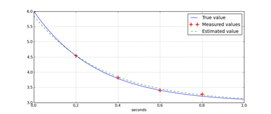

class: title

5CCYB041
# OBJECT-ORIENTED PROGRAMMING
### Week 7, session 1
## OOP design and principles


---

# Exercises

We have now covered all the material necessary to finish the [robot arm
project](https://github.com/KCL-BMEIS/OOP/blob/main/projects/robot_arm/assignment.md)

You can find the most up to date version in [the project's `solution/`
folder](https://github.com/KCL-BMEIS/OOP/tree/robot_solution/projects/robot_arm/solution)

Modify your code to implement the remaining steps:
1. load the parameter file (including all relevant error checking)
1. set the various angles to their corresponding values in the parameter file
  for each time frame
1. iterate over the time frames, compute the trajectory, and display on the
  terminal
1. compute the speed of the tip and display this as a function of time
1. compute the acceleration of the tip and display this alongside the speed
1. compute the maximum speed and acceleration and check whether they are within
  the specified safety margins


.explain-bottom[
Refer to [the online
solution](https://github.com/KCL-BMEIS/OOP/tree/robot_solution/projects/robot_arm/solution) for the final design
]

---
name: OOP_principles
class: section

# OOP core principles

---

# OOP core principles

Object-Oriented Programming is based on [4 core
principles](https://khalilstemmler.com/articles/object-oriented/programming/4-principles/):

- abstraction
- encapsulation
- inheritance
- polymorphism

--

We have already been using all 4 of these principles throughout the course

⇒ it's time to formalise what they mean

---
name: abstraction
class: section

# Abstraction

---

# Abstraction

Abstraction aims to provide a simplified interface to otherwise complex
systems. 
- this allows us to focus on how to *use* these abstractions to solve problems
- without worrying about the details of *how* these abstractions are implemented

--
 
We use abstractions all the time:
- cars provides a uniform and familiar interface to the driver
  - regardless of the type of engine, gearbox, etc. 
--
- TVs can be operated by remote control
  - without the need to understand whether this is a plasma or LCD screen,
    whether the signal comes over the air, via cable, or the internet, etc. 
--
- a coffee machine can be operated by providing water and coffee beans, then pushing the right button
  - without needing to worry about the temperature and pressure of the water,
    the coarseness of the grind, etc.

--

These are all examples of *abstraction*

---

# Abstraction in OOP

Abstraction can be achieved in C++ by providing *intuitive interfaces* to
potentially complex objects

The most common manifestation is the use of classes with methods

--

Example, the `Image` class that we set up for the fMRI project:
- this provides an intuitive way to access individual pixels by providing their
  coordinates
- even though the pixels are stored in a one-dimensional `std::vector`
  internally

--

The various segments in the robot arm projects also provide a level of
abstraction
- the `tip_position()` method provides the position without the need to worry
  about how it was computed

--

But functions can also provide abstractions:
- we don't need to worry about how to load a PGM file if we know how to use the
  `load_pgm()` function

---
name: encapsulation
class: section

# Encapsulation

---

# Encapsulation

Encapsulation aims to maintain the integrity of a system, by protecting its
internal components and preventing direct manipulation other than through the
interface provided
- it is closely related to abstraction, but more focussed on maintaining integrity
- this allows us to use complex objects without worrying about causing
  accidental damage

--

Again, there are plenty of everyday examples of encapsulation:
- many electrical devices use non-standard, sometimes hidden screws to prevent
  users from trying to 'fix' their device
- modern smartphones are locked down to prevent malicious or accidental damage
  to the operating system
- trying to open up your laptop will most likely void your warranty...

--

All of these are examples of encapsulation: 
- they aim to ensure the integrity of an object or system

---

# Encapsulation in OOP

Encapsulation can be achieved in C++ by protecting the internal *state* of
objects

The most common way is to use classes, storing the state of the object as
private or protected attributes, along with suitably designed public methods to
interact with these attributes safely
- these methods need to provide both the abstraction and ensure the integrity
  of the data in the class

--

For example, consider our Image class:
- its state consists of the image dimensions (integers) and the vector of
  intensities
- what if we wanted to resize an existing image? 
- could we just set the image dimensions to the desired size?

--

⇒ no, since changing the image dimensions changes the number of pixels
- the vector of intensities would need to be resized to match!
- what if we wanted to preserve any intensities already present in the image?

--

The current implementation *protects* these attributes, ensuring they cannot be
modified other than through the methods provided.

---
name: inheritance
class: section

# Inheritance

---

# Inheritance

Inheritance allows one class to derive from and extent another class, allowing
strongly related objects to share common attributes and methods
- it allows for code re-use, simplifying the implementation and maintenance of
  shared functionality
- it is used to implement multiple sub-types that share a common set of
  features

--

Examples of inheritance include:
- cars that share a common chassis and engine, but can be customised with
  different bodywork, furnishings, and extras
  - e.g. Volkswagen Golf, Audi A3, and Skoda Octavia
--
- laptops are often designed as a series, with a range of models sharing common
  attributes (chassis, screen, battery, etc), but different CPUs, memory,
  storage, etc. 

--

These are examples of making use of a common base, which can then be extended
in different ways for specific products
- this means developpers can optimise a single shared base, and spend
  more time on the features specific to each product
 
---

# Inheritance in OOP

Inheritance in achieved in OOP by allowing a *base class* to be inherited by
one or more *derived classes*

- The data members of the base class are also present in any derived class
  - The derived class *is* a realisation of the base class

- The methods of the base class are also available to the derived class and
  external code
  - depending on the level of access provided and mode of inheritance

- Derived classes can *extend* the base class by adding more data members and
  providing additional functionality

- Derived class can also provide their own implementation of some of the
  methods of the base class 
  - this is the basis of [runtime polymorphism](https://www.geeksforgeeks.org/cpp-polymorphism/)

--

We have seen this in action in our robot arm project


---
name: polymorphism
class: section

# Polymorphism

---

# Polymorphism

The word comes from Greek, and means 'many forms'

[Polymorphism](https://www.geeksforgeeks.org/cpp-polymorphism/) refers to the
ability to define different objects that provide the *same interface*
- it allows us to focus on *using* the object, rather than worrying about *how*
  this is implemented

--

There are many day-to-day examples of polymorphism:

- cars all have a steering wheel and pedals
  - even though what these do may be implemented completely differently for
    different types of car
--
- bank accounts all have one or more account holders, balance, history of
  previous transactions, etc. 
  - but come in different variants: current, savings, investment, mortgage, ...
--
- many numerical problems can be represented as a *cost function*, which
  computes a *cost* for a given set of input parameters
  - solving these problems can be done by optimisation: finding the set of
    parameters that minimises the output cost function value
  - ... even though the internal calculations of the cost function may be
    completely different, and will not be known to the optimisation algorithm

--

These all involve objects with a known, common interface, but different implementations


---

# Polymorphism in OOP

C++ supports different types of polymorphism:

## Compile-time or *static* polymorphism

In this form, a common interface is defined in the (human-readable) C++ code, and the compiler
deduces which implementation to use when generating the binary code

--

## Run-time or *dynamic* polymorphism

In this form, a common interface is defined in the C++ code, and *also* 
in the generated binary code. The compiler implements the necessary machinery
to ensure that the program can work with any object that provides the expected
interface, but cannot make assumptions regarding which specific subtype might
be provided at any point in time while running.

The decision as to which specific implementation is to be used is therefore
made while the program is running: dynamically, at run-time.

---
name: compiletime_polymorphism

# Compile-time polymorphism

C++ provides two main ways to achieve compile-time polymorphism:

## [Function overloading](https://www.geeksforgeeks.org/function-overloading-c/)

We can provide multiple functions with the same name, but different arguments
- the compiler will then use the appropriate version by [overload
  resolution](https://www.learncpp.com/cpp-tutorial/function-overload-resolution-and-ambiguous-matches/)

```
void display (int x)                { std::cout << x << "\n"; }
void display (double d)             { std::cout << d << "\n"; }
void display (const std::string& s) { std::cout << s << "\n"; }

...
double val = 10.2;
display (val);    // <= the compiler can deduce which version to invoke here

...
std::string mesg = "not good!";
display (mesg);   // <= the compiler can deduce which different version to use here
```

---

# Compile-time polymorphism

C++ provides two main ways to achieve compile-time polymorphism:

## [Template functions](https://www.learncpp.com/cpp-tutorial/function-templates/)

We can specify a function as taking one or more *generic* argument types
- When encountered in the code, the compiler can then substitute the type
  provided to generate the code for the function

```
template <typename X>
  void display (const X& x)     { std::cout << x << "\n"; }

...
double val = 10.2;
display (val);    // <= the compiler can substitute 'double' instead of 'X' here

...
std::string mesg = "not good!";
display (mesg);   // <= the compiler can substitute 'std::string' instead of 'X' here
```

---

# Compile-time polymorphism

C++ provides two main ways to achieve compile-time polymorphism:

## [Template classes](https://www.learncpp.com/cpp-tutorial/template-classes/)

We can also create template classes in this way:

```
template <typename X> 
  class Complex {
    public: 
      void display () const { std::cout << "(" << real << "," << imag << ")\n";
    ...
    private:
      X real, imag;
  };


Complex<int>    ci { 3, 2 };
Complex<double> cd { 1.0, 0.5 };
```

---
name: runtime_polymorphism

# Run-time polymorphism

In C++, runtime polymorphism is typically achieved using [inheritance and
virtual functions](https://www.learncpp.com/cpp-tutorial/virtual-functions/).

--

We define a *base class* to specify the expected *interface*
- we specify which methods (behaviours) can be
  [overridden](https://www.geeksforgeeks.org/function-overriding-in-cpp/) using
  the `virtual` keyword

--

We can then define *derived classes* that
[inherit](https://www.geeksforgeeks.org/inheritance-in-c/) from the *base class*
- they will provide the interface specified in the base class
- but can also extend it with additional methods & behaviours specific to their
  role
- they can also
  [override](https://www.geeksforgeeks.org/function-overriding-in-cpp/) any
  methods marked `virtual` and provide their own *implementation*
  - note: methods denoted as [pure
    virtual](https://www.geeksforgeeks.org/pure-virtual-functions-and-abstract-classes/)
    in the base class *must* be [overridden](https://www.geeksforgeeks.org/function-overriding-in-cpp/) 
    in the derived class

--

Which implementation to invoke will be determined at runtime, at the point of
use, based on the specific *type* of the object being handled at that time
- The compiler knows all derived classes provide the interface
  specified in the base class, so can generate code to process any object of
  type base, and that code can then also be used with any derived types 
--
- For this to work, we have to use references, pointers or iterators that are
  declared to refer to objects of base class types, but actually refer to *instances* of
  derived type

---

# Run-time polymorphism

For example, let's design a class to represent a generic *numerical problem*
- i.e. any problem that can be expressed as a function of a *parameter
  vector*, and for which a *cost* can be computed
- the solution is the *parameter vector* that minimises the *cost*

```
class ProblemBase {
  public:
    virtual int size () const = 0;
    virtual double eval (const std::vector<double>& x) const = 0;
};
```

--

<br>
We can then write a function to minimise any problem defined in this way:

```
std::vector<double> minimise (const ProblemBase& problem);
```
which could use some suitable [optimisation
algorithm](https://en.wikipedia.org/wiki/Category:Optimization_algorithms_and_methods)
to identify and return the optimal parameter vector.


---

# Run-time polymorphism

.columns[
.col[
One such problem might be to fit an exponential:
$$
S = x_0 \exp (x_1 t)
$$
to a set of measurements of acquired at various times.
]
.col[

]
]

The task is to identify the parameters of the curve that minimise the sum of
squared differences between the fitted curve and the measurements. 

---

# Run-time polymorphism

We can then represent our exponential fitting problem by deriving from `ProblemBase`:

```
class Exponential : public ProblemBase {
  public:
    Exponential (const std::vector<double>& measurements, 
                 const std::vector<double>& timepoints) :
       m (measurements), t (timepoints) { } 
    int size () const override { return 2; }
    double eval (const std::vector<double>& x) const override {
      double cost = 0.0;
      for (int n = 0; n < m.size(); n++) {
        double diff = x[0] * std::exp (x[1]*t[n]) - m[n];
        cost += diff*diff;
      }
      return cost;
    }
    double eval (const std::vector<double>& x) const override {
  private: 
    std::vector<double> m, t;
};
```

---

# Run-time polymorphism

We can then represent our exponential fitting problem by deriving from `ProblemBase`:

```
class Exponential : public ProblemBase {
  public:
    Exponential (const std::vector<double>& measurements, 
                 const std::vector<double>& timepoints) :
       m (measurements), t (timepoints) { } 
*   int size () const override { return 2; }
    double eval (const std::vector<double>& x) const override {
      double cost = 0.0;
      for (int n = 0; n < m.size(); n++) {
        double diff = x[0] * std::exp (x[1]*t[n]) - m[n];
        cost += diff*diff;
      }
      return cost;
    }
    double eval (const std::vector<double>& x) const override {
  private: 
    std::vector<double> m, t;
};
```

.explain-bottomright[
The problem is characterised by 2 parameters: the amplitude and decay rate
$$
S = x_0 \exp (x_1 t)
$$
]

---

# Run-time polymorphism

We can then represent our exponential fitting problem by deriving from `ProblemBase`:

```
class Exponential : public ProblemBase {
  public:
    Exponential (const std::vector<double>& measurements, 
                 const std::vector<double>& timepoints) :
       m (measurements), t (timepoints) { } 
    int size () const override { return 2; }
*   double eval (const std::vector<double>& x) const override {
*     double cost = 0.0;
*     for (int n = 0; n < m.size(); n++) {
*       double diff = x[0] * std::exp (x[1]*t[n]) - m[n];
*       cost += diff*diff;
*     }
*     return cost;
*   }
*   double eval (const std::vector<double>& x) const override {
  private: 
    std::vector<double> m, t;
};
```

.explain-topright[
The `eval()` call evaluates the goodness of fit:
$$
\phi = \sum_n (x_0 \exp (x_1 t_n) - m_n)^2
$$
In other words, the sum of squares difference between measurements
*m<sub>n</sub>* at
specified times *t<sub>n</sub>* and corresponding predictions from the exponential model
parameterised by amplitude *x*<sub>0</sub> and exponent *x*<sub>1</sub>
]

---

# Run-time polymorphism

We can then represent our exponential fitting problem by deriving from `ProblemBase`:

```
class Exponential : public ProblemBase {
  public:
*   Exponential (const std::vector<double>& measurements, 
*                const std::vector<double>& timepoints) :
*      m (measurements), t (timepoints) { } 
    int size () const override { return 2; }
    double eval (const std::vector<double>& x) const override {
      double cost = 0.0;
      for (int n = 0; n < m.size(); n++) {
        double diff = x[0] * std::exp (x[1]*t[n]) - m[n];
        cost += diff*diff;
      }
      return cost;
    }
    double eval (const std::vector<double>& x) const override {
  private: 
*   std::vector<double> m, t;
};
```

.explain-bottomright[
We can provide the measurements and their corresponding time points in the
constructor
]

---

# Run-time polymorphism

Similarly, we could use this approach to solve any other problem of interest that can be
expressed as a cost that depends on a vector of parameters.

- the placement of sensors to optimise sensitivity to a signal of interest
- optimising the parameters of a machine learning algorithm
- finding the transformation that best aligns two images
- ...

--

[Runtime polymorphism](https://www.geeksforgeeks.org/cpp-polymorphism/) is
useful when the system needs to interact with a generic type of object, but the
specific type cannot be known at runtime, or may change at runtime.
- the base class can be used to specify the *interface*
- derived classes can provide specific implementations suitable for each sub-type


---
name: relationships
class: section

# Relationships between classes

---

# Relationships between classes

A fundamental aspect of OOP design is to:
- break up a problem into distinct *objects*
- identify the *relationships* between these objects

--

When designing an OOP solution, the first challenge is to identify which
aspects of the problem should be represented as distinct classes
- the general rule is that each class should have a clear, distinct role or *responsibility*
  - this is also known as the [single responsibility
    principle](https://www.geeksforgeeks.org/single-responsibility-in-solid-design-principle/)

--

The next challenge is to specify how these classes and objects relate to each other. There
are different types of relationships in OOP, including notably:
- dependency
- association
  - aggregation
  - composition
- inheritance


---
name: dependency

# Dependency

Dependency is the most 'loose' form of relationship

Objects may 'know' about each other, but are otherwise independent.
- it may be used to represent "uses-a" relationships

.center[  ]

--

For example, a class to load and store a matrix of data would depend on
the `std::string` and the `std::ifstream` classes
- `std::string` is used to provide the filename
- `std::ifstream` might be used internally in the class' `load()` method 

--

More generally, classes `A` & `B` can be said to be in a *dependency*
relationship if class `A` is only used in class `B`'s method(s) (whether as
arguments or local variables), but not in a more persistent manner.

---
name: aggregation

# Association: aggregation

Aggregation implies a weak association between two classes

This applies in situations where one class holds a reference to another, but
does not otherwise 'own' it
- it is said to represent "has-a" relationships

.center[  ]

--

For example, a student has-a university, and vice-versa, but neither 'own' each
other
- this can be considered from the point of view of *lifetime*: closing down the
  university will not automatically terminate the student (or vice-versa)
- it is also possible for the student to drop out of university, or change to a
  different university

---

# Association: aggregation

More examples of aggregation:

- `Company` has-a `Employee` (in fact, has-many `Employee`s) 
  - `Employee`s exist even if `Company` closes
  - An `Employee` can be employed in multiple `Company`s

--

- `Airplane` has-a `Passenger` (again, has-many `Passenger`s)
  - Decommissioning `Airplane` does not imply `Passenger`s need to be terminated
  - Here, `Passenger` can only be on one `Airplane` at a time

--

- `Computer` has-a `Keyboard`
  - `Computer` can exist without a `keyboard`
  - `Keyboard` can be removed, replaced, etc.

--

<br>
Aggregation can be unidirectional or bidirectional
- a `Company` has-a `Employee`, but it's also possible that an `Employee` has-a `Company`
- a `Computer` has-a `Keyboard`, but there is no need to say that
  the `Keyboard` has-a `Computer`...

---
name: composition

# Association: composition 

Composition is implies a stronger association between two classes

This applies in situtations where one class is made up of other objects,
including the other class under consideration
- it can be said to represent "is-made-of" relationships

.center[  ]

--

For example, a car is-made-of a chassis, engine, 4 wheels, etc. 
- composition implies *ownership*: one object *contains* and manages the other
- it also implies the *lifetime* of the *contained* object is tied to that of
  the *container* object

--

Composition can only be unidirectional
- the *container* object is responsible for the *contained* object
- the *contained* object will (typically) have no knowledge of or reference to its *container*

---

# Association: composition

More examples of composition:

- a `Building` is-made-of (multiple) `Room`s
  - `Room` cannot exist outside of a `Building`

--

- a `Book` is-made-of (many) `Page`s 
  - Here, relationship is one of lifetime: if `Book` is destroyed, so are its `Page`s

--


- `Car` is-made-of `Motor` (amongst other parts!)
  - this is a more contentious example, depending on context
  - `Motor` can be taken out of `Car`, replaced, etc
  - But `Car` is not complete without `Motor`, and `Motor` is (usually!) destroyed if `Car` is destroyed
  - &rArr; this reflects the intention of the designer: a `Car` shall be made-of a `Motor`

---
name: inheritance_relationship

# Inheritance

Inheritance (also known as *generalisation*) is the strongest form of relationship 

This applies in situtations where one class is a specialisation of another,
more general class
- it can be said to represent "is-a" relationships

.center[  ]

---

# Inheritance

Example of inheritance include:

- a computer screen is-a general type of display, and the computer
   will need to know how to interact with it in a generic way
  - but actual computer screens may use different technologies (LCD, LED, plasma,
    CRT, ...)
  - or use different connectors (VGA, DisplayPort, HDMI, Thunderbolt, ...)
  - and provide different native resolutions and refresh rates, etc. 

--

- `Dog` is-a `Animal`
  - So is `Cat`, `Mouse`, `Pangolin`, ...

--

- `4WheelDrive` is-a `Car`
  - So is `FrontWheelDrive`, `RearWheelDrive`, `Formula1`, ...

--

- `BluetoothMouse` is-a `Mouse`
  - So is `USBMouse`, `PS/2Mouse`, `TouchPad`, `TouchScreen`, ...

---

# Inheritance

Inheritance implies that derived classes are *full instances* of the class they
inherit from
- it is a stronger relationship than ownership
- the *lifetime* of the *base* object is obviously tied to that of the *derived* object
  - the 'base' object is a *part* of the derived object
- inheritance can only be unidirectional

--

Derived classes *extend* the functionality of the base class

--

The Base class will have no 'knowledge' of or dependence on the derived classes

--

Object of a derived type can be used anywhere the Base type is expected

--

... but objects of the Base type cannot be used where a specific derived type is
expected

---
name: oop_design_examples
class: section

# OOP design

---

# OOP design

Object-Oriented Design (OOD) is a method of designing software by
conceptualizing it as a group of interacting objects, each representing an
instance of a class.

--

These objects encapsulate both data (attributes) and behavior (methods). 

--

The aim of Object-Oriented Design is to create a system with the following
properties:
- **Modularity**: Breaks down complex problems into manageable pieces.
- **Reusability**: Promotes reuse of existing components.
- **Scalability**: Makes it easier to extend and scale software.
- **Maintainability**: Enhances code readability and maintainability.

--

<br>The OOP design process involves:
- Understanding the project brief and figuring out all the requirements
- mapping out *classes* that best represent the different components of the problem
- working out the *relationships* between these different classes
- writing out code that matches the design

---

# The OOP design process

When writing out an OOP design, we need to state:

- what is the *purpose* or *responsibility* of each class?

--

- what data will each class need to *encapsulate*?

--

- what *methods* or *behaviours* will each class provide? 
  - in other words, what *interface* or *abstraction* will it provide?

--

- which aspects of this *interface* need to be *polymorphic*?
  - in other words, which methods need to be *virtual*? 
  - Should any of them be *pure* virtual? If so, this class should be labelled
    as *abstract*

--

- what are the relationships between the different classes?

--

<br>
&rArr; Let's look at a few illustrative examples

---

# Number representations

We are designing a system to handle mathematics on numbers provided in
different forms: real, rational, and complex

- real numbers can be simply represented as regular floating-point values
- rational numbers are represented as the ratio of two integer numbers
- complex numbers are represented as the combination of real and imaginary
  components, both represented as real numbers

We need to support display and basic operations on these numbers
- for now, let's focus on just one basic operation: negation

We also need to provide:
- a way to simplify a rational number
- a way to get the complex conjugate of a complex number


---

# Number representations

Our design might involves:

- an [abstract base
  class](https://www.geeksforgeeks.org/pure-virtual-functions-and-abstract-classes/)
for numbers, specifying the *interface* that all numbers are expecting to
provide. This interface involves (at least) these [pure virtual
methods](https://www.geeksforgeeks.org/pure-virtual-functions-and-abstract-classes/):
  - a `display()` method
  - a `negate()` method
  - ...

--

- a set of 3 classes that *derive* from that base class, and override the
  implementations for the virtual methods
  - a `Real` class 
  - a `Rational` class, with an additional `simplify()` method
  - a `Complex` class, with an additional `conjugate()` method

--

- the `Complex` class may also be *composed* of two `Real` numbers

--

- All of these classes will also need to provide *getter* (accessor) & *setter*
(mutator) methods to get & set the values

---

# Number representations

Here what this might look like in C++ (ignoring constructors and
getter/setter methods)

.columns[
.col[
```
class NumberBase {
  public:
    virtual void display () = 0;
    virtual void negate () = 0;
    virtual ~NumberBase() { }
};

```
```
class Rational : public NumberBase {
  public:
    void display () override;
    void negate () override;
    void simplify ();
  private:
    int m_numerator, m_denominator;
};
```
]
.col[
```
class Real : public NumberBase {
  public:
    void display () override;
    void negate () override;
  private:
    double m_value;
};

```
```
class Complex : public NumberBase {
  public:
    void display () override;
    void negate () override;
    void conjugate ();
  private:
    Real m_real, m_imag;
};
```
]
]


---

# Medical catheters

A medical catheter manufacturer wishes to store information about all of the
catheter types it produces. The following statements summarise the
characteristics of catheters:

- All catheters should have a stiffness (nm<sup>-1</sup>), a cost (in pounds/pence) and a
  diameter. Diameters are represented in the French scale, in which 1Fr =
  0.33mm. All catheter diameters will be an integer between 3Fr and 34Fr

- All catheters produced by the manufacturer are either ablation catheters or
  balloon catheters. Ablation catheters have a power in Watts. Balloon
  catheters have a balloon size in mm

- The company manufactures both MR-compatible and non-MR-compatible ablation
  catheters. MR-compatible ablation catheters consist of a number of segments,
  although the precise number of segments varies

In the software application, the classes for all types of catheter should be able to display their parameters to the screen

---

# Medical catheters

This project brief calls for:

An [abstract base
class](https://www.geeksforgeeks.org/pure-virtual-functions-and-abstract-classes/) to represent a generic `Catheter`, with:
- data members:
  - stiffness (a floating-point value)
  - cost (a floating-point value, or an integer if expressed in pence)
  - diameter (an integer value)
- a [pure virtual method](https://www.geeksforgeeks.org/pure-virtual-functions-and-abstract-classes/) to display the parameters

--

A `BallonCatheter` class derived from `Catheter`, with:
- additional data members: ballon size (a floating-point value)
- methods / behaviours: a concrete implementation of the display method


---

# Medical catheters

This project also calls for:

Another abstract class derived from `Catheter`, to represent an `AblationCatheter`, with:
- additional data members: power (a floating-point value)
- this will also be an abstract class since we need to know which sub-type to
  implement 
  - we will not define the display method in this class, so it will remain *pure virtual*

--

A `NonMRCompatibleAblationCatheter` class:
- methods / behaviours: a concrete implementation of the display method

--

A `MRCompatibleAblationCatheter` class:
- additional data members: number of segments (an integer value)
- methods / behaviours: a concrete implementation of the display method


---

.columns[
.col[
What this might look like in C++ (ignoring constructors and getter/setter
methods):
```
class Catheter {
  public:
    virtual void display () const = 0;
    virtual ~Catheter () { }
  protected:
    double m_stiffness;
    double m_cost;
    int m_diameter;
};
```
```
class BallonCatheter : public Catheter {
  public:
    void display () const override;
  private:
    double m_balloon_size;
};
```
]
.col[
```
class AblationCatheter : 
        public Catheter {
  public:
    virtual ~AblationCatheter () { }
  protected:
    double m_power;
};
```
```
class MRCompatibleAblationCatheter :
        public AblationCatheter {
  public:
    void display () const override;
  protected:
    int m_num_segments;
};
```
```
class NonMRCompatibleAblationCatheter :
        public AblationCatheter {
  public:
    void display () const override;
};
```
]
]

---

# Numerical optimisation

We are developing software to perform numerical optimisation of any
well-behaved continuous function or problem. Problems to be solved will all
compute a *cost* as a function of the *parameter vector* of a size dependent on
the problem. The software will provide implementations of multiple optimisation
algorithms, allowing the user to choose the most appropriate approach for their
particular problem.

A problem will need to report its number of parameters, and provide a method to
compute the cost for a given parameter vector of the stated size.

Optimisation algorithms will all provide methods to:
- initialise the optimisation with an initial guess for the solution
- iterate
- check for convergence.
- get the solution vector

To start with, the software will provide implementations for 3 [derivative-free](https://en.wikipedia.org/wiki/Derivative-free_optimization) optimisation algorithms: the [Nelder-Mead method](https://en.wikipedia.org/wiki/Nelder%E2%80%93Mead_method); [Particle Swarm Optimisation](https://en.wikipedia.org/wiki/Particle_swarm_optimization); and the [Genetic algorithm](https://en.wikipedia.org/wiki/Genetic_algorithm)

---

# Numerical optimisation

This project calls for: 
- an abstract base class to represent a numerical problem: `ProblemBase`
- an abstract base class to represent an optimisation algorithm: `OptimiserBase`

--

The `OptimiserBase` class will be inherited by (at least) 3 *derived* classes:
- `NelderMeadOptimiser`
- `ParticleSwarmOptimiser`
- `GeneticOptimiser`

--

The `ProblemBase` class will be inherited by any problem that software users
wish to optimise
- the software we are developing does not *need* to provide an implementation
- but it is nonetheless a good idea to provide a `DemoProblem` to illustrate
  the use of the software!

---

# Numerical optimisation

The `ProblemBase` class:
- purpose: specifies the *interface* for the types of problems to be optimised
- no attributes / data members
- behaviours / methods: 
  - a pure virtual `size()` method to return its number of parameters
  - a pure virtual `compute()` method to calculate the cost,
    given a parameter vector as its argument

--

The `OptimiserBase` class:
- purpose: specifies the *interface* for the available optimisation algorithms
- attributes / data members: 
  - a reference to the problem to be solved
  - the current best parameter vector
- behaviours / methods:
  - a pure virtual `init()` method to initialise the algorithm, providing a
    reference to the problem to be solved
  - a pure virtual `iterate()` method to perform the next iteration of the
    algorithm and update the current best estimate of the parameter vector
  - a pure virtual `converged()` method to check for convergence
  - a `get_solution()` method to retrieve the current best estimate

---

# Numerical optimisation

The relationship between `ProblemBase` and `OptimiserBase` is one of
*aggregation*:
- `OptimiserBase` 'has-a' `ProblemBase`

--

The relationship between `OptimiserBase` and the 3 specific implementations (`NelderMeadOptimiser`,
`ParticleSwarmOptimiser`, `GeneticOptimiser`) is one of *inheritance*:
- e.g. `NelderMeadOptimiser` 'is-a' `OptimiserBase`

--

Likewise, the relationship between `ProblemBase` and any specific problem (notably `DemoProblem`)
is also one of *inheritance*:
- `DemoProblem` 'is-a' `ProblemBase`

---

# Numerical optimisation

The `NelderMeadOptimiser` class:
- purpose: provide a concrete realisation of a `ProblemBase` that implements
  the Nelder-Mead method
- attributes / data members:
  - a set of N+1 parameter vectors to represent the internal state of the
    algorithm
  - a set of reflection, expansion, contraction and shrink coefficients
- behaviours / methods:
  - an override `init()` method
  - an override `iterate()` method
  - an override `converged()` method

--

The other optimisers will loop very similar, though the attributes will
necessarily differ according to the needs of the specific optimisation
algorithm


---

# Numerical optimisation

The `DemoProblem` class:
- purpose: provide a concrete realisation of `ProblemBase` in the expected format to demonstrate the
  use of the software
- attributes / data members: none required
- behaviours / methods:
  - an override `size()` method
  - an override `compute()` method

--

Other problems can be set up by copying `DemoProblem` and implementing the
specific calculations required for their problem

---

# Numerical optimisation

```
class ProblemBase {
  public:
    virtual int size () const = 0;
    virtual double compute (const std::vector<double>& x) const = 0;
};
```
```
class OptimiserBase {
  public:
    OptimiserBase (const ProblemBase& problem) :
      m_problem (problem) { } 
    virtual void init (const std::vector<double>& initial_guess) = 0;
    virtual void iterate () = 0;
    virtual bool converged () = 0;
    const std::vector<double>& get_solution () const { return m_estimate; }
  protected:
   ProblemBase& m_problem;
   std::vector<double> m_estimate;
};
```

---

```
class DemoProblem : public ProblemBase {
  public:
    int size () override { return 5; } // for example...
    double compute (const std::vector<double>& x) const override;
};
```

<br>
```
class NelderMeadOptimiser : public OptimiserBase {
  public:
    NelderMeadOptimiser (const ProblemBase& problem) :
     OptimiserBase (problem) { }
    void init (const std::vector<double>& initial_guess) override;
    void iterate () override;
    bool converged () override;
  private:
    std::vector<std::vector<double>> m_simplex;
    double m_reflection, m_expansion, m_contraction, m_shrink;
};
```

and similarly for the other optimisers

---
name: design_principles
class: section

# Design principles

---

# Design principles

It is difficult to provide general advice about how to engineer an OOP design
for a given problem
- Problems vary enormously in their requirements and structure, and solutions
  have to match the problem!

--

Nonetheless, there are some broad principles that can be used to design robust,
maintainable, and scalable software.

--

The best known such principles are known as the [SOLID
principles](https://www.geeksforgeeks.org/solid-principle-in-programming-understand-with-real-life-examples/)
- but there are many others!

--

We'll go over a few such principles over The next few slides to give you an
idea of what to have in mind when faced with an Object-Oriented Design problem

---
name: solid
class: info

# The SOLID principles

The [SOLID principles](https://www.geeksforgeeks.org/solid-principle-in-programming-understand-with-real-life-examples/)
are five widely-used guidelines

The five principles spell out the acronym *SOLID*:
1. **S**ingle Responsibility Principle
2. **O**pen/Closed Principle
3. **L**iskov’s Substitution Principle
4. **I**nterface Segregation Principle
5. **D**ependency Inversion Principle

---
class: info

# The SOLID principles

## 1. Single Responsibility Principle


> A class should have one and only one reason to change, meaning that a class should have only one job.

If you find that your class is responsible for distinct aspects of your code,
then you should consider splitting the functionality across multiple classes.

--

For example, if you have a class to manage patient records, but it also has
functionality to manage patient appointments, you should consider having
separate classes to manage each aspects separately
- you could then also have a class that provides an interface into both &ndash;
  but its single job would be to provide that interface


---
class: info

# The SOLID principles

## 2. Open/Closed Principle

> Objects or entities should be open for extension but closed for modification

The idea here is that we should create a design that allows for the addition of
functionality, without requiring modification of any code that might be used
elsewhere.

--

For example, imagine our robot arm was written assuming a fixed
configuration, with the calculation of the tip position all done as a single function
- if we wanted to insert another segment, or another *type* of segment, that
  would require modification of that one function &ndash; which risks
introducing errors

A better approach is to use inheritance: 
- we can trivially extend the system with additional types of segments by
  adding more derived segment classes &ndash; without modifying any of the
  existing code!
- we can easily define new configurations by using the existing segments and
  connecting them differently

---
class: info

# The SOLID principles

## 3. Liskov Substitution Principle

> Subtypes must be substitutable for their base types without altering the correctness of the program.

Essentially, this means that derived classes should not behave in unexpected
ways 
- with respect to their base class

--

For example, imagine we have a base class representing a general 3D shape, with a
virtual method `get_volume()` to obtain its volume
- the `get_volume()` method of any derived type should always return the correct volume
- the `get_volume()` method of any derived type should always succeed (for a properly initialised shape)

--

More explicitly, if the base class provides certain functionality that is
expected to work in a certain way, it should work the same way for all derived
classes as well. 

---
class: info

# The SOLID principles

## 4. Interface Segregation Principle 

> Clients should not be forced to depend on interfaces they do not use

This means that interfaces should be kept minimal and specific to a single
task. If a class provides functionality for many loosely related tasks, you
should consider splitting this off into distinct interfaces.

The main advantage of this principle is to avoid bloated interfaces that become
difficult to maintain. 

--

A good example is the addition of functionality such as stapling and faxing to Xerox
printers (this is actually [where this principle
originates](https://en.wikipedia.org/wiki/Interface_segregation_principle#Origin)!).
- over time, all this functionality was added to the main interface
- this eventually made almost impossible to make modifications as it would take
  too long to make even simple changes!


---
class: info

# The SOLID principles

## 5. Dependency Inversion Principle

> High-level modules should not depend on low-level modules. Both should depend
> on abstractions. Abstractions should not depend on details. Details should
> depend on abstractions.

The idea behind this principle is to avoid introducing dependencies between
specific sub-systems that would be hard to untangle later.

--

For example, a patient record system might need to interface with a database
where the records are stored. If we write the code for the database we
currently use, it may be very difficult to modify this code to swap to a
different (presumably better) database at a later stage. 
- we may need to make many changes in many places deep in the code

--

A better approach is to introduce another level of abstraction to represent a
database and all the generic interactions required, so that switching to a
different database can be done by modifying that interface, without affecting
any other parts of the code.

---
name: composition_over_inheritance
class: info

# Favor Composition over Inheritance

While inheritance is a powerful tool, it has its downsides, introducing very
tight coupling between the different components, and making it harder to
modify.

--

For example, if we had designed a base class for a car that assumed manual
transmission, introducing automatic transmission into the class hierarchy would
require extensive changes in the base and derived classes.

--

Rather than trying to identify common features between components and forming a
hierarchy, it is often easier to *compose* complex components out of
simpler ones. 

--

Inheritance is best reserved for cases that truly require *runtime* polymorphism.

---
name: design_dry
class: info

# Don't repeat yourself

One of the aims of Object-Oriented design to maximise code re-use: don't repeat yourself!

If you have the same block of code in more than two places, consider making it a
separate method. 

Similarly, if you use a hard-coded value more than once, consider defining them
as a constant at global scope.

--

The benefit of this principle is reduced maintenance:
- if we need to fix or update this particular functionality, we only need to do
  it in one place


---
name: yagni
class: info

# You ain't gonna need it!

This principle suggests that you should only implement the features you need
&ndash; not the features you *think* you might need in the future

--

The point is to avoid unnecessary code bloat, maintenance burden, source of
bugs &ndash; and wasting your own time!

--

This is closely related to the widely used [Keep It Simple Stupid (KISS)](https://www.geeksforgeeks.org/kiss-principle-in-software-development/)

---
name: kiss
class: info

# Keep It Simple, Stupid (KISS)

The [KISS principle](https://www.geeksforgeeks.org/kiss-principle-in-software-development/) 
suggests that designs (in software and more broadly!) should aim for simplicity

Simple solutions are often better in practice
- they are easier to understand and reason about
- they are easier to implement and get right
- they are easier to maintain and use
- they are often more efficient in terms of resource use

--

... and simple designs are often more elegant!


---
class: info

# Design principles: summary

There are many design principles that can help to guide the design process

Some of these can at times be contradictory
- for example, the dependency inversion principle advocates for the use of
  abstract interfaces to avoid unnecessary coupling
- but the 'You ain't gonna need it' principle suggests not implementing
  unnecessary features unless you need them now

--

Remember these are only guidelines
- they are not hard-and-fast rules!

Ultimately, the best design is one that is sufficiently complex to perform the
task at hand, while remaining as simple as it can be.
- think about how you would interact with your code a year from now: 
  - will you be able to understand it?
  - would you be able to modify it easily to extend its functionality or fix
    bugs?
  - what if someone else needs to maintain your code in the future?


---

# Exercise

## Propose an Object-Oriented Design for the following project:

A medical device manufacturer specialises in designing and producing stent
grafts, which are tubular devices typically composed of a special fabric
supported by a rigid structure (the stent). They are commonly employed in
endovascular surgery to repair aneurysms, which are balloon-like bulges in
arteries (e.g. the aorta) caused by weakness in the arterial wall. The
manufacturer produces two different types of stent graft: bifurcated and
complex (see images below). In a bifurcated stent graft the tubular structure
splits into two, and each branch is typically placed in a separate branch of
the artery undergoing repair. In a complex stent grant, the tubular structure
contains a number of holes which should be located over the smaller arteries
that branch off of the main artery. Complex stent grafts come in two types:
branched (in which the holes have tubes attached to them which fit into the
smaller arteries) or fenestrated (in which they are just holes). 

The extra information in the following slides may be useful.

---

The rigid structure of all stent grafts is made of either nitinol or stainless
steel. Some stent grafts have a fabric cover whilst others are uncovered.  All
stent grafts should have a diameter and a length, both stored in millimetres.
For a bifurcated stent graft it is also necessary to store the diameter of each
of the bifurcations.  For a complex stent graft it is necessary to store the
number of holes it has. For each hole the following extra information is
required: the angular position (an integer between 1 and 12 which represents
the position of the hole on a 'clock face' viewed from above the stent graft;
and the height of the hole in millimetres.

There will not normally be more than 20 holes in a stent graft.

You are tasked with creating an object-oriented design to represent this
problem domain. In your final design, the classes for each type of stent graft
should be able to display their information to the screen.

.center[
 &emsp;


*Stent grafts: (left) bifurcated, and (right) complex.*
]
