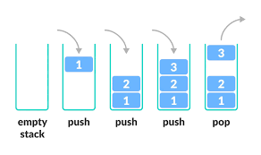

class: title

5CCYB041
# OBJECT-ORIENTED PROGRAMMING
### Week 7, session 2
## Resource and memory management

---
name: memory_management
class: section

# Memory management

---

# Memory management

[Memory safety](https://www.memorysafety.org/docs/memory-safety/) is arguably
the biggest source of errors, bugs and security issues with C / C++
- &rArr; we need to understand memory, how to manage it, and the various kinds of
issues that we may encounter. 

--

There are two broad categories of issues that we need to consider:
.columns[
.col[
- accessing invalid memory locations
  - [buffer overflow](https://en.wikipedia.org/wiki/Buffer_overflow)
  - using [stale references or pointers](https://en.wikipedia.org/wiki/Stale_pointer_bug) 
  - ...
]
.col[
- manual memory management
  - [memory leaks](https://www.geeksforgeeks.org/memory-leak-in-c-and-how-to-avoid-it/)
  - [double free](https://isab.run/paste/5aece618)
  - [dangling pointers](https://www.geeksforgeeks.org/dangling-pointers-in-cpp/)
  - ...
]
]

--

Nodern C++ makes it is possible to produce code that is relatively safe
- without performing any manual memory management
- this is the approach taken on this course

But we are now at the stage where we need to cover this topic

---

# Memory management

On modern computers, every running process has access to its own region of
memory
- this is its [address space](https://en.wikipedia.org/wiki/Virtual_address_space)
- this region is isolated from other processes using [virtual memory](https://en.wikipedia.org/wiki/Virtual_memory)

--

[Memory can be allocated from two regions](https://www.geeksforgeeks.org/stack-vs-heap-memory-allocation/) of this address space:
- the stack
- the heap

---
name: stack_memory
class: section

# The stack

---

# The stack

Stack allocation takes place in the [function call stack](https://en.wikipedia.org/wiki/Call_stack)

The call stack is a data structure that holds the information about the
functions currently running in our process

--

.columns[
.col[
a [stack](https://en.wikipedia.org/wiki/Stack_(abstract_data_type%29) is a
  generic data structure widely used in computing

It is a way of storing items in a last-in first-out (LIFO) manner

Items are *pushed* on top of the stack, and then *popped* off the stack
]
.col[

]
]

--

This structure matches the way functions work

---

## The function stack and stack frames


.columns[
.col[
- `main()` calls `run()`
  - the program *pushes* a new [stack frame](https://www.geeksforgeeks.org/stack-frame-in-computer-organization/) for `run()` onto the function call stack
  - the program then executes the code for `run()`
]
.col[
```
               &#9474;             &#9474;
               &#9474;             &#9474;
      run() &rarr; &#9474;             &#9474;
               &#9474; main()      &#9474;
```
]
]

--

.columns[
.col[
- `run()` calls `load_pgm()`
  - the program *pushes* a new [stack frame](https://www.geeksforgeeks.org/stack-frame-in-computer-organization/) for `load_pgm()` onto the function call stack
  - the program then executes the code for `load_pgm()`
]
.col[
```
               &#9474;             &#9474;
 load_pgm() &rarr; &#9474;             &#9474;
               &#9474; run()       &#9474;
               &#9474; main()      &#9474;
```
]
]

--

.columns[
.col[
- `load_pgm()` completes and returns
  - the program *pops* the [stack frame](https://www.geeksforgeeks.org/stack-frame-in-computer-organization/) for `load_pgm()`
  - the program then resumes execution of the remaining code for `run()`
]
.col[
```
               &#9474;             &#9474;
               &#9474; load_pgm()  &#9474; &rarr; 
               &#9474; run()       &#9474;
               &#9474; main()      &#9474;
```
]
]

---

# The function stack and stack frames

Each item in the [function call stack](https://en.wikipedia.org/wiki/Call_stack) 
is called a [stack frame](https://www.geeksforgeeks.org/stack-frame-in-computer-organization/) 

Every time a function is invoked, a new stack frame is pushed onto the call stack
- this is where the arguments and local variables needed for a function to run are stored

--

The memory allocated for all arguments and local variables is therefore stored on the stack
- *&rArr; this is what is meant by 'stack allocation'*

--

The lifetime of the stack frame is tied to the lifetime of the function call
- as soon as the function returns, the stack frame is popped and its contents *destroyed*
- all local (function-scope) variables immediately go out of scope 
- &rArr; the compiler will insert code to ensure all their destructors are invoked at that point

--

Stack allocations are therefore very predictable and easy to manage
- memory is allocated on the stack when a local variable is declared
- memory is released when the function returns

&rArr; on this course, we have so far used stack allocations *only* 

---
name: recursion
class: section

# Recursive functions

---

# Recursive functions

It is important to understand that a stack frame is specific to an *invocation* of the function
- *not* the function itself

--

If that function is called again, that specific call will get its *own* fresh stack frame
- this allows functions to call themselves &ndash; these are called [recursive functions](https://www.geeksforgeeks.org/recursive-functions/)

--
<br>
This is best illustrated with a classic example: the [Fibonacci sequence](https://en.wikipedia.org/wiki/Fibonacci_sequence)
- The [Fibonacci sequence](https://en.wikipedia.org/wiki/Fibonacci_sequence) is
  consists of numbers where each number is the sum of the two numbers that
  directly precede it (starting with 0, 1):
- 0, 1, 1, 2, 3, 5, 8, 13, 21, 34, 55, 89, 144

--

This can be written as a recursive function:
$$
f(n) = f(n-1) + f(n-2)
$$

---

# Recursive functions: the Fibonacci sequence

We can therefore write this as:
```
int fib (int n) {
* return fib(n-1) + fib(n-2);
}
```
The part of a recursive function where the function calls itself is called the
*inductive step*

--

But what happens when the function eventually calls `fib(1)` or `fib(0)`?
- we need some condition that will prevent further recursion

--

```
int fib (int n) {
* if (n <= 1)
*   return n;
  return fib(n-1) + fib(n-2);
}
```
- this is called the *anchor condition*


---
layout: true

## Recursive functions: the Fibonacci sequence

Let's track the state of the call stack when we call `fib(5)` to get the 
5th element:

---

.stack1[
in `fib(5)`: &emsp; `n = 5` &emsp; `a = ?` &emsp; `b = ?` &emsp; `return ?`

```
int fib (int n) {
  if (n <= 1)
    return n;
  int a = fib(n-1);
  int b = fib(n-2);
  return a + b;
}
```
]

---

.stack1[
in `fib(5)`: &emsp; `n = 5` &emsp; `a = ?` &emsp; `b = ?` &emsp; `return ?`

```
int fib (int n) {
  if (n <= 1)
    return n;
* int a = fib(n-1);
  int b = fib(n-2);
  return a + b;
}
```
]

---

.stack1[
in `fib(5)`: &emsp; `n = 5` &emsp; `a = ?` &emsp; `b = ?` &emsp; `return ?`

```
int fib (int n) {
  if (n <= 1)
    return n;
* int a = fib(n-1);
  int b = fib(n-2);
  return a + b;
}
```
]

.stack2[
in `fib(4)`: &emsp; `n = 4` &emsp; `a = ?` &emsp; `b = ?` &emsp; `return ?`

```
int fib (int n) {
  if (n <= 1)
    return n;
  int a = fib(n-1);
  int b = fib(n-2);
  return a + b;
}
```
]

---

.stack1[
in `fib(5)`: &emsp; `n = 5` &emsp; `a = ?` &emsp; `b = ?` &emsp; `return ?`

```
int fib (int n) {
  if (n <= 1)
    return n;
* int a = fib(n-1);
  int b = fib(n-2);
  return a + b;
}
```
]

.stack2[
in `fib(4)`: &emsp; `n = 4` &emsp; `a = ?` &emsp; `b = ?` &emsp; `return ?`

```
int fib (int n) {
  if (n <= 1)
    return n;
* int a = fib(n-1);
  int b = fib(n-2);
  return a + b;
}
```
]


---

.stack1[
in `fib(5)`: &emsp; `n = 5` &emsp; `a = ?` &emsp; `b = ?` &emsp; `return ?`

```
int fib (int n) {
  if (n <= 1)
    return n;
* int a = fib(n-1);
  int b = fib(n-2);
  return a + b;
}
```
]

.stack2[
in `fib(4)`: &emsp; `n = 4` &emsp; `a = ?` &emsp; `b = ?` &emsp; `return ?`

```
int fib (int n) {
  if (n <= 1)
    return n;
* int a = fib(n-1);
  int b = fib(n-2);
  return a + b;
}
```
]

.stack3[
in `fib(3)`: &emsp; `n = 3` &emsp; `a = ?` &emsp; `b = ?` &emsp; `return ?`

```
int fib (int n) {
  if (n <= 1)
    return n;
  int a = fib(n-1);
  int b = fib(n-2);
  return a + b;
}
```
]


---

.stack1[
in `fib(5)`: &emsp; `n = 5` &emsp; `a = ?` &emsp; `b = ?` &emsp; `return ?`

```
int fib (int n) {
  if (n <= 1)
    return n;
* int a = fib(n-1);
  int b = fib(n-2);
  return a + b;
}
```
]

.stack2[
in `fib(4)`: &emsp; `n = 4` &emsp; `a = ?` &emsp; `b = ?` &emsp; `return ?`

```
int fib (int n) {
  if (n <= 1)
    return n;
* int a = fib(n-1);
  int b = fib(n-2);
  return a + b;
}
```
]

.stack3[
in `fib(3)`: &emsp; `n = 3` &emsp; `a = ?` &emsp; `b = ?` &emsp; `return ?`

```
int fib (int n) {
  if (n <= 1)
    return n;
* int a = fib(n-1);
  int b = fib(n-2);
  return a + b;
}
```
]

---

.stack1[
in `fib(5)`: &emsp; `n = 5` &emsp; `a = ?` &emsp; `b = ?` &emsp; `return ?`

```
int fib (int n) {
  if (n <= 1)
    return n;
* int a = fib(n-1);
  int b = fib(n-2);
  return a + b;
}
```
]

.stack2[
in `fib(4)`: &emsp; `n = 4` &emsp; `a = ?` &emsp; `b = ?` &emsp; `return ?`

```
int fib (int n) {
  if (n <= 1)
    return n;
* int a = fib(n-1);
  int b = fib(n-2);
  return a + b;
}
```
]

.stack3[
in `fib(3)`: &emsp; `n = 3` &emsp; `a = ?` &emsp; `b = ?` &emsp; `return ?`

```
int fib (int n) {
  if (n <= 1)
    return n;
* int a = fib(n-1);
  int b = fib(n-2);
  return a + b;
}
```
]

.stack4[
in `fib(2)`: &emsp; `n = 2` &emsp; `a = ?` &emsp; `b = ?` &emsp; `return ?`

```
int fib (int n) {
  if (n <= 1)
    return n;
  int a = fib(n-1);
  int b = fib(n-2);
  return a + b;
}
```
]

---

.stack1[
in `fib(5)`: &emsp; `n = 5` &emsp; `a = ?` &emsp; `b = ?` &emsp; `return ?`

```
int fib (int n) {
  if (n <= 1)
    return n;
* int a = fib(n-1);
  int b = fib(n-2);
  return a + b;
}
```
]

.stack2[
in `fib(4)`: &emsp; `n = 4` &emsp; `a = ?` &emsp; `b = ?` &emsp; `return ?`

```
int fib (int n) {
  if (n <= 1)
    return n;
* int a = fib(n-1);
  int b = fib(n-2);
  return a + b;
}
```
]

.stack3[
in `fib(3)`: &emsp; `n = 3` &emsp; `a = ?` &emsp; `b = ?` &emsp; `return ?`

```
int fib (int n) {
  if (n <= 1)
    return n;
* int a = fib(n-1);
  int b = fib(n-2);
  return a + b;
}
```
]

.stack4[
in `fib(2)`: &emsp; `n = 2` &emsp; `a = ?` &emsp; `b = ?` &emsp; `return ?`

```
int fib (int n) {
  if (n <= 1)
    return n;
* int a = fib(n-1);
  int b = fib(n-2);
  return a + b;
}
```
]

---

.stack1[
in `fib(5)`: &emsp; `n = 5` &emsp; `a = ?` &emsp; `b = ?` &emsp; `return ?`

```
int fib (int n) {
  if (n <= 1)
    return n;
* int a = fib(n-1);
  int b = fib(n-2);
  return a + b;
}
```
]

.stack2[
in `fib(4)`: &emsp; `n = 4` &emsp; `a = ?` &emsp; `b = ?` &emsp; `return ?`

```
int fib (int n) {
  if (n <= 1)
    return n;
* int a = fib(n-1);
  int b = fib(n-2);
  return a + b;
}
```
]

.stack3[
in `fib(3)`: &emsp; `n = 3` &emsp; `a = ?` &emsp; `b = ?` &emsp; `return ?`

```
int fib (int n) {
  if (n <= 1)
    return n;
* int a = fib(n-1);
  int b = fib(n-2);
  return a + b;
}
```
]

.stack4[
in `fib(2)`: &emsp; `n = 2` &emsp; `a = ?` &emsp; `b = ?` &emsp; `return ?`

```
int fib (int n) {
  if (n <= 1)
    return n;
* int a = fib(n-1);
  int b = fib(n-2);
  return a + b;
}
```
]

.stack5[
in `fib(1)`: &emsp; `n = 1` &emsp; `a = ?` &emsp; `b = ?` &emsp; `return ?`

```
int fib (int n) {
  if (n <= 1)
    return n;
  int a = fib(n-1);
  int b = fib(n-2);
  return a + b;
}
```
]

---

.stack1[
in `fib(5)`: &emsp; `n = 5` &emsp; `a = ?` &emsp; `b = ?` &emsp; `return ?`

```
int fib (int n) {
  if (n <= 1)
    return n;
* int a = fib(n-1);
  int b = fib(n-2);
  return a + b;
}
```
]

.stack2[
in `fib(4)`: &emsp; `n = 4` &emsp; `a = ?` &emsp; `b = ?` &emsp; `return ?`

```
int fib (int n) {
  if (n <= 1)
    return n;
* int a = fib(n-1);
  int b = fib(n-2);
  return a + b;
}
```
]

.stack3[
in `fib(3)`: &emsp; `n = 3` &emsp; `a = ?` &emsp; `b = ?` &emsp; `return ?`

```
int fib (int n) {
  if (n <= 1)
    return n;
* int a = fib(n-1);
  int b = fib(n-2);
  return a + b;
}
```
]

.stack4[
in `fib(2)`: &emsp; `n = 2` &emsp; `a = ?` &emsp; `b = ?` &emsp; `return ?`

```
int fib (int n) {
  if (n <= 1)
    return n;
* int a = fib(n-1);
  int b = fib(n-2);
  return a + b;
}
```
]

.stack5[
in `fib(1)`: &emsp; `n = 1` &emsp; `a = ?` &emsp; `b = ?` &emsp; **`return 1`**

```
int fib (int n) {
* if (n <= 1)
*   return n;
  int a = fib(n-1);
  int b = fib(n-2);
  return a + b;
}
```
]

---

.stack1[
in `fib(5)`: &emsp; `n = 5` &emsp; `a = ?` &emsp; `b = ?` &emsp; `return ?`

```
int fib (int n) {
  if (n <= 1)
    return n;
* int a = fib(n-1);
  int b = fib(n-2);
  return a + b;
}
```
]

.stack2[
in `fib(4)`: &emsp; `n = 4` &emsp; `a = ?` &emsp; `b = ?` &emsp; `return ?`

```
int fib (int n) {
  if (n <= 1)
    return n;
* int a = fib(n-1);
  int b = fib(n-2);
  return a + b;
}
```
]

.stack3[
in `fib(3)`: &emsp; `n = 3` &emsp; `a = ?` &emsp; `b = ?` &emsp; `return ?`

```
int fib (int n) {
  if (n <= 1)
    return n;
* int a = fib(n-1);
  int b = fib(n-2);
  return a + b;
}
```
]

.stack4[
in `fib(2)`: &emsp; `n = 2` &emsp; **`a = 1`** &emsp; `b = ?` &emsp; `return ?`

```
int fib (int n) {
  if (n <= 1)
    return n;
* int a = fib(n-1);
  int b = fib(n-2);
  return a + b;
}
```
]

---

.stack1[
in `fib(5)`: &emsp; `n = 5` &emsp; `a = ?` &emsp; `b = ?` &emsp; `return ?`

```
int fib (int n) {
  if (n <= 1)
    return n;
* int a = fib(n-1);
  int b = fib(n-2);
  return a + b;
}
```
]

.stack2[
in `fib(4)`: &emsp; `n = 4` &emsp; `a = ?` &emsp; `b = ?` &emsp; `return ?`

```
int fib (int n) {
  if (n <= 1)
    return n;
* int a = fib(n-1);
  int b = fib(n-2);
  return a + b;
}
```
]

.stack3[
in `fib(3)`: &emsp; `n = 3` &emsp; `a = ?` &emsp; `b = ?` &emsp; `return ?`

```
int fib (int n) {
  if (n <= 1)
    return n;
* int a = fib(n-1);
  int b = fib(n-2);
  return a + b;
}
```
]

.stack4[
in `fib(2)`: &emsp; `n = 2` &emsp; `a = 1` &emsp; `b = ?` &emsp; `return ?`

```
int fib (int n) {
  if (n <= 1)
    return n;
  int a = fib(n-1);
* int b = fib(n-2);
  return a + b;
}
```
]

---

.stack1[
in `fib(5)`: &emsp; `n = 5` &emsp; `a = ?` &emsp; `b = ?` &emsp; `return ?`

```
int fib (int n) {
  if (n <= 1)
    return n;
* int a = fib(n-1);
  int b = fib(n-2);
  return a + b;
}
```
]

.stack2[
in `fib(4)`: &emsp; `n = 4` &emsp; `a = ?` &emsp; `b = ?` &emsp; `return ?`

```
int fib (int n) {
  if (n <= 1)
    return n;
* int a = fib(n-1);
  int b = fib(n-2);
  return a + b;
}
```
]

.stack3[
in `fib(3)`: &emsp; `n = 3` &emsp; `a = ?` &emsp; `b = ?` &emsp; `return ?`

```
int fib (int n) {
  if (n <= 1)
    return n;
* int a = fib(n-1);
  int b = fib(n-2);
  return a + b;
}
```
]

.stack4[
in `fib(2)`: &emsp; `n = 2` &emsp; `a = 1` &emsp; `b = ?` &emsp; `return ?`

```
int fib (int n) {
  if (n <= 1)
    return n;
  int a = fib(n-1);
* int b = fib(n-2);
  return a + b;
}
```
]

.stack5[
in `fib(0)`: &emsp; `n = 0` &emsp; `a = ?` &emsp; `b = ?` &emsp; `return ?`

```
int fib (int n) {
  if (n <= 1)
    return n;
  int a = fib(n-1);
  int b = fib(n-2);
  return a + b;
}
```
]

---

.stack1[
in `fib(5)`: &emsp; `n = 5` &emsp; `a = ?` &emsp; `b = ?` &emsp; `return ?`

```
int fib (int n) {
  if (n <= 1)
    return n;
* int a = fib(n-1);
  int b = fib(n-2);
  return a + b;
}
```
]

.stack2[
in `fib(4)`: &emsp; `n = 4` &emsp; `a = ?` &emsp; `b = ?` &emsp; `return ?`

```
int fib (int n) {
  if (n <= 1)
    return n;
* int a = fib(n-1);
  int b = fib(n-2);
  return a + b;
}
```
]

.stack3[
in `fib(3)`: &emsp; `n = 3` &emsp; `a = ?` &emsp; `b = ?` &emsp; `return ?`

```
int fib (int n) {
  if (n <= 1)
    return n;
* int a = fib(n-1);
  int b = fib(n-2);
  return a + b;
}
```
]

.stack4[
in `fib(2)`: &emsp; `n = 2` &emsp; `a = 1` &emsp; `b = ?` &emsp; `return ?`

```
int fib (int n) {
  if (n <= 1)
    return n;
  int a = fib(n-1);
* int b = fib(n-2);
  return a + b;
}
```
]

.stack5[
in `fib(0)`: &emsp; `n = 0` &emsp; `a = ?` &emsp; `b = ?` &emsp; **`return 0`**

```
int fib (int n) {
* if (n <= 1)
*   return n;
  int a = fib(n-1);
  int b = fib(n-2);
  return a + b;
}
```
]

---

.stack1[
in `fib(5)`: &emsp; `n = 5` &emsp; `a = ?` &emsp; `b = ?` &emsp; `return ?`

```
int fib (int n) {
  if (n <= 1)
    return n;
* int a = fib(n-1);
  int b = fib(n-2);
  return a + b;
}
```
]

.stack2[
in `fib(4)`: &emsp; `n = 4` &emsp; `a = ?` &emsp; `b = ?` &emsp; `return ?`

```
int fib (int n) {
  if (n <= 1)
    return n;
* int a = fib(n-1);
  int b = fib(n-2);
  return a + b;
}
```
]

.stack3[
in `fib(3)`: &emsp; `n = 3` &emsp; `a = ?` &emsp; `b = ?` &emsp; `return ?`

```
int fib (int n) {
  if (n <= 1)
    return n;
* int a = fib(n-1);
  int b = fib(n-2);
  return a + b;
}
```
]

.stack4[
in `fib(2)`: &emsp; `n = 2` &emsp; `a = 1` &emsp; **`b = 0`** &emsp; `return ?`

```
int fib (int n) {
  if (n <= 1)
    return n;
  int a = fib(n-1);
* int b = fib(n-2);
  return a + b;
}
```
]

---

.stack1[
in `fib(5)`: &emsp; `n = 5` &emsp; `a = ?` &emsp; `b = ?` &emsp; `return ?`

```
int fib (int n) {
  if (n <= 1)
    return n;
* int a = fib(n-1);
  int b = fib(n-2);
  return a + b;
}
```
]

.stack2[
in `fib(4)`: &emsp; `n = 4` &emsp; `a = ?` &emsp; `b = ?` &emsp; `return ?`

```
int fib (int n) {
  if (n <= 1)
    return n;
* int a = fib(n-1);
  int b = fib(n-2);
  return a + b;
}
```
]

.stack3[
in `fib(3)`: &emsp; `n = 3` &emsp; `a = ?` &emsp; `b = ?` &emsp; `return ?`

```
int fib (int n) {
  if (n <= 1)
    return n;
* int a = fib(n-1);
  int b = fib(n-2);
  return a + b;
}
```
]

.stack4[
in `fib(2)`: &emsp; `n = 2` &emsp; `a = 1` &emsp; `b = 0` &emsp; **`return 1`**

```
int fib (int n) {
  if (n <= 1)
    return n;
  int a = fib(n-1);
  int b = fib(n-2);
* return a + b;
}
```
]

---

.stack1[
in `fib(5)`: &emsp; `n = 5` &emsp; `a = ?` &emsp; `b = ?` &emsp; `return ?`

```
int fib (int n) {
  if (n <= 1)
    return n;
* int a = fib(n-1);
  int b = fib(n-2);
  return a + b;
}
```
]

.stack2[
in `fib(4)`: &emsp; `n = 4` &emsp; `a = ?` &emsp; `b = ?` &emsp; `return ?`

```
int fib (int n) {
  if (n <= 1)
    return n;
* int a = fib(n-1);
  int b = fib(n-2);
  return a + b;
}
```
]

.stack3[
in `fib(3)`: &emsp; `n = 3` &emsp; **`a = 1`** &emsp; `b = ?` &emsp; `return ?`

```
int fib (int n) {
  if (n <= 1)
    return n;
* int a = fib(n-1);
  int b = fib(n-2);
  return a + b;
}
```
]

---

.stack1[
in `fib(5)`: &emsp; `n = 5` &emsp; `a = ?` &emsp; `b = ?` &emsp; `return ?`

```
int fib (int n) {
  if (n <= 1)
    return n;
* int a = fib(n-1);
  int b = fib(n-2);
  return a + b;
}
```
]

.stack2[
in `fib(4)`: &emsp; `n = 4` &emsp; `a = ?` &emsp; `b = ?` &emsp; `return ?`

```
int fib (int n) {
  if (n <= 1)
    return n;
* int a = fib(n-1);
  int b = fib(n-2);
  return a + b;
}
```
]

.stack3[
in `fib(3)`: &emsp; `n = 3` &emsp; `a = 1` &emsp; `b = ?` &emsp; `return ?`

```
int fib (int n) {
  if (n <= 1)
    return n;
  int a = fib(n-1);
* int b = fib(n-2);
  return a + b;
}
```
]

--

.explain-bottomright[
... and so on!
]


---
layout: false

# Fibonacci sequence without recursion

In many cases, recursion is not necessary
- the problem can be written differently, for example:

```
int fib (int n) {
  if (n < 2)
    return n;
  int f_2 = 0, f_1 = 1, f_0;
  for (int i = 2; i <= n; i++) {
    f_0 = f_1 + f_2;
    f_2 = f_1;
    f_1 = f_0;
  }
  return f_0;
}
```

--

This is often preferable, since recursive functions require additional storage
on the stack for every nested function call
- the program can run out of stack memory for large numbers!


---
name: heap_memory
class: section

# The heap

---

# The heap

We can also allocate memory manually, outside the stack
- this type of memory is allocated on the [heap](https://www.geeksforgeeks.org/what-is-a-memory-heap/)

--

We can request a chunk of heap memory at any time, and release it back when
we're done
- the lifetime of data stored on the heap is not bound to function scope
- we can allocate memory in one function call, use it elsewhere, and release
  back from a different function

--

This provides a lot of flexibility, but requires careful management
- if our program allocates memory, we need to make sure that memory is released
  when no longer needed
- we need to keep track of all the chunks of memory we have allocated
- ...

---
layout: true
name: new_delete

# New & delete

---

The following allocates a single integer on the heap:

```
int* p = new int;
```

--

In C++, heap memory is allocated using the `new` and `delete` operators
- in C, the corresponding functions are `malloc()` and `free()`

--

It returns a [pointer](https://www.geeksforgeeks.org/cpp-pointers/) to the newly allocated integer
- this pointer stores the *memory address* to the first byte of the memory region holding the data for our `int`

--

We need to specify the *type* of the data that will be held at the new memory
location
- the compiler needs to know how much memory to allocate to hold a variable of
  that type

---

Since we have to provide the type to the `new` operator, we can often use the
`auto` keyword:

```
`auto`* p = new int;
```
---

We can allocate any type of object this way:
```
auto* p = new `std::vector<int>`;
```

---

We can also provide arguments to the constructor if required:
```
auto* p = new std::vector<int> `(5, 0)`;
```

The constructor will be invoked immediately after the memory has been allocated

---

When dealing with inherited types, we can assign the returned pointer to a
pointer-to-base-class:
```
`Segment::Base`* p = new `Segment::Tip` (20.0);
```

This means we can declare *pointers* to a base class and pass them to other
functions
- even for an *abstract* base class!
- this is widely used for runtime polymorphism

---

When we're done, we need to release the memory back to the system using the
`delete` operator:
```
Segment::Base* p = new Segment::Tip (20.0);

...

*delete p;
```

--

The `delete` operator needs to know which bit of memory to release
- this is the address stored in the pointer
- we therefore need to hold onto that address for the lifetime of that memory
  region!

--

The `delete` operator is responsible for invoking the *destructor* of the
object
- this is guaranteed to happen *before* the memory is released

---
layout: false

# New & delete for arrays

There is a special syntax to allocate memory to hold a C-style array of some
type:
```
double* p = new double [10];
```

For regular built-in types ([plain old data (POD)
types](https://www.geeksforgeeks.org/pod-type-in-cpp/)), this leaves the
values in the array uninitialised
- each element could contain anything


---

# New & delete for arrays

It is possible to *default-initialise* such POD values using this syntax:

```
double* p = new double [10]();
double* p = new double [10]{};
```

Both lines are equivalent, and both will zero-initialise the array.


---

# New & delete for arrays

It is also possible to *value-initialise* an array using a brace-enclosed list:

```
double* p = new double [10] { 1, 2, 3, 4, 5, 6, 7, 8, 9, 10 };
```

---

# New & delete for arrays

For class types, the default constructor will be invoked on each element:

```
auto* p = new std::string [10];
```
This constructs a C-style array of 10 `std::string`s, each default-constructed
- the strings will all be empty


---
name: null_pointer

# The null pointer

---
name: memory_problems
class: section

# What can go wrong with memory management?

---
name: memory_leak

# Memory leaks

---
name: dangling_pointers

# Dangling pointers and references

---
name: double_free

# Double free


---
name: memory_solutions
class: section

# Memory management<br>in modern C++

---

# First line of defence: don't do it!

---
name: ownership_lifetime

# Object ownership and lifetime


---
name: raii
class: section

# RAII: Resource Acquisition Is Initialisation

---

# RAII: Resource Acquisition Is Initialisation

---

# Implementing RAII for memory management

---
name: copy_and_assignment

# The copy constructor and assignment operator

---

# Case 1: deep copy

e.g. `std::string`, `std::vector`

---

# Case 2: unique copy

e.g. file streams

---
name: smart_pointers

# Smart pointers

---

# Smart pointers

---

# When holding a unique instance

`std::unique_ptr` and `std::make_unique`

---

# When holding a shareable instance

`std::shared_ptr` and `std::make_shared`

---
name: robot_arm_pointers
class: section

# The robot arm project<br>revisited using pointers

---
name: object_slicing

# Object slicing

---
name: vector_of_base

# Vector of base class objects

---
name: reference_wrapper

# The `std::reference_wrapper` class

Need to consider ownership & lifetime

---
name: vector_smart_ptr

# A vector of smart pointers

Vector now has ownership of objects

---

# Exercise

Update robot arm project using smart pointers


